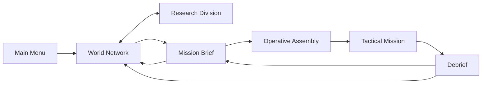

# Nexus Reborn — Game Design Document

**Document type:** Codebase-derived design specification  
**Project version reviewed:** `727f17e`  
**Review date:** 2026-07-28  
**Primary platform:** Desktop web browser  
**Current implementation:** React 19, TypeScript, React Three Fiber, Three.js WebGPU/WebGL2, Zustand  

## 1. Document purpose

This document reconstructs the intended game from the current repository. It is both:

1. A source-of-truth description of the playable build.
2. A production guide for completing the larger game implied by the existing systems and interface.

The following labels distinguish evidence from recommendation:

- **Implemented:** Functional in the current build.
- **Scaffolded:** Represented in data or UI, but incomplete as a game system.
- **Recommended:** A proposed extension that closes an identified design gap.

Where code and decorative UI disagree, the simulation code is treated as authoritative.

---

## 2. Executive summary

### High concept

**Nexus Reborn** is a cyberpunk corporate strategy and real-time tactics game in which the player acts as an executive operations director. From a global command network, the player monitors a changing corporate world, funds weapons and augmentation research, selects contracts, assembles a four-operative strike team, and commands that team through dangerous rain-soaked city districts.

The current build delivers one complete tactical contract inside a broader strategic shell. Its most distinctive qualities are:

- A dense, diegetic corporate command interface.
- A four-operative real-time tactical control model.
- Enemy awareness driven by sight, sound, investigation, and local alert propagation.
- Civilian collateral as both a tactical risk and an economic penalty.
- A strategic clock shared by world events and a 21-project research program.
- A deterministic, procedural city and a no-external-assets production approach.

### Product definition

| Attribute | Current definition |
|---|---|
| Genre | Real-time squad tactics with a strategic management layer |
| Perspective | Fixed-angle isometric-style 3D camera |
| Player role | Corporate Operations Director / `OPS_DIRECTOR` |
| Setting | Corporate-controlled near-future Earth, beginning 2087.05.14 |
| Core unit | Four cybernetically enhanced operatives |
| Input | Keyboard and mouse |
| Target display | Desktop, minimum 1280×720 |
| Session structure | Strategic planning → briefing → squad assembly → tactical mission → debrief |
| Current content | One playable mission, two locked mission concepts, eight operatives, five weapons, 21 research projects |
| Monetization | None represented in the codebase |
| Networking | Single-player; no multiplayer systems represented |
| Persistence | None; state currently lives in memory only |

### Player promise

> Read a hostile corporate world, invest in the right technologies, deploy the right four-person team, and execute a precise operation where every shot can change both the firefight and the contract payout.

---

## 3. Design pillars

### 3.1 Command, do not micromanage

The player directs a small team using selection groups, move and attack orders, and persistent tactical stances. Operatives automatically acquire visible targets when weapons are free, allowing the player to focus on positioning and tempo instead of issuing every shot.

### 3.2 Information is operational power

The interface exposes world unrest, corporate control, patrol routes, objective zones, enemy awareness, weapon state, and camera coverage. The intended skill is reading the situation quickly and making a small number of consequential orders.

### 3.3 Violence has corporate consequences

Combat is fast and noisy. Missed shots continue downrange and can strike other bodies. Civilian casualties are not merely flavor: the client deducts credits for every unique civilian hit by the squad.

### 3.4 The strategic and tactical layers feed each other

Contract rewards fund research. Completed research changes deployed weapon and operative statistics. The world clock advances both the corporate world and the labs.

The current build completes the economy-to-research-to-mission direction. Mission outcomes do not yet change sector control, unrest, ownership, intel, or future contract availability.

### 3.5 A cohesive corporate-terminal fantasy

Every surface uses the same near-black, teal, amber, and red command language. Briefings, squad assembly, research, the world map, the HUD, and the debrief should feel like different modules of one secure corporate operating system.

---

## 4. Setting, tone, and narrative frame

### World

The game begins on **2087.05.14** in a world divided into corporate spheres of influence. Cities change hands through trade, seizures, raids, unrest, and infrastructure failure. The player’s organization operates a secure global command network and deploys enhanced operatives on contracts for powerful corporate clients.

### Player identity

The player is framed as:

- User: `OPS_DIRECTOR`
- Clearance: Executive
- Network: secure corporate command interface
- Tactical asset: `STRIKE TEAM 04`

The player is not an individual operative. They are the remote decision-maker who controls funding, mission acceptance, personnel selection, and battlefield orders.

### Corporations and clients

| Organization or state | Strategic function | Visual color |
|---|---|---|
| Stratos Industries | City holder and contract client/faction | Cyan |
| Nexus Global | City holder and corporate faction | Green |
| Helix Corp | City holder and contract client/faction | Amber |
| Omnicorp | City holder and CorpSec affiliation in Glass Veil | Muted teal-gray |
| Sable Enterprises | Client for Glass Veil; no city holdings or strategic simulation identity | No faction color defined |
| Contested | Map ownership state | Red |
| Unknown | Unsurveyed map state | Dark teal |

The player organization is not explicitly defined as one of the four city-holding corporations. “Nexus” appears as both a map faction and the repository identity, but the build does not formally state that the player serves Nexus Global.

### Tone

- Cold, procedural, and corporate.
- Tactical violence described through system logs and contract language.
- Operatives communicate in short, professional acknowledgements.
- Civilians and collateral keep the player’s actions morally and financially legible.
- Visual drama comes from night, rain, neon, scanlines, warning states, and sparse bloom.

### Narrative delivery

Narrative is currently delivered through:

- Mission briefing copy.
- World event feed.
- Operative names, codenames, roles, and short biographies.
- Research project descriptions.
- In-mission comm log.
- Objective updates.
- Debrief statistics and payout adjustments.

There are no cutscenes, dialogue trees, character relationships, or campaign chapters in the current implementation.

---

## 5. Game structure

### Screen and state flow

### Current flow rules

1. The player initiates the command interface.
2. The World Network opens with Europe selected.
3. The player may inspect sectors, run the strategic clock, review world events, or enter Research.
4. Selecting the one unlocked contract opens its briefing.
5. Accepting the contract opens Operative Assembly.
6. Exactly four operatives must be assigned before deployment.
7. The player completes sequential objectives or loses the squad.
8. A debrief applies the payout and returns the player to the World Network or briefing.

### Core loops

#### Strategic loop

1. Monitor world state and available operations.
2. Advance or pause world time.
3. Fund available research projects.
4. Choose a contract.
5. Assemble a team.
6. Complete the mission.
7. Receive credits, less collateral penalties.
8. Reinvest in research.

#### Tactical loop

1. Read patrols, objective markers, sight cones, and civilian positions.
2. Select one or more operatives.
3. Move as a formation or establish a hold position.
4. Avoid, investigate, or deliberately trigger enemy awareness.
5. Engage hostiles through automatic or explicit targeting.
6. Complete the active objective.
7. Repeat until extraction.

#### Research loop

1. Inspect available projects and prerequisites.
2. Commit credits to one project in a branch laboratory.
3. Advance world time on the World Network or Research screen.
4. Complete the project.
5. Unlock dependent projects.
6. Apply completed effects to future deployments.

---

## 6. Strategic layer

### 6.1 World clock

**Implemented**

- Start timestamp: **2087.05.14 14:32:17 UTC**.
- At 1× speed, one real second advances 60 world seconds.
- Available speeds: **1×, 2×, 4×, 8×**.
- Initial speed: **2×**.
- The clock can be paused.
- World time advances only while the World Network or Research screen is mounted.
- World time does not advance during the menu, briefing, squad assembly, tactical mission, or debrief.
- The tactical mission uses its own independent clock, beginning at **22:14:08**.
- The player can scrub and keyboard-navigate a rolling 24-hour event timeline without changing the live world state.

This clock is the shared authority for world events and research completion.

### 6.2 Continental sectors

| Sector | Initial control | Initial unrest | Influence weight | Status |
|---|---:|---:|---:|---|
| North America | 68% | 12% | 1.15 | Open |
| South America | 41% | 24% | 0.85 | Open |
| Europe | 62% | 18% | 1.20 | Open |
| Africa | 37% | 28% | 0.90 | Open |
| Asia | 55% | 16% | 1.35 | Open |
| Oceania | 73% | 9% | 0.55 | Open |
| Antarctica | 0% | 0% | 0.00 | Locked / no survey data |

Each open sector exposes:

- Control.
- Unrest.
- Weekly tax yield.
- Influence income.
- Black-market impact.
- Garrison condition.
- Total forces.
- Defense rating.

The simulation also calculates an asset count for each sector, but the current sector panel does not display it.

Global influence is the weighted average control of all open sectors.

### 6.3 City ownership

**Implemented**

The world map contains 18 named cities. Each has a current corporate holder. A sector’s displayed corporate color is determined by which corporation holds the most cities in that sector; ties display as contested.

Ownership can change through generated seizure events. This affects map color and corporate labels, but currently has no effect on contracts, research, prices, or tactical missions.

### 6.4 Dynamic world events

**Implemented**

Event categories:

| Event | Typical strategic effect |
|---|---|
| Riot | Raises unrest and reduces control |
| Blackout | Raises unrest |
| CorpSec raid | Reduces unrest and may improve control |
| Trade agreement | Improves control and may reduce unrest |
| Seizure | May change city ownership and alter control/unrest |

Events occur every **15–45 world minutes** and favor high-unrest sectors. The feed stores up to 40 events, displays the most recent 14 for the selected timeline point, and tracks unread events.

**Current limitation:** The event simulation runs independently of player missions. Contract success or failure does not create events or change sector values.

### 6.5 Intel and contract access

**Scaffolded**

- Initial intel level: **1**.
- Displayed progress to the next level: **25%**.
- Two contracts require intel level 2.
- Intel never increases in the current build.
- Antarctica and several navigation surfaces remain locked or unavailable.

**Recommended:** Award intel from successful objectives, optional reconnaissance, low-alert completion, or city control. Intel should unlock contracts and strategic capabilities rather than function as a decorative progress bar.

---

## 7. Economy and progression

### 7.1 Credits

**Implemented**

- Starting balance: **128,450 CR**.
- Credits pay for research.
- Successful contracts add their net payout.
- Failed contracts pay nothing.
- The balance cannot be overdrawn by research authorization.

### 7.2 Collateral penalty

Each unique civilian hit by an operative deducts **5,000 CR** from a successful contract.

Rules:

- The fine is assessed on the first squad-caused hit, not only on death.
- Repeated hits to the same civilian do not add additional fines.
- CorpSec-caused civilian damage does not count against the player.
- Total deductions are capped at the contract reward.
- A failed mission already pays zero, so collateral does not create debt.

### 7.3 Progression model

The implemented progression is entirely research-driven:

- Weapon projects modify damage, range, magazine, reload time, spread, or fire delay.
- Crew projects add maximum health or movement speed to every deployed operative.
- Effects stack in project-completion order.
- Completed research is sampled when the mission is created and cannot alter an active deployment.

There is currently no:

- Save data.
- Account level.
- Operative experience.
- Persistent injury or death.
- Equipment ownership.
- Consumable inventory economy.
- Intel progression.
- Sector reward for mission outcomes.

---

## 8. Research program

### 8.1 Research rules

**Implemented**

- Three branches: Ballistics, Cybernetics, Control Systems.
- Seven projects per branch; 21 total.
- One lab per branch.
- One active project per lab.
- Up to three projects can run concurrently if each belongs to a different branch.
- Project durations use world time.
- Tiers require their listed prerequisite projects.
- Credits are spent immediately when authorization succeeds.
- Total cost of all research: **779,000 CR**.

At 1× strategic speed, one world hour takes one real minute. At the default 2× speed, a two-hour project takes approximately one real minute while a strategy screen remains open.

### 8.2 Ballistics — 248,000 CR total

| Project | Cost | Time | Prerequisites | Applied effect |
|---|---:|---:|---|---|
| Advanced Propellants | 16,000 | 2h | None | +12% assault-rifle damage |
| Barrel Wear Coating | 14,000 | 2h | None | −10% spread for all squad weapons |
| Hypervelocity Core | 30,000 | 4h | Advanced Propellants | +18% longrifle damage; +10% longrifle range |
| Caseless Ammo Feed | 26,000 | 4h | Barrel Wear Coating | +10 SMG magazine; −12% reload time for all weapons |
| Rail Stabilization | 44,000 | 8h | Hypervelocity Core | −15% spread for all weapons |
| Smart Fragmentation | 42,000 | 8h | Caseless Ammo Feed | +22% shotgun damage; +15% shotgun range |
| Tungsten Sabot | 76,000 | 14h | Rail Stabilization + Smart Fragmentation | +15% damage for all weapons |

### 8.3 Cybernetics — 261,000 CR total

| Project | Cost | Time | Prerequisites | Applied effect | Augmentation bay |
|---|---:|---:|---|---|---|
| Neural Interface I | 15,000 | 2h | None | −8% fire delay for all weapons | Neural |
| Synaptic Enhancement | 17,000 | 2h | None | +0.20 m/s move speed | Chest |
| Reflex Booster | 28,000 | 4h | Neural Interface I | −15% reload time for all weapons | Arms |
| Pain Inhibitor | 27,000 | 4h | Synaptic Enhancement | +14 max HP | Chest |
| Neural Accelerator Mk II | 48,000 | 8h | Reflex Booster | −12% fire delay; +0.15 m/s speed | Neural |
| Subdermal Weave | 46,000 | 8h | Pain Inhibitor | +22 max HP | Chest |
| Neural Cache Array | 80,000 | 14h | Neural Accelerator Mk II + Subdermal Weave | +18 max HP; +0.35 m/s speed | Neural |

### 8.4 Control Systems — 270,000 CR total

| Project | Cost | Time | Prerequisites | Applied effect | Augmentation bay |
|---|---:|---:|---|---|---|
| Targeting AI Suite | 18,000 | 2h | None | −12% spread for all weapons | Arms |
| Sensor Fusion Array | 16,000 | 2h | None | +8% range for all weapons | Neural |
| Swarm Coordination | 29,000 | 4h | Targeting AI Suite | +0.25 m/s move speed | Legs |
| Threat Prediction | 31,000 | 4h | Sensor Fusion Array | +12 max HP | Neural |
| EM Hardening | 45,000 | 8h | Swarm Coordination | +16 max HP | Legs |
| Encryption Core | 47,000 | 8h | Threat Prediction | −10% reload time for all weapons | Arms |
| Adaptive Command AI | 84,000 | 14h | EM Hardening + Encryption Core | −10% fire delay; +0.20 m/s speed | Neural |

### 8.5 Augmentation presentation

The team-selection dossier has four augmentation bays:

- Neural.
- Chest.
- Arms.
- Legs.

The latest completed project associated with each bay is displayed as the installed augmentation for every operative. This is currently presentation logic: projects apply globally to the squad, not as individually installed or swappable hardware.

---

## 9. Operative assembly

### 9.1 Squad rules

**Implemented**

- Roster size: eight.
- Deployment size: exactly four.
- Default squad: Mara, Ghost, Dart, Torq.
- The player may inspect an operative without assigning them.
- Assignment and inspection are separate controls.
- At least one operative must remain assigned while editing the squad.
- Deployment is disabled until all four bays are filled.

**Current limitation:** An `INJURED` operative can still be assigned and deployed. Status is not enforced by gameplay.

### 9.2 Operative roster

| Codename | Name | Role | HP | Speed | Primary | Sidearm | Status | Intended specialty |
|---|---|---|---:|---:|---|---|---|---|
| Mara | D. Torres | Assault | 124 | 4.6 | RFC-27 Assault | S-18 Pistol | Ready | Frontline breach and clear |
| Ghost | L. Fernandez | Recon | 110 | 5.2 | K-9 Rattler SMG | S-18 Pistol | Ready | Intel gathering and range |
| Dart | K. Park | Infiltrator | 98 | 5.6 | K-9 Rattler SMG | S-18 Pistol | Ready | Silent entry and close quarters |
| Torq | M. Ivanova | Demolitions | 132 | 4.2 | M6 Breacher | S-18 Pistol | Ready | Heavy ordnance and area denial |
| Raven | A. Okafor | Sniper | 92 | 4.4 | VK-88 Longrifle | S-18 Pistol | Injured | Precision and overwatch |
| Slate | J. Sato | Tech | 104 | 4.8 | K-9 Rattler SMG | S-18 Pistol | Ready | Intrusion and drone control |
| Vex | R. Volkov | Support | 118 | 4.4 | RFC-27 Assault | S-18 Pistol | Ready | Suppression and logistics |
| Kestrel | N. Diallo | Medic | 100 | 5.0 | S-18 Pistol | S-18 Pistol | Ready | Trauma and stim protocols |

Speed is measured in world meters per second. Research bonuses are added at deployment.

### 9.3 Role implementation status

**Scaffolded**

Roles currently affect:

- Flavor text and iconography.
- Baseline HP, speed, and primary weapon through the authored roster.
- Informational HUD item counts:
  - Base squad: one med item and one cell.
  - Medic: +2 med.
  - Support: +1 med.
  - Tech: +1 cell.

Roles do not currently grant usable abilities, passive skills, AI behaviors, or mission interactions. HUD items and team-screen inventory tiles are non-functional displays.

### 9.4 Deployment mass

The assembly screen calculates and displays squad mass from authored health and speed values plus a base amount. It is presented against a 400 kg limit, but the limit does not restrict deployment and research-modified stats do not affect the calculation.

---

## 10. Mission briefing and contract selection

### Briefing purpose

The Mission Brief converts strategic data into an operational plan. It includes:

- Contract identity, client, type, threat, and reward.
- Narrative briefing and mission notes.
- Sequential objective list.
- Collateral tolerance.
- Satellite-style recon image.
- A tactical map generated from the same city layout used by the mission.
- Insertion, target, extraction, patrol, and hostile-zone overlays.
- Estimated civilian, patrol, garrison, route, block, and street counts.

### Contract acceptance

There is no contract cost or confirmation dialog. Accepting a contract advances directly to team selection. The contract remains replayable after success or failure.

---

## 11. Tactical mission design

### 11.1 Current mission space

The current mission takes place in a deterministic **96×96 meter** procedural district.

Fixed structural landmarks:

- Squad insertion/extraction: south, approximately `(48, 88)`.
- Main north-south avenue: central.
- Checkpoint and garrison plaza: north, approximately `(48, 14)`.
- A road and alley network divides procedural building blocks.
- Buildings retain walkable setbacks and minimum-width alleys.
- The generator guarantees connectivity from insertion to the checkpoint, enemies, patrol paths, and extraction.

Population:

- Four deployed operatives.
- Seven checkpoint garrison enemies.
- Five street patrol enemies.
- 22 civilians.

The visual district is reconstructed from the mission seed, so a given mission is repeatable.

### 11.2 Selection

**Implemented**

- Left click selects one operative.
- Shift + left click adds or removes an operative from selection.
- Left drag box-selects all living operatives whose projected center falls inside the marquee.
- Shift + drag adds to the existing selection.
- Left click on empty ground clears selection.
- Left click on an enemy preserves the current selection.
- Number keys 1–4 select one squad slot.
- `0` or backtick selects all living operatives.
- Backspace clears selection.
- The mission begins with all living operatives selected.
- Dead operatives are automatically excluded from future order recipients.

### 11.3 Orders and stances

#### Move

Right click on the ground sends selected operatives to a compact spread around the destination.

- Group destinations use a ring formation so agents do not stack.
- A move order clears explicit targeting.
- A move order releases Hold Ground.
- Operatives automatically stop and engage visible enemies along the route when weapons are free, then resume moving.

#### Attack

Right click on a living hostile assigns it as an explicit target.

- Operatives chase until line of sight and range are available.
- Explicit attack orders override Hold Fire.
- Hold Ground prevents chasing but does not cancel the target.

#### Stop

`X` clears pathing and targeting for the selected operatives. Hold Ground and Hold Fire flags remain unchanged.

#### Hold Ground

`H` toggles Hold Ground for the selection.

- The operative is pinned in place.
- An active path is parked and restored when the hold is released.
- Separation does not push a held operative out of position.
- The operative may still fire.

#### Hold Fire

`C` toggles Hold Fire for the selection.

- Automatic targets are cleared.
- The operative does not auto-acquire.
- A later explicit attack order still fires.

### 11.4 Movement and navigation

**Implemented**

- Eight-direction A* pathfinding on a one-meter walk grid.
- Diagonal corner cutting is forbidden.
- Paths are straightened when line of sight permits.
- Blocked destinations snap to the nearest walkable cell.
- Units slide along a valid axis when collision geometry blocks a full movement step.
- Local separation keeps living units from overlapping.
- There is no rigid-body physics system.

### 11.5 Camera

**Implemented**

- Fixed 45° yaw.
- 55° elevation.
- Perspective field of view: 25°.
- Zoom distance: 44–115 meters.
- Keyboard and minimap panning.
- Smooth damping.
- Recenter on the living squad.
- Buildings that obscure operatives or important ground fade to transparent ghost shells.

The camera cannot rotate or tilt during play.

### 11.6 Enemy perception

Enemy behavior uses three states:

1. **Patrol:** follows authored patrol points at reduced speed.
2. **Suspicious:** moves to the last seen or heard location, then scans.
3. **Combat:** pursues and attacks visible operatives.

#### Vision

- Maximum vision range: **14 m**.
- Vision cone: **110° total**.
- Omnidirectional notice radius: **4.5 m**.
- Vision requires clear grid line of sight.
- Continuous sight required for certainty:
  - Approximately 0.45 seconds at close range.
  - Up to approximately 1.7 seconds at maximum vision range.

#### Hearing

- Gunshots create noise events.
- Hearing passes through walls.
- Noise supplies a location, not a target.
- Sound alone can raise awareness only to 85%, causing investigation but not immediate firing.
- Weapon noise radius increases with range and damage.

#### Alert propagation

- A guard can alert another guard within 9 m when they have line of sight to each other.
- Combat awareness does not propagate through walls.
- After losing sight for six seconds, a guard returns to suspicious investigation rather than directly to patrol.
- Awareness decays when no evidence is received.

### 11.7 Civilian behavior

**Implemented**

- Civilians wander locally when calm.
- Gunfire within 10 m causes them to flee.
- Flee behavior lasts five seconds after the latest nearby shot.
- Fleeing civilians move 50% faster.
- A direct hit forces the civilian to flee from the shooter.
- Civilians can be injured or killed by either side.

### 11.8 Combat model

Combat is real-time and automatically resolved after positioning and targeting decisions.

#### Fire prerequisites

The shooter must:

- Be alive.
- Have a weapon.
- Have ammunition in the current magazine.
- Not be reloading.
- Have completed the weapon cooldown.
- Have the target in range.
- Have line of sight.

#### Accuracy

Base hit chance is approximately:

`(0.78 − 0.28 × distance/range + random jitter) × accuracy multiplier`

The result is clamped between 5% and 95%.

- Operative accuracy multiplier: 1.0.
- CorpSec accuracy multiplier: 0.45.
- Weapon spread affects the path of missed shots, not the initial hit-roll formula.

#### Damage and fire rate

- Operatives deal the weapon’s full damage.
- CorpSec deals 70% of weapon damage.
- CorpSec weapon cooldowns are 1.75× longer than authored weapon cooldowns.
- Magazines automatically reload from an unlimited implicit reserve.

#### Misses and stray fire

Missed rounds continue along the shot lane to weapon range. The first living body intersected before cover can be hit, regardless of faction.

Consequences:

- Civilians can be hit by misses.
- Other operatives can be hit by friendly stray fire.
- Enemies can hit civilians or other enemies with stray fire.
- Cover blocks the continued shot lane.

This is a central expression of the collateral pillar and should remain highly legible through tracers, logs, and debrief feedback.

### 11.9 Weapons

| Weapon | Damage | Range | Fire delay | Magazine | Reload | Spread | Tactical identity |
|---|---:|---:|---:|---:|---:|---:|---|
| RFC-27 Assault | 11 | 16 m | 0.16 s | 30 | 1.7 s | 0.045 | Flexible sustained fire |
| K-9 Rattler SMG | 7 | 12 m | 0.09 s | 40 | 1.9 s | 0.080 | High-volume close combat |
| S-18 Pistol | 10 | 11 m | 0.45 s | 12 | 1.2 s | 0.030 | Accurate light sidearm |
| VK-88 Longrifle | 46 | 26 m | 1.60 s | 5 | 2.6 s | 0.008 | Precision long-range elimination |
| M6 Breacher | 26 | 8 m | 0.90 s | 6 | 2.2 s | 0.120 | Short-range burst damage |

**Current limitation:** Only the authored primary weapon is usable. Sidearms are displayed but cannot be selected or fired. Reserve-ammo values shown in the UI are informational and do not constrain the simulation.

### 11.10 Objectives

Supported objective types:

- Reach a zone.
- Eliminate all living enemies with a specified tag.
- Extract every surviving operative.

Objectives are strictly sequential. A later objective cannot complete early.

Completion rules:

- Reach Zone completes when any living operative enters the radius.
- Eliminate Tag completes when no living enemy with the tag remains.
- Extract completes when every surviving operative is inside the extraction radius.

### 11.11 Win and loss

**Win:** All mission objectives complete.  
**Loss:** No living operatives remain.

The HUD presents the result immediately. After a 2.5-second delay, the game enters the debrief.

The debrief reports:

- Target.
- Eliminations.
- Squad casualties.
- Civilian collateral count.
- Mission time.
- Contract value when relevant.
- Collateral penalty when relevant.
- Net payout.
- New account balance.

---

## 12. Current content catalogue

### 12.1 Contracts

| Codename | Location | Type | Client | Threat | Reward | Chance | ETA | Status |
|---|---|---|---|---|---:|---:|---:|---|
| Glass Veil | New Carthage, District 07, Europe | Seizure | Sable Enterprises | Severe | 85,000 CR | 78% | 2 days | Playable |
| Hollow Crown | Shingang, District 21, Asia | Extraction | Helix Corp | High | 62,000 CR | 64% | 4 days | Locked; no objectives authored |
| Rust Haven | Detroit Sprawl, District 03, North America | Sabotage | Stratos Industries | Moderate | 41,000 CR | 82% | 3 days | Locked; no objectives authored |

Displayed chance and ETA are authored presentation values. They do not affect simulation outcomes or strategic time.

### 12.2 Glass Veil

#### Premise

CorpSec has sealed District 07 behind an Omnicorp checkpoint. Sable Enterprises wants the district opened for an asset transfer at 23:00. The squad inserts on the south perimeter and advances through market blocks under heavy rain.

#### Conditions

- Heavy rain.
- Reduced-visibility framing.
- Moderate civilian density.
- Low collateral tolerance.
- Severe threat rating.

Rain is visual. It does not currently change sight distance, accuracy, movement, or sound.

#### Objective sequence

1. **Reach the checkpoint gate.**
   - Any living operative enters the checkpoint zone.
2. **Eliminate the CorpSec garrison.**
   - Kill the seven checkpoint enemies tagged `garrison`.
   - Five untagged street patrols are optional unless they threaten the squad.
3. **Extract the squad.**
   - Move every surviving operative back to the southern insertion zone.

#### Tactical arc

- Approach from the comparatively low-rise southern edge.
- Read and bypass or engage five street patrols.
- Manage civilians who flee across fire lanes.
- Breach the guarded northern plaza.
- Eliminate a six-unit mixed rifle/SMG garrison and one 80-HP longrifle guard.
- Return south with all survivors.

---

## 13. User interface and experience

### 13.1 Interface principles

- DOM UI surrounds and overlays the 3D scene.
- Near-black backgrounds preserve contrast.
- Teal communicates operation and selection.
- Amber communicates focus, authorization, and active objectives.
- Red communicates danger, lock states, damage, and failure.
- Green communicates completion and positive status.
- Small monospace uppercase labels create a command-terminal identity.
- Primary values should remain visually larger than labels.

### 13.2 Main surfaces

#### Main Menu

- Establishes the secure-system fiction.
- Unlocks browser audio on the first user gesture.
- Offers one action: initiate the World Network.

#### World Network

- Sector selection and corporate ownership map.
- Mission markers and operation list.
- World time controls and 24-hour review timeline.
- Dynamic events feed.
- Credits, influence, operative count, and intel display.
- Navigation to Research.

#### Research Division

- Three simultaneous branch trees.
- Four node states: researched, active, available, locked.
- Live progress fills.
- Project detail, prerequisites, effects, time, cost, and authorization.
- Lab status and program summary.

#### Mission Brief

- Recon image and code-derived tactical plan.
- Dossier, objectives, notes, threat, reward, and collateral tolerance.
- Contract acceptance.

#### Operative Assembly

- Roster inspection and assignment.
- Four squad bays.
- Research-adjusted stats and weapon values.
- Installed-augmentation presentation.
- Informational inventory and deployment mass.

#### Mission HUD

- District clock and static weather readouts.
- Alert level.
- Account credits.
- Squad cards with HP, magazine, selected/active state, and tactical stances.
- Objective list.
- Comm log.
- Active operative’s primary and sidearm readout.
- Locked ability bar.
- Informational item counts.
- Interactive, zoomable minimap.
- Pause menu and mission result banner.

#### Debrief

- Outcome, combat, collateral, timing, and economy.
- Return to World Network or replay.

### 13.3 Minimap

**Implemented**

- Rotated to match screen orientation.
- Building footprints and roads.
- Extraction and checkpoint zones.
- Active-objective pulse.
- Calm, suspicious, and combat enemy states.
- Sight cones for suspicious and combat guards.
- Civilians and operatives.
- Ground footprint of the current camera.
- Three zoom levels.
- Click and drag to steer the camera.

### 13.4 Pause and control discovery

Space or Escape opens a modal pause menu. The menu:

- Freezes simulation and camera motion.
- Displays every mission binding from the same authoritative binding table used by input.
- Supports focus trapping.
- Offers Resume.
- Uses a two-step, three-second confirmation window for Abort.

Abort returns to the World Network and discards the current mission state without a debrief.

### 13.5 Accessibility status

**Partially implemented**

- Most major buttons have contextual accessible labels.
- Research nodes support Enter and Space.
- The timeline supports arrows, Home, and End.
- Pause-menu focus is trapped and restored.
- The minimap is keyboard-focusable but its declared arrow-key behavior is actually handled by the global camera controls.
- Color is often reinforced by labels, icons, or state text.

**Recommended**

- Full keyboard navigation for all screen panels.
- Remappable controls.
- Text scaling and reduced CRT/noise options.
- Reduced-motion mode for sweeps, pulses, rain, and transitions.
- High-contrast and color-vision presets.
- Captions or textual equivalents for all audio cues.
- Screen-reader validation of the tactical HUD.

---

## 14. Controls

### Camera

| Input | Action |
|---|---|
| W / Up | Pan forward |
| S / Down | Pan backward |
| A / Left | Pan left |
| D / Right | Pan right |
| F | Recenter on living squad |
| `=` / Numpad `+` | Zoom in |
| `-` / Numpad `-` | Zoom out |
| Mouse wheel | Zoom |
| Minimap click/drag | Steer camera |

### Squad

| Input | Action |
|---|---|
| 1–4 / Numpad 1–4 | Select operative slot |
| 0 / backtick / Numpad 0 | Select all living operatives |
| Backspace | Clear selection |
| X | Stop and clear orders |
| H | Toggle Hold Ground |
| C | Toggle Hold Fire |
| Space / Escape | Pause menu |

### Mouse

| Input | Action |
|---|---|
| Left click operative | Select |
| Shift + left click | Add/remove selection |
| Left drag | Box select |
| Shift + left drag | Add box selection |
| Left click bare ground | Clear selection |
| Right click ground | Move order |
| Right click hostile | Attack order |
| Double-click squad HUD card | Center camera on operative |

---

## 15. Art direction

### Visual identity

The project uses a late-1980s/1990s cyberpunk strategy-game vocabulary rebuilt as a crisp modern browser interface:

- Near-black and dark blue-green ground.
- Teal operational graphics.
- Amber active/focus states.
- Red hostile and failure states.
- Thin technical borders.
- Monospace uppercase typography.
- Scanlines, vignette, radar sweeps, data chips, coordinate labels, and barcodes.

### Tactical scene

- Nighttime urban district.
- Heavy rain.
- Wet asphalt and puddle-like roughness variation.
- Cool window light and warm street lamps.
- Procedural neon banners.
- Dense towers, blocks, slabs, and industrial structures.
- Instanced cars, barriers, crates, dumpsters, pillars, and checkpoint dressing.
- Emissive-only bloom keeps lights controlled.
- Building ghosting protects tactical readability.

### Units

Units are assembled procedurally from simple geometry:

- Operatives use cool armored forms and personal accent colors.
- CorpSec uses dark coats, red visors, faction rings, and garrison markings.
- Civilians use varied procedural colors.
- Operatives display slot tags, health pips, selection rings, and route feedback.
- Enemies display alert/suspicion markers and health feedback.

### Effects

- Colored weapon tracers.
- Muzzle flashes and impact/death flashes.
- Dashed movement routes.
- Destination rings.
- Click markers.
- Objective pulses.
- Two-layer camera-following rain.
- Scanline and vignette overlay.

### Asset strategy

**Implemented constraint:** No external art assets.

The build generates:

- Canvas textures.
- SVG portraits and full-body figures.
- Icons and glyphs.
- Unit geometry.
- World-map graphics.
- UI decoration.

This keeps the build self-contained and stylistically consistent. A future external asset pipeline should be introduced only if the project intentionally changes this constraint.

---

## 16. Audio direction

### Current audio

All audio is synthesized at runtime with Web Audio:

- Weapon-specific gunshots.
- Reload sound.
- Confirmation blip.
- UI click.
- Alert sting.
- Objective-complete chime.
- Death thud.

Voices use filtered noise and oscillator envelopes. Rate limiting prevents dense combat from stacking excessive simultaneous sounds.

### Current limitations

- No music.
- No ambient rain bed.
- No city ambience.
- No spoken operative dialogue.
- No spatial audio model.
- No volume, mute, or accessibility settings.

### Recommended audio goals

- Low industrial ambience on strategy screens.
- Rain, distant traffic, electrical hum, and sirens in missions.
- Clear perceptual separation among squad, CorpSec, UI, and objective sounds.
- Optional synthetic radio voice treatment for operative acknowledgements.
- Independent master, music, ambience, UI, and combat levels.

---

## 17. Difficulty and balance

### Current balance model

There is one authored difficulty state and no selectable difficulty setting.

Player advantages:

- Four operatives.
- Full weapon damage.
- Higher accuracy.
- Faster weapon cooldowns than CorpSec.
- Automatic target acquisition.
- Tactical pause freezes the simulation.
- Enemy states and sight cones are visible on the minimap.
- Research can permanently improve future deployments within the session.

Enemy advantages:

- Numerical superiority: 12 hostiles.
- Patrol coverage across the route.
- Alert propagation.
- Longrifle garrison guard.
- Civilian presence complicates fire lanes.

### Economy pressure

Glass Veil pays 85,000 CR. The full research tree costs 779,000 CR, so repeated mission income or additional contracts are required to complete progression. The current build allows unlimited replay of the same contract and has no diminishing rewards.

### Recommended difficulty vectors

Difficulty should modify readable systems rather than hide information:

- Enemy sight confirmation time.
- Enemy accuracy and cooldown multiplier.
- Patrol count and route overlap.
- Garrison composition.
- Civilian density.
- Research and contract economy.
- Alert propagation distance.
- Optional-objective requirements.

Avoid increasing difficulty by removing minimap information without offering compensating tools.

---

## 18. Technical design

### 18.1 Runtime architecture

| Layer | Responsibility |
|---|---|
| `src/game/` | Pure TypeScript simulation, static data, pathfinding, research effects, audio |
| `src/world/` | Deterministic procedural city generation |
| `src/scene/` | React Three Fiber / Three.js rendering and mission input |
| `src/ui/` | DOM screens, HUD, minimap, briefing visualizations |
| `src/state/` | Zustand stores for app, world, research, and low-frequency mission UI |

### 18.2 State boundaries

- High-frequency mission state lives in a mutable `WorldApi`, outside React.
- Render systems read unit positions and effects directly each frame.
- Mission UI is synchronized at approximately 5 Hz.
- The minimap redraws at approximately 10 Hz.
- The strategic clock batches updates at approximately 20 Hz.
- App, world, research, and mission UI have separate stores.

### 18.3 Simulation timing

- Tactical frames are subdivided into steps no larger than 0.05 seconds.
- Up to five seconds of a long frame gap can be consumed.
- Opening warm-up prevents multiple unseen seconds from simulating while WebGPU pipelines compile.
- World and tactical clocks are intentionally independent.

### 18.4 Rendering

- React Three Fiber root is manually configured.
- Three.js `WebGPURenderer` is preferred.
- WebGL2 fallback occurs through renderer initialization.
- ACES filmic tone mapping.
- Emissive MRT bloom pipeline.
- Device pixel ratio constrained to 1–1.75.
- Static city geometry uses instancing.
- Units and effects use pooled geometry and preallocated buffers.
- Per-frame hot paths are designed to avoid allocation.

### 18.5 Determinism

- Missions and cities use the mission seed.
- Portraits and UI figures use stable hashes.
- Strategic event generation uses a seeded random stream.
- Procedural rain and WebAudio noise use unseeded randomness because they do not affect gameplay.

### 18.6 Browser and layout

- Minimum supported viewport: **1280×720**.
- Smaller browser windows preserve the minimum layout and scroll rather than compressing panels.
- Mission scene is full viewport with DOM HUD overlays.
- There is no mobile or touch-control design.

### 18.7 Build and quality

- Intended checks: `npm run lint` and `npm run build`.
- No automated test suite exists.
- No gameplay simulation tests exist.
- No save migration or content validation tools exist.

---

## 19. Implemented, scaffolded, and missing systems

### 19.1 Implemented and functional

- Complete screen flow from menu to debrief.
- Interactive world map with six open sectors.
- Strategic time controls and review timeline.
- Dynamic world events and city ownership changes.
- Credit economy.
- Full 21-node research tree with real gameplay effects.
- Eight-operative roster and four-person assembly.
- Code-derived mission briefing map.
- One deterministic procedural tactical district.
- Real-time selection, formation movement, attack, stop, Hold Ground, and Hold Fire.
- A* pathfinding and line-of-sight checks.
- Patrol, suspicion, combat, hearing, vision, and alert-propagation AI.
- Civilian wandering, fleeing, damage, and collateral fines.
- Five differentiated weapons.
- Sequential objectives, win/loss, and debrief.
- Functional minimap, camera controls, pause menu, and abort confirmation.
- Procedural visuals and audio.

### 19.2 Scaffolded or presentation-only

- Intel level and locked-contract progression.
- Two additional mission definitions.
- Operative injury status.
- Roles beyond authored stats and HUD item counts.
- Sidearms.
- Inventory.
- Abilities.
- Deployment mass limit.
- Contract chance and ETA.
- Weather effects on gameplay.
- Influence as a spendable resource.
- Sector assets, tax, forces, and black-market values as decision systems.
- Operative capacity `/120`.
- Sector-intel view.
- Archives and additional navigation tabs.

### 19.3 Missing for a complete campaign

- Persistent saves.
- Mission outcome effects on world control, unrest, ownership, and intel.
- New contract generation or a larger authored mission set.
- Progression unlock rules.
- Persistent operative injury, death, recovery, recruitment, or experience.
- Loadout customization.
- Usable items, sidearms, and abilities.
- Mission types beyond reach/eliminate/extract.
- Strategic fail state or campaign victory condition.
- Tutorials and onboarding.
- Settings and control remapping.
- Difficulty modes.
- Music and ambient sound.
- Automated tests and telemetry.

---

## 20. Recommended product roadmap

The recommendations below complete the promise already made by the UI and data. They are not current behavior.

### Milestone 1 — Close the campaign loop

1. Add save/load for credits, world time, sectors, city ownership, research, intel, and operative state.
2. Make mission outcomes change the strategic world.
3. Award intel and unlock Hollow Crown and Rust Haven.
4. Give the campaign an explicit success condition and recoverable failure pressure.
5. Prevent injured operatives from deploying or add an accepted-risk rule.

### Milestone 2 — Reach a minimum viable content set

1. Implement Hollow Crown as an extraction/rescue mission.
2. Implement Rust Haven as a sabotage mission.
3. Add objective primitives:
   - Interact/hack.
   - Escort/rescue.
   - Destroy/sabotage.
   - Defend for time.
   - Optional objective.
4. Author at least two tactical layouts or district archetypes per mission type.
5. Connect threat, chance, ETA, weather, and sector state to actual mission parameters.

### Milestone 3 — Make squad composition a real strategy

1. Give every role one active ability and one passive.
2. Implement sidearm switching.
3. Convert inventory display into usable items with finite quantities.
4. Add loadout and deployment-mass tradeoffs.
5. Add recovery, injury, recruitment, and persistent operative consequences.

### Milestone 4 — Deepen the strategic game

1. Connect control, unrest, defense, garrisons, and ownership to contract supply.
2. Let the player spend influence.
3. Make world events create or modify operations.
4. Add consequences for ignoring high-unrest sectors.
5. Add research or intel tools that forecast event and mission risk.

### Milestone 5 — Release readiness

1. Add tutorialization and contextual control prompts.
2. Add settings, remapping, audio controls, and accessibility modes.
3. Add automated simulation, economy, research, and objective tests.
4. Add browser/device performance tiers.
5. Add campaign telemetry and balance dashboards.

---

## 21. Recommended design acceptance criteria

### Campaign loop

- A successful mission visibly changes at least two strategic values.
- A failed mission produces a meaningful but recoverable consequence.
- Intel has at least two earn sources and at least two unlock uses.
- Saving and reloading reproduces all strategic and roster state.

### Mission content

- Every operation has at least one route choice.
- Optional engagement is possible; not every patrol must be killed.
- Civilian placement creates risk without making collateral feel arbitrary.
- Mission notes correspond to active modifiers.
- Briefing geometry matches the deployed city.

### Squad differentiation

- Every role changes at least one tactical decision.
- Every active ability has readable range, targeting, cooldown, and feedback.
- A four-person composition has identifiable strengths and weaknesses.

### UX

- Every interactive element is keyboard reachable.
- All critical states use more than color alone.
- Text remains legible at 1280×720.
- A new player can discover selection, move, attack, Hold Ground, Hold Fire, objectives, and extraction without opening source code or external documentation.

### Performance

- Stable frame pacing with four agents, 12+ enemies, 22 civilians, rain, bloom, and a dense city.
- No unbounded object creation in per-frame systems.
- Long renderer initialization never advances the unseen opening encounter.

---

## 22. Telemetry recommendations

If analytics are added, capture:

- Time spent on each strategic screen.
- World speed usage.
- Projects authorized and completion order.
- Squad compositions.
- Mission completion and failure rate.
- Time to each objective.
- First-contact time and alert-level duration.
- Number of explicit attacks versus automatic engagements.
- Hold Ground and Hold Fire usage.
- Damage, deaths, and reloads by weapon.
- Civilian hits, their source, and the shot context.
- Patrols bypassed versus killed.
- Payout, deductions, and research spending.
- Abort and replay rates.

Telemetry must distinguish a deliberate tactical choice from a usability failure; for example, an unused Hold Fire command may indicate either a preferred aggressive play style or poor control discovery.

---

## 23. Source-of-truth map

| Design area | Primary implementation |
|---|---|
| Screen flow | `src/App.tsx` |
| Missions, weapons, roster, intel | `src/game/data.ts` |
| Shared gameplay types | `src/game/types.ts` |
| Tactical simulation | `src/game/world.ts` |
| Pathfinding and line of sight | `src/game/pathfind.ts` |
| Research tree and effects | `src/game/research.ts` |
| Strategic world simulation | `src/state/worldStore.ts` |
| Research progression | `src/state/researchStore.ts` |
| Credits, squad, outcomes | `src/state/appStore.ts` |
| City generation | `src/world/citygen.ts` |
| Mission input | `src/scene/Input.tsx` |
| Mission controls table | `src/game/bindings.ts` |
| Camera | `src/scene/CameraRig.tsx` |
| Mission HUD | `src/ui/Hud.tsx` |
| Minimap | `src/ui/Minimap.tsx` |
| World Network | `src/ui/WorldMap.tsx` |
| Research UI | `src/ui/Research.tsx` |
| Briefing, assembly, debrief | `src/ui/index.tsx` |
| Visual tokens | `src/index.css`, `src/ui/ui.css` |
| Procedural audio | `src/game/audio.ts` |

---

## 24. Glossary

| Term | Meaning |
|---|---|
| Alert | HUD level derived from the number of living enemies in combat |
| Awareness | Per-enemy certainty value from 0 to 1 |
| CorpSec | Armed corporate security enemies |
| Explicit target | A hostile assigned by right-click attack order |
| Hold Fire / Tight | Prevent automatic target acquisition |
| Hold Ground | Pin an operative in place while preserving their parked route |
| Intel | Scaffolded progression gate for contracts and strategic access |
| Operative | A player-controlled squad member |
| Review time | A historical point in the 24-hour strategic event timeline |
| Strategic time | World-map and research clock |
| Tactical time | Independent mission clock and simulation time |
| Tagged enemy | An enemy associated with an eliminate objective, such as `garrison` |

---

## 25. Final design statement

The codebase already establishes a coherent identity: a corporate geostrategy interface wrapped around an unusually readable real-time squad simulation. The tactical game’s strongest authored tension is not simple survival; it is moving four powerful operatives through a populated city while managing information, detection, fire lanes, and financial liability.

The highest-value next step is not additional visual surface area. It is connecting the systems that already exist: mission outcomes to the world, intel to contract access, operative status to deployment, and role/loadout presentation to tactical mechanics. Once those links are complete, the current vertical slice can become a campaign rather than a highly polished standalone contract.
