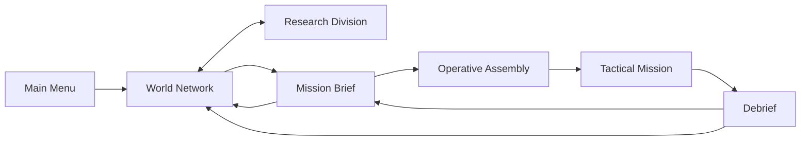

# Nexus Reborn — Game Design Document

**Document type:** Codebase-derived design specification  
**Project version reviewed:** `e270e41` plus the milestone 1 validation fixes  
**Review date:** 2026-07-29  
**Primary platform:** Desktop web browser  
**Current implementation:** React 19, TypeScript, React Three Fiber, Three.js WebGPU/WebGL2, Zustand  

## 1. Document purpose

This document reconstructs the intended game from the current repository. It is both:

1. A source-of-truth description of the playable build.
2. A production guide for completing the larger game implied by the existing systems and interface.

The following labels distinguish evidence from recommendation:

- **Implemented:** Functional in the current build.
- **Scaffolded:** Represented in data or UI, but incomplete as a game system.
- **Recommended:** A proposed extension that closes an identified design gap.

Where code and decorative UI disagree, the simulation code is treated as authoritative.

---

## 2. Executive summary

### High concept

**Nexus Reborn** is a cyberpunk corporate strategy and real-time tactics game in which the player acts as an executive operations director. From a global command network, the player monitors a changing corporate world, funds weapons and augmentation research, selects contracts, assembles a four-operative strike team, and commands that team through dangerous rain-soaked city districts.

The current build delivers a persistent three-contract campaign inside a broader strategic shell; one contract has a full authored design and two run on placeholder objective sets. Its most distinctive qualities are:

- A dense, diegetic corporate command interface.
- A four-operative real-time tactical control model.
- Enemy awareness driven by sight, sound, investigation, and local alert propagation.
- Civilian collateral as both a tactical risk and an economic penalty.
- A strategic clock shared by world events and a 21-project research program.
- A deterministic, procedural city and a no-external-assets production approach.
- A saved campaign loop: outcomes move the world, intel opens contracts, injuries gate the roster.

### Product definition

| Attribute | Current definition |
|---|---|
| Genre | Real-time squad tactics with a strategic management layer |
| Perspective | Fixed-angle isometric-style 3D camera |
| Player role | Corporate Operations Director / `OPS_DIRECTOR` |
| Setting | Corporate-controlled near-future Earth, beginning 2087.05.14 |
| Core unit | Four cybernetically enhanced operatives |
| Input | Keyboard and mouse |
| Target display | Desktop, minimum 1280×720 |
| Session structure | Strategic planning → briefing → squad assembly → tactical mission → debrief |
| Current content | Three playable contracts (two on placeholder objective sets), eight operatives, five weapons, 21 research projects |
| Monetization | None represented in the codebase |
| Networking | Single-player; no multiplayer systems represented |
| Persistence | Versioned localStorage autosave; tactical mission state stays memory-only |

### Player promise

> Read a hostile corporate world, invest in the right technologies, deploy the right four-person team, and execute a precise operation where every shot can change both the firefight and the contract payout.

---

## 3. Design pillars

### 3.1 Command, do not micromanage

The player directs a small team using selection groups, move and attack orders, and persistent tactical stances. Operatives automatically acquire visible targets when weapons are free, allowing the player to focus on positioning and tempo instead of issuing every shot.

### 3.2 Information is operational power

The interface exposes world unrest, corporate control, patrol routes, objective zones, enemy awareness, weapon state, and camera coverage. The intended skill is reading the situation quickly and making a small number of consequential orders.

### 3.3 Violence has corporate consequences

Combat is fast and noisy. Missed shots continue downrange and can strike other bodies. Civilian casualties are not merely flavor: the client deducts credits for every unique civilian hit by the squad.

### 3.4 The strategic and tactical layers feed each other

Contract rewards fund research. Completed research changes deployed weapon and operative statistics. The world clock advances both the corporate world and the labs.

The loop now runs in both directions. Mission outcomes change sector control and unrest, post feed events, award intel, and unlock further contracts. City ownership is the one strategic value missions do not yet move.

### 3.5 A cohesive corporate-terminal fantasy

Every surface uses the same near-black, teal, amber, and red command language. Briefings, squad assembly, research, the world map, the HUD, and the debrief should feel like different modules of one secure corporate operating system.

---

## 4. Setting, tone, and narrative frame

### World

The game begins on **2087.05.14** in a world divided into corporate spheres of influence. Cities change hands through trade, seizures, raids, unrest, and infrastructure failure. The player’s organization operates a secure global command network and deploys enhanced operatives on contracts for powerful corporate clients.

### Player identity

The player is framed as:

- User: `OPS_DIRECTOR`
- Clearance: Executive
- Network: secure corporate command interface
- Tactical asset: `STRIKE TEAM 04`

The player is not an individual operative. They are the remote decision-maker who controls funding, mission acceptance, personnel selection, and battlefield orders.

### Corporations and clients

| Organization or state | Strategic function | Visual color |
|---|---|---|
| Stratos Industries | City holder and contract client/faction | Cyan |
| Nexus Global | City holder and corporate faction | Green |
| Helix Corp | City holder and contract client/faction | Amber |
| Omnicorp | City holder and CorpSec affiliation in Glass Veil | Muted teal-gray |
| Sable Enterprises | Client for Glass Veil; no city holdings or strategic simulation identity | No faction color defined |
| Contested | Map ownership state | Red |
| Unknown | Unsurveyed map state | Dark teal |

The player organization is not explicitly defined as one of the four city-holding corporations. “Nexus” appears as both a map faction and the repository identity, but the build does not formally state that the player serves Nexus Global.

### Tone

- Cold, procedural, and corporate.
- Tactical violence described through system logs and contract language.
- Operatives communicate in short, professional acknowledgements.
- Civilians and collateral keep the player’s actions morally and financially legible.
- Visual drama comes from night, rain, neon, scanlines, warning states, and sparse bloom.

### Narrative delivery

Narrative is currently delivered through:

- Mission briefing copy.
- World event feed.
- Operative names, codenames, roles, and short biographies.
- Research project descriptions.
- In-mission comm log.
- Objective updates.
- Debrief statistics and payout adjustments.

There are no cutscenes, dialogue trees, character relationships, or campaign chapters in the current implementation.

---

## 5. Game structure

### Screen and state flow

### Current flow rules

1. The menu offers CONTINUE when a valid save exists, and NEW OPERATION behind a two-step erase confirm.
2. The World Network opens with Europe selected.
3. The player may inspect sectors, run the strategic clock, review world events, or enter Research.
4. Selecting an unlocked contract opens its briefing; contracts unlock at their required intel level.
5. Accepting the contract opens Operative Assembly.
6. Exactly four operatives must be assigned before deployment.
7. The player completes sequential objectives or loses the squad.
8. A debrief applies the payout, the sector effects, intel, and roster changes, then returns the player onward.
9. Strategy screens autosave; the mission and debrief never write a save.

### Core loops

#### Strategic loop

1. Monitor world state and available operations.
2. Advance or pause world time.
3. Fund available research projects.
4. Choose a contract.
5. Assemble a team.
6. Complete the mission.
7. Receive credits, less collateral penalties.
8. Reinvest in research.

#### Tactical loop

1. Read patrols, objective markers, sight cones, and civilian positions.
2. Select one or more operatives.
3. Move as a formation or establish a hold position.
4. Avoid, investigate, or deliberately trigger enemy awareness.
5. Engage hostiles through automatic or explicit targeting.
6. Complete the active objective.
7. Repeat until extraction.

#### Research loop

1. Inspect available projects and prerequisites.
2. Commit credits to one project in a branch laboratory.
3. Advance world time on the World Network or Research screen.
4. Complete the project.
5. Unlock dependent projects.
6. Apply completed effects to future deployments.

---

## 6. Strategic layer

### 6.1 World clock

**Implemented**

- Start timestamp: **2087.05.14 14:32:17 UTC**.
- At 1× speed, one real second advances 60 world seconds.
- Available speeds: **1×, 2×, 4×, 8×**.
- Initial speed: **2×**.
- The clock can be paused.
- World time advances only while the World Network or Research screen is mounted.
- World time does not advance during the menu, briefing, squad assembly, tactical mission, or debrief.
- The tactical mission uses its own independent clock, beginning at **22:14:08**.
- The player can scrub and keyboard-navigate a rolling 24-hour event timeline without changing the live world state.

This clock is the shared authority for world events, research completion, and operative injury recovery.

### 6.2 Continental sectors

| Sector | Initial control | Initial unrest | Influence weight | Status |
|---|---:|---:|---:|---|
| North America | 68% | 12% | 1.15 | Open |
| South America | 41% | 24% | 0.85 | Open |
| Europe | 62% | 18% | 1.20 | Open |
| Africa | 37% | 28% | 0.90 | Open |
| Asia | 55% | 16% | 1.35 | Open |
| Oceania | 73% | 9% | 0.55 | Open |
| Antarctica | 0% | 0% | 0.00 | Locked / no survey data |

Each open sector exposes:

- Control.
- Unrest.
- Weekly tax yield.
- Influence income.
- Black-market impact.
- Garrison condition.
- Total forces.
- Defense rating.

The simulation also calculates an asset count for each sector, but the current sector panel does not display it.

The **influence index** is the weighted average control of all open sectors, shown as a percentage. Beside it the player holds a spendable **influence points** balance (section 7.4). The sector panel exposes three numbered actions per sector, each with a point cost and a per-sector cooldown, disabled when unaffordable:

1. **STABILIZE** (8 pts): −12 unrest applied over 6 world hours in hourly steps. 24-hour cooldown.
2. **LOBBY** (10 pts): +8 control applied over 12 world hours in eight steps. 36-hour cooldown.
3. **EXPEDITE** (12 pts): the sector's lowest-intel-gate open generated contract loses its intel requirement and gains 24 world hours of expiry. 24-hour cooldown.

Staged spends run on the strategic clock through the same time-ordered catch-up as events, so a contract ETA jump applies them exactly as continuous ticking would. Balance numbers live as data in `src/game/influence.ts`.

A sector that holds above **60 unrest** decays: every 6 world hours it loses 1–2 control, and its tax yield readout falls with the strain (2% per unrest point above the threshold, floored at 25%). At **85+ unrest** the sector enters **CRISIS**: it reads red on the plate and the sector list, a red feed event posts, its event frequency doubles, and its open generated contracts gain the priority tag. Crisis clears, with a green feed event, once unrest falls under **70**. Unrest is clamped to 2–96 so the crisis band is reachable.

### 6.3 City ownership

**Implemented**

The world map contains 18 named cities. Each has a current corporate holder. A sector’s displayed corporate color is determined by which corporation holds the most cities in that sector; ties display as contested.

Ownership can change through generated seizure events, and it now drives contract supply: the client of every generated contract is the corporation holding the most cities in its source sector (ties break in a fixed holder order), and a seizure event that flips a city re-clients that sector's open generated contracts and posts a feed note. Ownership still has no effect on research, prices, or tactical missions.

### 6.4 Dynamic world events

**Implemented**

Event categories:

| Event | Typical strategic effect | Contract market effect |
|---|---|---|
| Riot | Raises unrest and reduces control | 45% chance to spawn a linked priority suppression contract in the sector |
| Blackout | Raises unrest | — |
| CorpSec raid | Reduces unrest and may improve control | 35% chance to withdraw an open generated contract from the sector |
| Trade agreement | Improves control and may reduce unrest | — |
| Seizure | May change city ownership and alter control/unrest | A city flip re-clients the sector's open generated contracts |

Events occur every **15–45 world minutes** and favor high-unrest sectors; a sector in crisis draws events at **double weight** (section 6.2). The feed stores up to 40 events, displays the most recent 14 for the selected timeline point, and tracks unread events. The market probabilities live as data beside the event tables in `src/state/worldStore.ts` (`EVENT_CONTRACT_FX`); the sector and kind weight tables themselves live in `src/game/forecast.ts`, where the intel event forecast reads the same rows the generator rolls from.

Events also share the feed with the generated contract market: new offers, priority offers, expiries, withdrawals, and re-clienting all post `contract` events. Crisis entries and exits post `crisis` events, and influence spends post `influence` events. Contract generation, staged influence spends, unrest decay, and the influence trickle all run on the same strategic clock and the same time-ordered catch-up path as events, so a contract ETA jump lands exactly where continuous ticking would have.

At intel level 2+ the sector panel shows an **event forecast**: the chance of each event category landing in the focused sector over the next 6 world hours, derived from the shared weight tables rather than a duplicate set of constants.

Mission results feed this system. A win raises the mission sector's control and lowers its unrest; a loss does the opposite. Each result posts its own feed event, green for a win and red for a loss, and civilian hits add unrest.

### 6.5 Intel and contract access

**Implemented**

- Initial intel level: **1**, with 25/100 progress.
- A contract win awards **+40** progress; a clean win (zero civilians hit by the squad) awards **+15** more.
- A lost contract awards nothing.
- Each 100 progress rolls into the next level.
- Every contract carries a required intel level. Hollow Crown and Rust Haven need level 2.
- Antarctica and the unbuilt navigation tabs stay locked at every intel level.

Intel's second strategic use is forecasting. At intel level 2+:

- The World Network sector panel shows the next-6-hours event risk per category for the focused sector (section 6.4).
- The mission brief replaces the legacy projected-success percentage with a computed **risk index** (LOW / GUARDED / HIGH / SEVERE), derived in `src/game/forecast.ts` from the actual deployment build: the same patrol, garrison, and civilian counts the tactical rail lists, weighted by enemy toughness and weather.

The EXPEDITE influence action (section 6.2) can waive a generated contract's intel gate.

---

## 7. Economy and progression

### 7.1 Credits

**Implemented**

- Starting balance: **128,450 CR**.
- Credits pay for research.
- Successful contracts add their net payout.
- Failed contracts pay nothing.
- The balance cannot be overdrawn by research authorization.

Influence points are the second resource, earned and spent on the strategic layer alone (section 7.4).

### 7.2 Collateral penalty

Each unique civilian hit by an operative deducts **5,000 CR** from a successful contract.

Rules:

- The fine is assessed on the first squad-caused hit, not only on death.
- Repeated hits to the same civilian do not add additional fines.
- CorpSec-caused civilian damage does not count against the player.
- Total deductions are capped at the contract reward.
- A failed mission already pays zero, so collateral does not create debt.

### 7.3 Progression model

Tactical progression is research-driven:

- Weapon projects modify damage, range, magazine, reload time, spread, or fire delay.
- Crew projects add maximum health or movement speed to every deployed operative.
- Effects stack in project-completion order.
- Completed research is sampled when the mission is created and cannot alter an active deployment.

Beyond research, wins raise intel and mission results move sector values (sections 6.4 and 6.5), and the roster itself is a progression surface: operatives die for good, injuries cost world time scaled by the damage taken, and replacements come from a rolling candidate market for credits (section 9.1). There is currently no:

- Account level.
- Operative experience.
- Equipment ownership.
- Consumable inventory economy.

### 7.4 Influence economy

**Implemented**

Influence points are earned three ways and spent on the three sector actions (section 6.2):

- **+6** points per contract win, generated or authored.
- **+2** more for a clean win (zero civilians hit by the squad).
- **+1** per 12 world hours while the influence index holds above **55** (the trickle).

Costs: STABILIZE 8, LOBBY 10, EXPEDITE 12, each on its own per-sector cooldown (24h / 36h / 24h). The balance, staged spends, cooldowns, crisis states, and pressure timers are all persisted by the versioned save (v5). Every balance number lives in `src/game/influence.ts`.

---

## 8. Research program

### 8.1 Research rules

**Implemented**

- Three branches: Ballistics, Cybernetics, Control Systems.
- Seven projects per branch; 21 total.
- One lab per branch.
- One active project per lab.
- Up to three projects can run concurrently if each belongs to a different branch.
- Project durations use world time.
- Tiers require their listed prerequisite projects.
- Credits are spent immediately when authorization succeeds.
- Total cost of all research: **779,000 CR**.

At 1× strategic speed, one world hour takes one real minute. At the default 2× speed, a two-hour project takes approximately one real minute while a strategy screen remains open.

### 8.2 Ballistics — 248,000 CR total

| Project | Cost | Time | Prerequisites | Applied effect |
|---|---:|---:|---|---|
| Advanced Propellants | 16,000 | 2h | None | +12% assault-rifle damage |
| Barrel Wear Coating | 14,000 | 2h | None | −10% spread for all squad weapons |
| Hypervelocity Core | 30,000 | 4h | Advanced Propellants | +18% longrifle damage; +10% longrifle range |
| Caseless Ammo Feed | 26,000 | 4h | Barrel Wear Coating | +10 SMG magazine; −12% reload time for all weapons |
| Rail Stabilization | 44,000 | 8h | Hypervelocity Core | −15% spread for all weapons |
| Smart Fragmentation | 42,000 | 8h | Caseless Ammo Feed | +22% shotgun damage; +15% shotgun range |
| Tungsten Sabot | 76,000 | 14h | Rail Stabilization + Smart Fragmentation | +15% damage for all weapons |

### 8.3 Cybernetics — 261,000 CR total

| Project | Cost | Time | Prerequisites | Applied effect | Augmentation bay |
|---|---:|---:|---|---|---|
| Neural Interface I | 15,000 | 2h | None | −8% fire delay for all weapons | Neural |
| Synaptic Enhancement | 17,000 | 2h | None | +0.20 m/s move speed | Chest |
| Reflex Booster | 28,000 | 4h | Neural Interface I | −15% reload time for all weapons | Arms |
| Pain Inhibitor | 27,000 | 4h | Synaptic Enhancement | +14 max HP | Chest |
| Neural Accelerator Mk II | 48,000 | 8h | Reflex Booster | −12% fire delay; +0.15 m/s speed | Neural |
| Subdermal Weave | 46,000 | 8h | Pain Inhibitor | +22 max HP | Chest |
| Neural Cache Array | 80,000 | 14h | Neural Accelerator Mk II + Subdermal Weave | +18 max HP; +0.35 m/s speed | Neural |

### 8.4 Control Systems — 270,000 CR total

| Project | Cost | Time | Prerequisites | Applied effect | Augmentation bay |
|---|---:|---:|---|---|---|
| Targeting AI Suite | 18,000 | 2h | None | −12% spread for all weapons | Arms |
| Sensor Fusion Array | 16,000 | 2h | None | +8% range for all weapons | Neural |
| Swarm Coordination | 29,000 | 4h | Targeting AI Suite | +0.25 m/s move speed | Legs |
| Threat Prediction | 31,000 | 4h | Sensor Fusion Array | +12 max HP | Neural |
| EM Hardening | 45,000 | 8h | Swarm Coordination | +16 max HP | Legs |
| Encryption Core | 47,000 | 8h | Threat Prediction | −10% reload time for all weapons | Arms |
| Adaptive Command AI | 84,000 | 14h | EM Hardening + Encryption Core | −10% fire delay; +0.20 m/s speed | Neural |

### 8.5 Augmentation presentation

The team-selection dossier has four augmentation bays:

- Neural.
- Chest.
- Arms.
- Legs.

The latest completed project associated with each bay is displayed as the installed augmentation for every operative. This is currently presentation logic: projects apply globally to the squad, not as individually installed or swappable hardware.

---

## 9. Operative assembly

### 9.1 Squad rules

**Implemented**

- Roster cap: eight. The campaign starts at the cap with the authored roster.
- Deployment size: exactly four.
- Default squad: Mara, Ghost, Dart, Torq.
- The player may inspect an operative without assigning them.
- Assignment and inspection are separate controls.
- At least one operative must remain assigned while editing the squad.
- Deployment is disabled until all four bays are filled.
- The assembly screen shows the live roster count (for example `6 / 8 ON FILE`); the world screen's OPERATIVES readout follows the same live roster.

Death and injury are enforced:

- An operative killed in a mission is lost for good: the debrief removes them from the roster, lists them under KILLED IN ACTION, and the world feed posts a red loss event naming them. Their bay empties and must be refilled on the assembly screen before the next deployment.
- A survivor who ends a mission below 35% of maximum health returns `INJURED`. Downtime scales with the missing health: 12 world hours just under the threshold, up to 48 world hours at near-death. Survivors at or above 35% stay `READY`. The debrief lists each new injury with its recovery time.
- An `INJURED` operative cannot be assigned; the team screen disables the control and names the reason. Newly injured operatives leave the squad at debrief.
- Recovery runs on the world clock; Raven starts `INJURED` and recovers after 24 world hours.

Recruitment replaces losses:

- The assembly screen's RECRUIT control opens the recruitment market: three procedural candidates at a time, refreshed one new candidate every 24 world hours on the same strategic clock injuries recover on.
- A candidate carries a procedural name and codename, one of the eight roles, health and speed inside the authored roster's ranges, and the role's authored primary weapon. Portraits derive from stable hashes, so a candidate keeps one face.
- Hiring costs 16,000–34,000 CR by candidate quality, paid from the credit account; an overdraw is refused, as is a hire past the roster cap.
- The candidate rng is seeded and serialized with the save, so a reload continues the exact candidate sequence.

### 9.2 Operative roster

The authored eight are a starting roster, not a fixed cast: deaths remove operatives permanently, and hires from the recruitment market fill the vacated bays (section 9.1). The live roster is store state covered by the versioned save.

| Codename | Name | Role | HP | Speed | Primary | Sidearm | Status | Intended specialty |
|---|---|---|---:|---:|---|---|---|---|
| Mara | D. Torres | Assault | 124 | 4.6 | RFC-27 Assault | S-18 Pistol | Ready | Frontline breach and clear |
| Ghost | L. Fernandez | Recon | 110 | 5.2 | K-9 Rattler SMG | S-18 Pistol | Ready | Intel gathering and range |
| Dart | K. Park | Infiltrator | 98 | 5.6 | K-9 Rattler SMG | S-18 Pistol | Ready | Silent entry and close quarters |
| Torq | M. Ivanova | Demolitions | 132 | 4.2 | M6 Breacher | S-18 Pistol | Ready | Heavy ordnance and area denial |
| Raven | A. Okafor | Sniper | 92 | 4.4 | VK-88 Longrifle | S-18 Pistol | Injured | Precision and overwatch |
| Slate | J. Sato | Tech | 104 | 4.8 | K-9 Rattler SMG | S-18 Pistol | Ready | Intrusion and drone control |
| Vex | R. Volkov | Support | 118 | 4.4 | RFC-27 Assault | S-18 Pistol | Ready | Suppression and logistics |
| Kestrel | N. Diallo | Medic | 100 | 5.0 | S-18 Pistol | S-18 Pistol | Ready | Trauma and stim protocols |

Speed is measured in world meters per second. Research bonuses are added at deployment.

### 9.3 Role implementation status

**Implemented**

Every role carries one active ability and one always-on passive, both defined as data in `src/game/abilities.ts`. Q triggers the actives of the current selection; the HUD ability bar carries one per-operative button. Actives cool down for 25–45 seconds; a targeted active that finds no target reports on the comm log and keeps its cooldown.

| Role | Active (cooldown) | Active effect | Passive |
|---|---|---|---|
| Assault | Overdrive (30 s) | Fire delay halved for 6 s | +10% weapon damage on both slots |
| Recon | Pulse Scan (35 s) | All enemies and their sight cones on the minimap for 8 s | Enemies within 16 m are marked on the minimap even when calm |
| Infiltrator | Ghost Veil (35 s) | Enemies cannot gain vision awareness of this operative for 6 s; hearing still works | Enemy vision certainty builds 25% slower against this operative |
| Demolitions | Frag Charge (40 s) | Thrown under the nearest enemy within 10 m; after 1 s deals 60 damage in a 3 m radius, with a large noise and an impact flash | Takes 15% less damage |
| Sniper | Deadeye (30 s) | The next shot within 10 s cannot miss and deals double damage | +15% weapon range on both slots |
| Tech | EM Burst (35 s) | Enemies within 8 m drop to suspicious, lose their target and cannot fire for 4 s | Squad ability cooldowns run 15% faster while this operative lives |
| Support | Suppression Sweep (30 s) | For 6 s, enemies within 12 m and line of sight move at half speed | Operatives within 6 m reload 20% faster |
| Medic | Field Stim (25 s) | Heals the most wounded living operative within 8 m by 40 HP, never above max | Living operatives within 6 m regenerate 1 HP/s up to half their maximum |

Roles and loadout feed the usable item stock, fixed for the whole mission at deployment:

- Base squad: two med kits and one power cell.
- Medic: +2 med.
- Support: +1 med.
- Tech: +1 cell.
- Each filled loadout slot on a deployed operative: +1 of its item.

Both pools are squad-shared consumables. A med kit (E, or the HUD ITEMS button) heals the most wounded selected operative by 50 HP, never above max; with nobody selected wounded it reports on the comm log and spends nothing. A power cell (R) instantly finishes the first selected operative's running role-ability cooldown, with the same comm-log refusal when no cooldown runs. Power cells also arm grenades (G), so the cell pool is contested between the two uses.

Stat passives (assault damage, sniper range) are applied to the weapon copies at deployment, after research, so both slots carry them; the rest are checked live in the simulation.

### 9.4 Deployment mass

Squad mass is a real deployment constraint, computed by `src/game/mass.ts` from the same numbers the mission uses:

- 60 kg base per operative.
- Both weapon slots' authored masses (assault 4.2, SMG 3.1, pistol 1.2, longrifle 6.8, shotgun 4.9 kg).
- 0.25 kg per max-HP point above 90, so research max-HP projects add plating mass.
- 8 kg per loaded MED KIT and 6 kg per POWER CELL.

Each operative carries up to two extra item slots, chosen on the assembly screen and persisted by the versioned save; filled slots add their items to the mission pools. The 400 kg limit blocks deployment: the deploy button disables and names the overage. Mass also sets a squad-wide speed tier, applied at deployment: at or under 340 kg every operative moves +0.15 m/s faster, over 380 kg 0.15 m/s slower. The assembly screen shows the active tier next to the mass readout.

---

## 10. Mission briefing and contract selection

### Briefing purpose

The Mission Brief converts strategic data into an operational plan. It includes:

- Contract identity, client, type, threat, and reward.
- Narrative briefing and mission notes.
- Sequential objective list.
- Collateral tolerance.
- Satellite-style recon image.
- A tactical map generated from the same city layout used by the mission.
- Insertion, target, extraction, patrol, and hostile-zone overlays.
- Estimated civilian, patrol, garrison, route, block, and street counts.

### Contract acceptance

There is no contract cost or confirmation dialog. Accepting a contract advances directly to team selection. The contract remains replayable after success or failure.

---

## 11. Tactical mission design

### 11.1 Current mission space

The current mission takes place in a deterministic **96×96 meter** procedural district.

Fixed structural landmarks:

- Squad insertion/extraction: south, approximately `(48, 88)`.
- Main north-south avenue: central.
- Checkpoint and garrison plaza: north, approximately `(48, 14)`.
- A road and alley network divides procedural building blocks.
- Buildings retain walkable setbacks and minimum-width alleys.
- The generator guarantees connectivity from insertion to the checkpoint, enemies, patrol paths, and extraction.

Population:

- Four deployed operatives.
- Seven checkpoint garrison enemies.
- Five street patrol enemies.
- 22 civilians.

The visual district is reconstructed from the mission seed, so a given mission is repeatable.

### 11.2 Selection

**Implemented**

- Left click selects one operative.
- Shift + left click adds or removes an operative from selection.
- Left drag box-selects all living operatives whose projected center falls inside the marquee.
- Shift + drag adds to the existing selection.
- Left click on empty ground clears selection.
- Left click on an enemy preserves the current selection.
- Number keys 1–4 select one squad slot.
- `0` or backtick selects all living operatives.
- Backspace clears selection.
- The mission begins with all living operatives selected.
- Dead operatives are automatically excluded from future order recipients.

### 11.3 Orders and stances

#### Move

Right click on the ground sends selected operatives to a compact spread around the destination.

- Group destinations use a ring formation so agents do not stack.
- A move order clears explicit targeting.
- A move order releases Hold Ground.
- Operatives automatically stop and engage visible enemies along the route when weapons are free, then resume moving.

#### Attack

Right click on a living hostile assigns it as an explicit target.

- Operatives chase until line of sight and range are available.
- Explicit attack orders override Hold Fire.
- Hold Ground prevents chasing but does not cancel the target.

#### Stop

`X` clears pathing and targeting for the selected operatives. Hold Ground and Hold Fire flags remain unchanged.

#### Hold Ground

`H` toggles Hold Ground for the selection.

- The operative is pinned in place.
- An active path is parked and restored when the hold is released.
- Separation does not push a held operative out of position.
- The operative may still fire.

#### Hold Fire

`C` toggles Hold Fire for the selection.

- Automatic targets are cleared.
- The operative does not auto-acquire.
- A later explicit attack order still fires.

### 11.4 Movement and navigation

**Implemented**

- Eight-direction A* pathfinding on a one-meter walk grid.
- Diagonal corner cutting is forbidden.
- Paths are straightened when line of sight permits.
- Blocked destinations snap to the nearest walkable cell.
- Units slide along a valid axis when collision geometry blocks a full movement step.
- Local separation keeps living units from overlapping.
- There is no rigid-body physics system.

### 11.5 Camera

**Implemented**

- Fixed 45° yaw.
- 55° elevation.
- Perspective field of view: 25°.
- Zoom distance: 44–115 meters.
- Keyboard and minimap panning.
- Smooth damping.
- Recenter on the living squad.
- Buildings that obscure operatives or important ground fade to transparent ghost shells.

The camera cannot rotate or tilt during play.

### 11.6 Enemy perception

Enemy behavior uses three states:

1. **Patrol:** follows authored patrol points at reduced speed.
2. **Suspicious:** moves to the last seen or heard location, then scans.
3. **Combat:** pursues and attacks visible operatives.

#### Vision

- Maximum vision range: **14 m**.
- Vision cone: **110° total**.
- Omnidirectional notice radius: **4.5 m**.
- Vision requires clear grid line of sight.
- Continuous sight required for certainty:
  - Approximately 0.45 seconds at close range.
  - Up to approximately 1.7 seconds at maximum vision range.

#### Hearing

- Gunshots create noise events.
- Hearing passes through walls.
- Noise supplies a location, not a target.
- Sound alone can raise awareness only to 85%, causing investigation but not immediate firing.
- Weapon noise radius increases with range and damage.

#### Alert propagation

- A guard can alert another guard within 9 m when they have line of sight to each other.
- Combat awareness does not propagate through walls.
- After losing sight for six seconds, a guard returns to suspicious investigation rather than directly to patrol.
- Awareness decays when no evidence is received.

### 11.7 Civilian behavior

**Implemented**

- Civilians wander locally when calm.
- Gunfire within 10 m causes them to flee.
- Flee behavior lasts five seconds after the latest nearby shot.
- Fleeing civilians move 50% faster.
- A direct hit forces the civilian to flee from the shooter.
- Civilians can be injured or killed by either side.

### 11.8 Combat model

Combat is real-time and automatically resolved after positioning and targeting decisions.

#### Fire prerequisites

The shooter must:

- Be alive.
- Have a weapon.
- Have ammunition in the current magazine.
- Not be reloading.
- Have completed the weapon cooldown.
- Have the target in range.
- Have line of sight.

#### Accuracy

Base hit chance is approximately:

`(0.78 − 0.28 × distance/range + random jitter) × accuracy multiplier`

The result is clamped between 5% and 95%.

- Operative accuracy multiplier: 1.0.
- CorpSec accuracy multiplier: 0.45.
- Weapon spread affects the path of missed shots, not the initial hit-roll formula.

#### Damage and fire rate

- Operatives deal the weapon’s full damage.
- CorpSec deals 70% of weapon damage.
- CorpSec weapon cooldowns are 1.75× longer than authored weapon cooldowns.
- Magazines automatically reload from an unlimited implicit reserve.

#### Misses and stray fire

Missed rounds continue along the shot lane to weapon range. The first living body intersected before cover can be hit, regardless of faction.

Consequences:

- Civilians can be hit by misses.
- Other operatives can be hit by friendly stray fire.
- Enemies can hit civilians or other enemies with stray fire.
- Cover blocks the continued shot lane.

This is a central expression of the collateral pillar and should remain highly legible through tracers, logs, and debrief feedback.

### 11.9 Weapons

| Weapon | Damage | Range | Fire delay | Magazine | Reload | Spread | Tactical identity |
|---|---:|---:|---:|---:|---:|---:|---|
| RFC-27 Assault | 11 | 16 m | 0.16 s | 30 | 1.7 s | 0.045 | Flexible sustained fire |
| K-9 Rattler SMG | 7 | 12 m | 0.09 s | 40 | 1.9 s | 0.080 | High-volume close combat |
| S-18 Pistol | 10 | 11 m | 0.45 s | 12 | 1.2 s | 0.030 | Accurate light sidearm |
| VK-88 Longrifle | 46 | 26 m | 1.60 s | 5 | 2.6 s | 0.008 | Precision long-range elimination |
| M6 Breacher | 26 | 8 m | 0.90 s | 6 | 2.2 s | 0.120 | Short-range burst damage |

**Sidearm switching:** Every operative carries two live weapon slots, the authored primary and sidearm. `V` swaps every selected operative to its other slot. The drawn weapon cannot fire for a 0.5-second readiness delay, shown as DRAWING on the HUD. Each slot keeps its own magazine: swapping cancels an in-progress reload of the stowed weapon, its round count persists as-is and resumes when drawn again. Auto-fire, ordered attacks, engagement range, noise radius, tracers, and gunshot audio all follow the drawn weapon, and weapon research applies to sidearms exactly as to primaries. Enemies carry a single weapon and never swap. Reserve-ammo values shown in the UI are informational and do not constrain the simulation.

### 11.10 Objectives

Supported objective types:

- Reach a zone.
- Eliminate all living enemies with a specified tag.
- Extract every surviving operative.

Objectives are strictly sequential. A later objective cannot complete early.

Completion rules:

- Reach Zone completes when any living operative enters the radius.
- Eliminate Tag completes when no living enemy with the tag remains.
- Extract completes when every surviving operative is inside the extraction radius.

### 11.11 Win and loss

**Win:** All mission objectives complete.  
**Loss:** No living operatives remain.

The HUD presents the result immediately. After a 2.5-second delay, the game enters the debrief.

The debrief reports:

- Target.
- Eliminations.
- Squad casualties.
- Civilian collateral count.
- Mission time.
- Contract value when relevant.
- Collateral penalty when relevant.
- Net payout.
- New account balance.

---

## 12. Current content catalogue

### 12.1 Contracts

Contract supply is the authored three plus a procedural stream.

| Codename | Location | Type | Client | Threat | Reward | Chance | ETA | Status |
|---|---|---|---|---|---:|---:|---:|---|
| Glass Veil | New Carthage, District 07, Europe | Seizure | Sable Enterprises | Severe | 85,000 CR | 78% | 2 days | Playable |
| Hollow Crown | Shingang, District 21, Asia | Extraction | Helix Corp | High | 62,000 CR | 64% | 4 days | Intel level 2; placeholder objective set |
| Rust Haven | Detroit Sprawl, District 03, North America | Sabotage | Stratos Industries | Moderate | 41,000 CR | 82% | 3 days | Intel level 2; placeholder objective set |

Displayed chance and ETA are authored presentation values. They do not affect simulation outcomes or strategic time.

**Generated contracts** (`src/game/contracts.ts`) keep the market stocked beside the authored three:

- The world keeps up to 3 generated contracts open; a new one rolls every 2–6 world hours when below target, weighted toward sectors with high unrest or low control.
- Parameters derive from the source sector: threat from its defense rating and garrison condition, reward from threat and the sector's influence weight (30,000–95,000 CR on a 500 CR grid), client from city ownership, type from seizure / extraction / sabotage (plus riot-linked suppression).
- Every contract is fully playable end to end through the standard pipeline: each type maps to a district archetype (seizure and suppression to checkpoint, extraction to compound, sabotage to industrial) with an objective set built from the existing reach / eliminate / interact / escort / destroy / extract primitives, and enemy counts scale with threat through the shared mission modifiers.
- Intel gating applies by threat: moderate needs level 1, high level 2, severe level 3.
- Unaccepted offers expire after 24–48 world hours (priority offers 8–16) and post a feed line; a fulfilled or failed generated contract applies the standard debrief consequences and then leaves the market. World Network rows and markers show a GENERATED or PRIORITY tag with an expiry countdown.
- The roll cursor is a serialized rng like the event stream, and every rolled field lands in the versioned save (v4), so a reload reproduces the same open contracts.

### 12.2 Glass Veil

#### Premise

CorpSec has sealed District 07 behind an Omnicorp checkpoint. Sable Enterprises wants the district opened for an asset transfer at 23:00. The squad inserts on the south perimeter and advances through market blocks under heavy rain.

#### Conditions

- Heavy rain.
- Reduced-visibility framing.
- Moderate civilian density.
- Low collateral tolerance.
- Severe threat rating.

Rain is visual. It does not currently change sight distance, accuracy, movement, or sound.

#### Objective sequence

1. **Reach the checkpoint gate.**
   - Any living operative enters the checkpoint zone.
2. **Eliminate the CorpSec garrison.**
   - Kill the seven checkpoint enemies tagged `garrison`.
   - Five untagged street patrols are optional unless they threaten the squad.
3. **Extract the squad.**
   - Move every surviving operative back to the southern insertion zone.

#### Tactical arc

- Approach from the comparatively low-rise southern edge.
- Read and bypass or engage five street patrols.
- Manage civilians who flee across fire lanes.
- Breach the guarded northern plaza.
- Eliminate a six-unit mixed rifle/SMG garrison and one 80-HP longrifle guard.
- Return south with all survivors.

---

## 13. User interface and experience

### 13.1 Interface principles

- DOM UI surrounds and overlays the 3D scene.
- Near-black backgrounds preserve contrast.
- Teal communicates operation and selection.
- Amber communicates focus, authorization, and active objectives.
- Red communicates danger, lock states, damage, and failure.
- Green communicates completion and positive status.
- Small monospace uppercase labels create a command-terminal identity.
- Primary values should remain visually larger than labels.

### 13.2 Main surfaces

#### Main Menu

- Establishes the secure-system fiction.
- Unlocks browser audio on the first user gesture.
- Offers CONTINUE when a valid save exists.
- Offers NEW OPERATION behind a two-step erase confirm.
- Opens the SETTINGS panel (audio, controls, accessibility).

#### World Network

- Sector selection and corporate ownership map.
- Mission markers and operation list.
- World time controls and 24-hour review timeline.
- Dynamic events feed.
- Credits, influence, operative count, and intel display.
- Campaign-complete banner after all three contracts are won.
- Navigation to Research.
- First-visit orientation overlay naming the panel groups and the Research tab; its dismissal persists with the save.

#### Research Division

- Three simultaneous branch trees.
- Four node states: researched, active, available, locked.
- Live progress fills.
- Project detail, prerequisites, effects, time, cost, and authorization.
- Lab status and program summary.

#### Mission Brief

- Recon image and code-derived tactical plan.
- Dossier, objectives, notes, threat, reward, and collateral tolerance.
- Contract acceptance.

#### Operative Assembly

- Roster inspection and assignment.
- Four squad bays.
- Research-adjusted stats and weapon values.
- Installed-augmentation presentation.
- Two loadout item slots per operative (med kit / power cell / empty).
- Enforced deployment mass with the 400 kg limit and the speed-tier readout.

#### Mission HUD

- District clock and static weather readouts.
- Alert level.
- Account credits.
- Squad cards with HP, magazine, selected/active state, and tactical stances.
- Objective list.
- Comm log.
- Active operative’s primary and sidearm readout.
- Live ability bar: one role-ability button per squad member with ready, cooldown-fill, and running-duration states, plus the grenade control.
- Usable item buttons with live med kit and power cell counts, disabled at zero.
- Interactive, zoomable minimap.
- Pause menu and mission result banner.
- First-mission tutorial toasts and one-shot contextual advisories, dismissible, never blocking input or pausing the sim; progress persists with the save.

#### Debrief

- Outcome, combat, collateral, timing, and economy.
- Applies the sector, intel, and roster consequences exactly once per outcome.
- Return to World Network or replay.

### 13.3 Minimap

**Implemented**

- Rotated to match screen orientation.
- Building footprints and roads.
- Extraction and checkpoint zones.
- Active-objective pulse.
- Calm, suspicious, and combat enemy states.
- Sight cones for suspicious and combat guards.
- Civilians and operatives.
- Ground footprint of the current camera.
- Three zoom levels.
- Click and drag to steer the camera.

### 13.4 Pause and control discovery

Space or Escape opens a modal pause menu. The menu:

- Freezes simulation and camera motion.
- Displays every mission binding from the same authoritative binding table used by input, including any player remaps.
- Supports focus trapping.
- Offers Resume.
- Opens the SETTINGS panel; the sim stays frozen and closing returns to the pause menu.
- Uses a two-step, three-second confirmation window for Abort.

Abort returns to the World Network and discards the current mission state without a debrief.

Control discovery is also carried by the first-mission tutorial: a sequence of small dismissible HUD toasts (selection, move, attack, stances, ability, items, weapon swap, directives, extraction) that name the current bindings, advance when the player performs the action or dismisses them, and never block input. A SKIP TUTORIAL control marks all steps seen. One-shot contextual advisories fire at most once per campaign: an operative under 35% health with med kits in stock, the first combat alert, a role ability left ready for a minute, and an overweight deployment.

### 13.5 Accessibility status

**Implemented**

- Most major buttons have contextual accessible labels.
- Research nodes support Enter and Space.
- The timeline supports arrows, Home, and End.
- Pause-menu and settings-panel focus is trapped and restored.
- The minimap is keyboard-focusable but its declared arrow-key behavior is actually handled by the global camera controls.
- Color is often reinforced by labels, icons, or state text.
- Remappable controls (settings panel; pause, operative slots, and mouse stay fixed).
- Reduced-motion mode: decorative sweeps disappear, looping pulse and flow animations freeze, the minimap objective pulse holds a steady ring, and rain drops to minimum density.
- High-contrast mode: brighter ink tiers and stronger frame lines.
- Text scaling at 90/100/110/125%; screens scroll rather than clip at the larger sizes.
- All of it persists in localStorage separate from the campaign save, so NEW OPERATION keeps the player's settings.

**Recommended**

- Full keyboard navigation for all screen panels.
- Color-vision presets.
- Captions or textual equivalents for all audio cues.
- Screen-reader validation of the tactical HUD.

---

## 14. Controls

The tables below list the default keys. Every keyboard action except the pause keys and the operative slots can be remapped from the SETTINGS panel; the pause menu, the tutorial prompts, and the input handlers all read the same binding table, so a remap renames itself everywhere at once.

### Camera

| Input | Action |
|---|---|
| W / Up | Pan forward |
| S / Down | Pan backward |
| A / Left | Pan left |
| D / Right | Pan right |
| F | Recenter on living squad |
| `=` / Numpad `+` | Zoom in |
| `-` / Numpad `-` | Zoom out |
| Mouse wheel | Zoom |
| Minimap click/drag | Steer camera |

### Squad

| Input | Action |
|---|---|
| 1–4 / Numpad 1–4 | Select operative slot |
| 0 / backtick / Numpad 0 | Select all living operatives |
| Backspace | Clear selection |
| X | Stop and clear orders |
| H | Toggle Hold Ground |
| C | Toggle Hold Fire |
| V | Swap weapon |
| Space / Escape | Pause menu |

### Abilities

| Input | Action |
|---|---|
| Q | Use the selected operatives' role ability |
| E / M | Use a med kit on the most wounded selected operative |
| R | Use a power cell to finish the selected operative's ability cooldown |
| G | Arm / cancel grenade targeting |

### Mouse

| Input | Action |
|---|---|
| Left click operative | Select |
| Shift + left click | Add/remove selection |
| Left drag | Box select |
| Shift + left drag | Add box selection |
| Left click bare ground | Clear selection |
| Right click ground | Move order |
| Right click hostile | Attack order |
| Double-click squad HUD card | Center camera on operative |

---

## 15. Art direction

### Visual identity

The project uses a late-1980s/1990s cyberpunk strategy-game vocabulary rebuilt as a crisp modern browser interface:

- Near-black and dark blue-green ground.
- Teal operational graphics.
- Amber active/focus states.
- Red hostile and failure states.
- Thin technical borders.
- Monospace uppercase typography.
- Scanlines, vignette, radar sweeps, data chips, coordinate labels, and barcodes.

### Tactical scene

- Nighttime urban district.
- Heavy rain.
- Wet asphalt and puddle-like roughness variation.
- Cool window light and warm street lamps.
- Procedural neon banners.
- Dense towers, blocks, slabs, and industrial structures.
- Instanced cars, barriers, crates, dumpsters, pillars, and checkpoint dressing.
- Emissive-only bloom keeps lights controlled.
- Building ghosting protects tactical readability.

### Units

Units are assembled procedurally from simple geometry:

- Operatives use cool armored forms and personal accent colors.
- CorpSec uses dark coats, red visors, faction rings, and garrison markings.
- Civilians use varied procedural colors.
- Operatives display slot tags, health pips, selection rings, and route feedback.
- Enemies display alert/suspicion markers and health feedback.

### Effects

- Colored weapon tracers.
- Muzzle flashes and impact/death flashes.
- Dashed movement routes.
- Destination rings.
- Click markers.
- Objective pulses.
- Two-layer camera-following rain.
- Scanline and vignette overlay.

### Asset strategy

**Implemented constraint:** No external art assets.

The build generates:

- Canvas textures.
- SVG portraits and full-body figures.
- Icons and glyphs.
- Unit geometry.
- World-map graphics.
- UI decoration.

This keeps the build self-contained and stylistically consistent. A future external asset pipeline should be introduced only if the project intentionally changes this constraint.

---

## 16. Audio direction

### Current audio

All audio is synthesized at runtime with Web Audio:

- Weapon-specific gunshots.
- Reload sound.
- Confirmation blip.
- UI click.
- Alert sting.
- Objective-complete chime.
- Death thud.

Voices use filtered noise and oscillator envelopes. Rate limiting prevents dense combat from stacking excessive simultaneous sounds.

Every voice routes through one of two channel gains (UI cues and combat) under a master gain. The SETTINGS panel carries master, UI, and combat sliders (0-100) plus a mute switch; the sliders multiply, and the levels persist with the player settings, not the campaign save.

### Current limitations

- No music.
- No ambient rain bed.
- No city ambience.
- No spoken operative dialogue.
- No spatial audio model.

### Recommended audio goals

- Low industrial ambience on strategy screens.
- Rain, distant traffic, electrical hum, and sirens in missions.
- Clear perceptual separation among squad, CorpSec, UI, and objective sounds.
- Optional synthetic radio voice treatment for operative acknowledgements.
- Independent music and ambience levels once those beds exist.

---

## 17. Difficulty and balance

### Current balance model

There is one authored difficulty state and no selectable difficulty setting.

Player advantages:

- Four operatives.
- Full weapon damage.
- Higher accuracy.
- Faster weapon cooldowns than CorpSec.
- Automatic target acquisition.
- Tactical pause freezes the simulation.
- Enemy states and sight cones are visible on the minimap.
- Research can permanently improve future deployments within the session.

Enemy advantages:

- Numerical superiority: 12 hostiles.
- Patrol coverage across the route.
- Alert propagation.
- Longrifle garrison guard.
- Civilian presence complicates fire lanes.

### Economy pressure

Glass Veil pays 85,000 CR. The full research tree costs 779,000 CR, so repeated mission income or additional contracts are required to complete progression. The current build allows unlimited replay of the same contract and has no diminishing rewards.

### Recommended difficulty vectors

Difficulty should modify readable systems rather than hide information:

- Enemy sight confirmation time.
- Enemy accuracy and cooldown multiplier.
- Patrol count and route overlap.
- Garrison composition.
- Civilian density.
- Research and contract economy.
- Alert propagation distance.
- Optional-objective requirements.

Avoid increasing difficulty by removing minimap information without offering compensating tools.

---

## 18. Technical design

### 18.1 Runtime architecture

| Layer | Responsibility |
|---|---|
| `src/game/` | Pure TypeScript simulation, static data, pathfinding, research effects, audio |
| `src/world/` | Deterministic procedural city generation |
| `src/scene/` | React Three Fiber / Three.js rendering and mission input |
| `src/ui/` | DOM screens, HUD, minimap, briefing visualizations |
| `src/state/` | Zustand stores for app, world, research, and low-frequency mission UI |

### 18.2 State boundaries

- High-frequency mission state lives in a mutable `WorldApi`, outside React.
- Render systems read unit positions and effects directly each frame.
- Mission UI is synchronized at approximately 5 Hz.
- The minimap redraws at approximately 10 Hz.
- The strategic clock batches updates at approximately 20 Hz.
- App, world, research, campaign, and mission UI have separate stores.
- A save module writes the app, world, research, and campaign stores to localStorage with a debounced autosave; the mission and debrief phases suspend writes.

### 18.3 Simulation timing

- Tactical frames are subdivided into steps no larger than 0.05 seconds.
- Up to five seconds of a long frame gap can be consumed.
- Opening warm-up prevents multiple unseen seconds from simulating while WebGPU pipelines compile.
- World and tactical clocks are intentionally independent.

### 18.4 Rendering

- React Three Fiber root is manually configured.
- Three.js `WebGPURenderer` is preferred.
- WebGL2 fallback occurs through renderer initialization.
- ACES filmic tone mapping.
- Emissive MRT bloom pipeline.
- Device pixel ratio constrained to 1–1.75.
- Static city geometry uses instancing.
- Units and effects use pooled geometry and preallocated buffers.
- Per-frame hot paths are designed to avoid allocation.

### 18.5 Determinism

- Missions and cities use the mission seed.
- Portraits and UI figures use stable hashes.
- Strategic event generation steps an explicit, serializable rng state, so a reload continues the same sequence.
- Procedural rain and WebAudio noise use unseeded randomness because they do not affect gameplay.

### 18.6 Browser and layout

- Minimum supported viewport: **1280×720**.
- Smaller browser windows preserve the minimum layout and scroll rather than compressing panels.
- Mission scene is full viewport with DOM HUD overlays.
- There is no mobile or touch-control design.

### 18.7 Build and quality

- The checks are `npm run lint`, `npm run test`, and `npm run build`.
- A vitest suite (26 files, 424 tests) covers the pure layers: `src/game/`, `src/world/`, `src/state/`.
- Beyond unit coverage, the suite carries scenario tests: an orders-driven Glass Veil playthrough (advance, clear the garrison by weapon fire, extract, net payout) and a squad wipe driven by CorpSec fire; a cross-store economy integration test (payout minus fines, intel and influence awards, research spend gating, hiring, influence spends) holding a credits-never-negative invariant; research program sums against the authored tables and effect-stacking order; and an objective-completability sweep over the three authored missions plus all four generated-contract types (zones walkable and reachable from insertion, tagged and device sets nonempty, extraction last).
- Saves are versioned; the loader validates a blob and discards it on any mismatch. The settings and telemetry blobs live under their own keys with their own version guards.
- Scene and DOM screens rely on the manual click-through.

---

## 19. Implemented, scaffolded, and missing systems

### 19.1 Implemented and functional

- Complete screen flow from menu to debrief.
- Interactive world map with six open sectors.
- Strategic time controls and review timeline.
- Dynamic world events and city ownership changes.
- Credit economy.
- Full 21-node research tree with real gameplay effects.
- A live operative roster (cap eight) and four-person assembly.
- Permanent operative death with KIA reporting in the debrief and the world feed.
- Graded injury recovery scaled by end-of-mission health.
- A seeded, save-persistent recruitment market with quality-priced hires.
- Code-derived mission briefing map.
- One deterministic procedural tactical district.
- Real-time selection, formation movement, attack, stop, Hold Ground, and Hold Fire.
- A* pathfinding and line-of-sight checks.
- Patrol, suspicion, combat, hearing, vision, and alert-propagation AI.
- Civilian wandering, fleeing, damage, and collateral fines.
- Five differentiated weapons with sidearm slots and V swapping.
- Per-role active abilities and passives.
- Usable med kits and power cells from a squad-pooled, role-and-loadout-fed stock.
- Per-operative loadout slots and an enforced deployment-mass model with speed tiers.
- Sequential objectives, win/loss, and debrief.
- Functional minimap, camera controls, pause menu, and abort confirmation.
- Procedural visuals and audio.
- Versioned save/load with autosave, boot validation, CONTINUE, and NEW OPERATION.
- Mission outcomes that move sector control and unrest and post feed events.
- Intel earned from wins and clean wins; intel-gated contract unlocks.
- Campaign completion state after all three contracts.
- Injury enforcement with timed recovery on the world clock.
- First-mission tutorial toasts, one-shot contextual advisories, and the World Network onboarding overlay, with save-persistent progress.
- A settings panel (main menu and pause): audio channel sliders and mute, control remapping with conflict rejection, reduced-motion, high-contrast, and text scaling, persisted separately from the campaign save.

### 19.2 Scaffolded or presentation-only

- Contract ETA, and the projected-success chance below intel level 2 (at 2+ the brief shows the computed risk index instead).
- Weather effects on gameplay.
- Sector assets and black-market values as decision systems. Defense rating and garrison condition feed generated contract threat, and tax yield now falls under unrest pressure; assets and black market stay presentation.
- Sector-intel view (the dead button; the sector panel's event forecast covers the intel readout).
- Archives and additional navigation tabs.

### 19.3 Missing for a complete campaign

- Mission outcome effects on city ownership.
- Operative experience.
- A strategic fail state; the campaign has victory and recoverable pressure only, even through sector crisis.
- Difficulty modes.
- Music and ambient sound.

---

## 20. Recommended product roadmap

Every milestone is complete: Milestone 2 shipped with the objective-engine work (the full Hollow Crown and Rust Haven designs, section 12), and Milestone 5 items 3-5 closed on 2026-07-30. The roadmap below is a record, not a backlog.

### Milestone 1 — Close the campaign loop (complete 2026-07-29)

1. Add save/load for credits, world time, sectors, city ownership, research, intel, and operative state. Done.
2. Make mission outcomes change the strategic world. Done for sector control, unrest, and the event feed.
3. Award intel and unlock Hollow Crown and Rust Haven. Done, with placeholder objective sets.
4. Give the campaign an explicit success condition and recoverable failure pressure. Done.
5. Prevent injured operatives from deploying. Done.

Known limits: missions do not flip city ownership (Glass Veil's client holds no cities); intel's second use waits for Milestone 4; Milestone 2 owns the true Hollow Crown and Rust Haven designs.

### Milestone 2 — Reach a minimum viable content set

1. Implement Hollow Crown as an extraction/rescue mission.
2. Implement Rust Haven as a sabotage mission.
3. Add objective primitives:
   - Interact/hack.
   - Escort/rescue.
   - Destroy/sabotage.
   - Defend for time.
   - Optional objective.
4. Author at least two tactical layouts or district archetypes per mission type.
5. Connect threat, chance, ETA, weather, and sector state to actual mission parameters.

### Milestone 3 — Make squad composition a real strategy (complete 2026-07-30)

1. Give every role one active ability and one passive. Done 2026-07-30.
2. Implement sidearm switching. Done 2026-07-30.
3. Convert inventory display into usable items with finite quantities. Done 2026-07-30.
4. Add loadout and deployment-mass tradeoffs. Done 2026-07-30.
5. Add recovery, injury, recruitment, and persistent operative consequences. Done 2026-07-30.

### Milestone 4 — Deepen the strategic game (complete 2026-07-30)

1. Connect control, unrest, defense, garrisons, and ownership to contract supply. Done 2026-07-30: the generated contract market rolls from sector state (sections 6.3, 6.4, 12.1).
2. Let the player spend influence. Done 2026-07-30: influence points with three numbered sector actions, costs, cooldowns, and staged application (sections 6.2, 7.4).
3. Make world events create or modify operations. Done 2026-07-30: riots can spawn priority suppression contracts, raids can withdraw offers, seizures re-client them.
4. Add consequences for ignoring high-unrest sectors. Done 2026-07-30: control decay above 60 unrest, tax yield strain, and the crisis state with doubled events and priority contracts (section 6.2).
5. Add research or intel tools that forecast event and mission risk. Done 2026-07-30: the intel level 2+ sector event forecast and the brief's computed mission risk index (sections 6.4, 6.5).

### Milestone 5 — Release readiness (complete 2026-07-30)

1. Add tutorialization and contextual control prompts. Done 2026-07-30: the first-mission toast sequence, once-per-campaign advisories, and the World Network onboarding overlay, all save-persistent (sections 13.2, 13.4).
2. Add settings, remapping, audio controls, and accessibility modes. Done 2026-07-30: the SETTINGS panel from the main menu and pause with channel volumes, capture-style remapping, reduced motion, high contrast, and text scaling (sections 13.5, 14, 16).
3. Add automated simulation, economy, research, and objective tests. Done 2026-07-30: the scripted playthrough and squad-wipe suites, the cross-store economy integration test, the research sums and stacking-order tests, and the objective-completability sweep (section 18.7).
4. Add browser/device performance tiers. Done 2026-07-30: AUTO/HIGH/MEDIUM/LOW quality tiers applied at mission mount, with AUTO probing the renderer backend and a sustained-frame-time governor that steps the persisted setting down one tier and posts a comm-log notice (section 18.4).
5. Add campaign telemetry and balance dashboards. Done 2026-07-30: opt-in, local-only mission records and the BALANCE dashboard reachable from settings and the debrief (section 22).

---

## 21. Recommended design acceptance criteria

### Campaign loop

- A successful mission visibly changes at least two strategic values. Met.
- A failed mission produces a meaningful but recoverable consequence. Met.
- Intel has at least two earn sources and at least two unlock uses. Met: two earn sources; contract gating and the level 2+ forecasts.
- Saving and reloading reproduces all strategic and roster state. Met.

### Mission content

- Every operation has at least one route choice.
- Optional engagement is possible; not every patrol must be killed.
- Civilian placement creates risk without making collateral feel arbitrary.
- Mission notes correspond to active modifiers.
- Briefing geometry matches the deployed city.

### Squad differentiation

- Every role changes at least one tactical decision.
- Every active ability has readable range, targeting, cooldown, and feedback.
- A four-person composition has identifiable strengths and weaknesses.

### UX

- Every interactive element is keyboard reachable.
- All critical states use more than color alone.
- Text remains legible at 1280×720.
- A new player can discover selection, move, attack, Hold Ground, Hold Fire, objectives, and extraction without opening source code or external documentation.

### Performance

- Stable frame pacing with four agents, 12+ enemies, 22 civilians, rain, bloom, and a dense city.
- No unbounded object creation in per-frame systems.
- Long renderer initialization never advances the unseen opening encounter.

---

## 22. Telemetry

**Implemented, local-only**

Telemetry is opt-in and never leaves the machine. The SETTINGS panel carries a `TELEMETRY: LOCAL ONLY` toggle, off by default; nothing records until the player turns it on, and no network transmission exists anywhere in the pipeline.

When enabled, the debrief boundary appends one record per mission outcome to a versioned localStorage blob under its own key (`state/telemetry.ts`), capped at 60 records FIFO. The counters ride the outcome the simulation already pushes: `world.ts` keeps plain numeric fields during the mission (the hot path allocates nothing) and hands them over once, inside `MissionOutcome.telemetry`.

Each record captures:

- Mission id, seed, outcome, and duration.
- Time to first contact.
- Per-objective completion times.
- Shots and damage by weapon (squad fire only).
- Damage dealt to hostiles and damage taken by the squad.
- Civilian hits by source (squad versus CorpSec).
- Med kit and power cell uses.
- Ability uses by role.
- Operatives killed in action.
- Payout, fines, reward, and bonus.
- The deployed squad composition by role.

The **BALANCE dashboard** (reachable from the SETTINGS panel and the debrief) aggregates the stored records in the terminal style: win rate, mean duration, mean time to first contact, collateral rate, civilian and KIA totals, item use, payout statistics, weapon damage share, and ability use by role, drawn with plain div bars. EXPORT downloads the records as JSON through a data URL; CLEAR erases the log behind a two-step confirm.

**Still recommended, unmet**

- Time spent on each strategic screen.
- World speed usage.
- Projects authorized and completion order; research spending.
- Alert-level duration.
- Number of explicit attacks versus automatic engagements.
- Hold Ground and Hold Fire usage.
- Deaths and reloads by weapon.
- The shot context of civilian hits.
- Patrols bypassed versus killed.
- Abort and replay rates.

Telemetry must distinguish a deliberate tactical choice from a usability failure; for example, an unused Hold Fire command may indicate either a preferred aggressive play style or poor control discovery.

---

## 23. Source-of-truth map

| Design area | Primary implementation |
|---|---|
| Screen flow | `src/App.tsx` |
| Missions, weapons, roster, intel | `src/game/data.ts` |
| Shared gameplay types | `src/game/types.ts` |
| Tactical simulation | `src/game/world.ts` |
| Pathfinding and line of sight | `src/game/pathfind.ts` |
| Research tree and effects | `src/game/research.ts` |
| Strategic world simulation | `src/state/worldStore.ts` |
| Research progression | `src/state/researchStore.ts` |
| Credits, squad, outcomes | `src/state/appStore.ts` |
| Intel, roster condition, campaign result | `src/state/campaignStore.ts` |
| Save, load, autosave | `src/state/save.ts` |
| City generation | `src/world/citygen.ts` |
| Mission input | `src/scene/Input.tsx` |
| Mission controls table | `src/game/bindings.ts` |
| Camera | `src/scene/CameraRig.tsx` |
| Mission HUD | `src/ui/Hud.tsx` |
| Minimap | `src/ui/Minimap.tsx` |
| World Network | `src/ui/WorldMap.tsx` |
| Research UI | `src/ui/Research.tsx` |
| Briefing, assembly, debrief | `src/ui/index.tsx` |
| Visual tokens | `src/index.css`, `src/ui/ui.css` |
| Procedural audio | `src/game/audio.ts` |

---

## 24. Glossary

| Term | Meaning |
|---|---|
| Alert | HUD level derived from the number of living enemies in combat |
| Awareness | Per-enemy certainty value from 0 to 1 |
| Candidate | A procedural operative offered by the recruitment market, hired for credits |
| CorpSec | Armed corporate security enemies |
| KIA | An operative killed in a mission, removed from the roster permanently |
| Explicit target | A hostile assigned by right-click attack order |
| Hold Fire / Tight | Prevent automatic target acquisition |
| Hold Ground | Pin an operative in place while preserving their parked route |
| Intel | Earned progression level that gates contract access |
| Operative | A player-controlled squad member |
| Review time | A historical point in the 24-hour strategic event timeline |
| Role ability | A role's active (triggered on Q, per-role cooldown) or always-on passive, defined in `src/game/abilities.ts` |
| Strategic time | World-map and research clock |
| Tactical time | Independent mission clock and simulation time |
| Tagged enemy | An enemy associated with an eliminate objective, such as `garrison` |

---

## 25. Final design statement

The codebase already establishes a coherent identity: a corporate geostrategy interface wrapped around an unusually readable real-time squad simulation. The tactical game’s strongest authored tension is not simple survival; it is moving four powerful operatives through a populated city while managing information, detection, fire lanes, and financial liability.

Milestone 1 connected the systems that already existed: mission outcomes move the world, intel opens contracts, operative status gates deployment, and the campaign survives a reload. The highest-value next step is content and mechanics: true Hollow Crown and Rust Haven designs, new objective primitives, and roles that change tactical decisions.
