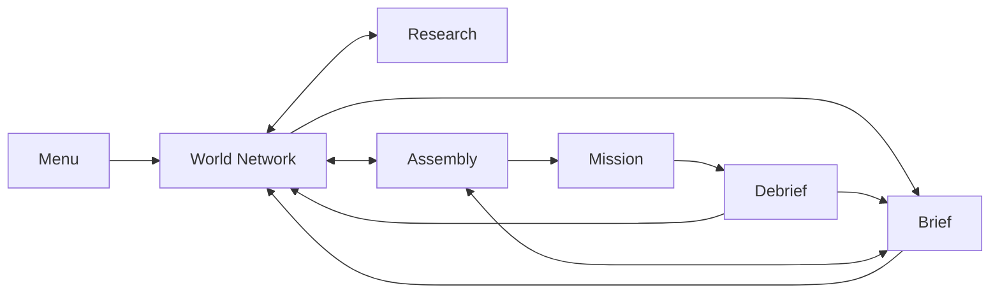

# Nexus Reborn

**Game Design Document**

A living specification of the game. It describes what the player does, what the world does back, and which rules are load-bearing. It is not a tour of the repository.

Names follow [`CONTEXT.md`](../CONTEXT.md). If this document and that glossary disagree on a name, the glossary wins and this document is wrong.

When this document and the playable build disagree, treat the disagreement as a defect in one of them and resolve both. Do not silently let either drift.

[`docs/game-design.html`](game-design.html) is a dated styled snapshot. This file, [`CONTEXT.md`](../CONTEXT.md), and [`docs/adr/`](adr/) are the spec.

---

## 1. The game

### High concept

The player is the **Operations Director** for **Nexus Global**. From the World Network they watch cities change hands, fund a research program, accept deniable contracts, and deploy a four-operative squad into neon districts.

The fantasy is remote command, not heroics. The player never walks the street. They read a situation, spend a few consequential orders, and live with the corporate cost of every stray round.

### Player promise

Read a hostile corporate world, invest in the right research, deploy the right four-operative squad, and execute a precise mission where every shot can change both the firefight and the contract payout.

### Product

| | |
|---|---|
| Genre | Real-time squad tactics with a strategic management layer |
| Perspective | Fixed-angle isometric 3D |
| Player role | Operations Director |
| Setting | Corporate-controlled Earth, 14 May 2087 |
| Core unit | Four cybernetically enhanced operatives |
| Input | Keyboard and mouse |
| Display | Desktop browser, 1280×720 minimum |
| Session | Plan on the World Network → brief → assembly → mission → debrief |
| Content | Three authored contracts, a generated contract market, eight starting operatives, five weapons, twenty-one research projects |
| Players | Single-player |
| Persistence | Versioned local campaign save. A mission in progress is not saved. |
| Monetization | None |

### What this game is not

- A hero shooter, stealth sim, or click-every-shot RTS.
- A character drama. There are no cutscenes, dialogue trees, or relationship tracks.
- An equipment locker. There is no owned inventory, consumable shop, or account level.
- A multiplayer or mobile game.

---

## 2. Design pillars

Each pillar can kill a proposal. If a pillar never does, it is copy, not design.

### Command, do not micromanage

The player selects groups, places them, and sets stances. Operatives acquire visible targets on their own when weapons are free. The skill is tempo and position, not issuing every shot.

*Vetoes:* per-bullet click combat; forcing the player to babysit idle operatives who can already see a target.

### Information is operational power

The player is rewarded for reading the board: unrest, control, patrols, sight cones, objective zones, weapon state, camera coverage. A good order is a small order made at the right time.

*Vetoes:* hiding the minimap as a difficulty lever; hiding the board only to pad the mission; undecorated numbers the player cannot act on.

### Violence has corporate consequences

Combat is fast and noisy. Missed shots continue downrange and hit whoever is in the lane. A civilian struck by the squad is a line item on the invoice, not flavor text.

*Vetoes:* harmless stray fire; collateral that is narrated but not priced; making CorpSec-caused civilian harm the player's collateral.

### The two layers feed each other

Credits fund research. Research changes the next deployment. Mission results move the sectors: control, unrest, city ownership, intel, injuries, deaths. Ownership decides who collects Tax yield. The strategic clock is the same clock that finishes laboratories, heals the roster, and pays that yield.

*Vetoes:* a World Network that is only a contract picker; research that does not change a later firefight; a win that leaves the World Network looking as it did before.

### One corporate operating system

Every surface is a module of the same secure terminal: near-black, teal, amber, red. Brief, assembly, research, the World Network, the HUD, and the debrief are different rooms of one building.

*Vetoes:* a game-UI that breaks character; a second visual language for “gameplay” versus “menu.”

---

## 3. Fantasy and world

### The player

The login is `OPS_DIRECTOR`. The organization is Nexus Global. Clearance is Executive. The tactical asset is Strike Team 04.

The player funds programs, accepts work, chooses personnel, and issues battlefield orders. They are not an operative.

### The world

Earth in 2087 is split into corporate spheres. Cities change hands through trade, seizures, raids, unrest, and infrastructure failure. Nexus Global is both a city-holding corporation and a deniable-operations house. Rivals remain paying clients. Work Nexus signs itself is an Internal directive.

Story arrives as paperwork: the brief, the feed, operative dossiers, research abstracts, the comm log, objective updates, and the debrief invoice. That is the narrative system. It is complete as designed.

### Corporations

**Holders** appear on the World Network and the CONTROL KEY.

| Name | Role | Color |
|---|---|---|
| Stratos Industries | City holder and client | Cyan |
| Nexus Global | Player house, city holder, issuer of internal directives | Green |
| Helix Corp | City holder and client | Amber |
| Omnicorp | City holder; CorpSec affiliation on Glass Veil | Muted teal-gray |
| Contested | Ownership tie | Red |
| Unknown | Unsurveyed | Dark teal |

**Client houses** commission work and never hold cities. They have no map color and never enter the generated-client pool.

| Name | Role |
|---|---|
| Sable Enterprises | Client for Glass Veil |

Nexus-signed generated work may target any city in its sector. An outside client is never paired with a Nexus-held city. A sector held entirely by Nexus can only post Internal directives. The brief `CLIENT:` field is the same for a holder-client and a client house; that field does not imply a map color.

### Tone

Cold, procedural, corporate. Violence is logged, not celebrated. Operatives answer in short professional acknowledgements. Civilians keep the player’s fire morally and financially legible. **Spectacle** is emissive city light (neon) and the terminal chrome (scanlines, teal, amber, ink, monospace). Night and rain may host it; they are not it. Bloom is a quality setting, not identity.

---

## 4. Structure of play

### Session rules

1. The menu offers Continue when a campaign save exists, and New Operation behind a two-step erase.
2. The World Network opens on Europe.
3. From the World Network the player inspects sectors, runs or pauses the strategic clock, reads the feed, or opens Research or Assembly from the nav. Brief unlocks on the nav once a contract is selected.
4. An unlocked contract opens its brief. Intel gates access.
5. Accepting a contract goes straight to assembly. There is no buy-in and no second confirm.
6. Exactly four operatives must be assigned before deployment.
7. The mission ends when the required objectives are done, or when no living operatives remain.
8. The debrief applies payout, sector movement, intel, influence, and roster changes once, then returns the player to the World Network (or back to the brief to replay). A quiet replay applies roster and ETA only.
9. The four Screens autosave. The mission and the debrief do not. Aborting a mission discards it. There is no mid-mission resume. Returning from the debrief to the World Network clears the selected contract; Replay is the only path back into that Brief.

The unsaved mission is a design choice, not a limitation. Once the squad is on the ground, the director is committed.

### The strategic loop

Monitor the World Network. Spend or hold time. Fund research. Take a contract. Pick four. Execute. Collect the invoice, less collateral. Reinvest.

### The tactical loop

Read street patrols, cones, civilians, and the objective. Select. Move or Hold Ground. Choose whether to trip awareness. Engage by placement or by Attack. Complete the active objective. Repeat through extraction.

### The research loop

Inspect a branch. Commit credits to one project in that laboratory. Let strategic time run. Unslotted effects land on the next deployment. Slotted effects land on operatives who wear them. Unlock the next projects.

### Campaign end

Winning all three authored contracts marks the campaign complete. The World Network posts a banner. The contracts stay replayable; completion is a mark, not a lock. A replay after that first win does not pay; see Replay.

Losing every remaining operative is a campaign fail. The World Network posts a failure banner, contracts lock, and the campaign cannot also be marked complete.

Sector crisis sits below that floor. It is recoverable.

---

## 5. The World Network

The World Network is the player’s job between missions. Time is a resource. Leaving it paused is a decision.

### Two clocks

**Strategic time** runs on the four Screens: World Network, Research, Brief, and Assembly. The campaign begins 14 May 2087, 14:32:17 UTC. At 1×, one real second is sixty strategic seconds. Speeds are 1×, 2×, 4×, and 8×; the default is 2×. The clock can be paused. A rolling 24-hour timeline can be scrubbed without changing live state.

**Tactical time** is an independent clock. Each mission opens at its own **Opening hour** on that clock. The World Network does not tick while the squad is in the field. After a win, the debrief spends the contract’s ETA in strategic days, and laboratories, injuries, recruitment, and Tax yield catch up to that new time. See [ADR-0007](adr/0007-opening-hour.md).

The clocks are independent because the director is either watching the World Network or running a mission, never both.

### Sectors

Six sectors are open. Antarctica is locked at every intel level: no survey data.

Each open sector shows four numbers: **Control**, **Unrest**, **Tax yield**, and **Garrison condition**. There is no defense rating, no sector weight, and no NETWORK THREAT banner. Black-market impact, total forces, and asset count are not systems and do not print.

| Sector | Opening control | Opening unrest | Opening garrison | Opening tax yield |
|---|---:|---:|---|---:|
| North America | 68% | 12% | Secure | 4,080 CR / 24h |
| South America | 41% | 24% | Strained | 1,722 CR / 24h |
| Europe | 62% | 18% | Secure | 2,468 CR / 24h |
| Africa | 37% | 28% | Strained | 1,887 CR / 24h |
| Asia | 55% | 16% | Secure | 4,620 CR / 24h |
| Oceania | 73% | 9% | Secure | 1,606 CR / 24h |
| Antarctica | — | — | — | — |

**Control** is a percentage on the sector. It does not belong to a corporation. A win raises it. A loss lowers it. Lobby raises it. Unrest pressure and some World Events lower it. Garrison condition is this number in three bands: **Secure** at 55 or above, **Strained** at 35 or above, **Critical** below 35. Generated-contract Threat is that label: Secure → Moderate, Strained → High, Critical → Severe.

**Unrest** is a percentage on the sector. High unrest pulls World Events and generated contracts toward it. Unrest above **20** adds **6 civilians** and **1 street patrol** to that sector’s missions. Unrest is clamped to 2–96 so Crisis is always reachable.

A sector above **60 unrest** is under **unrest pressure**: every 6 strategic hours it loses 1–2 control, and its tax yield falls 2% per unrest point above the threshold, floored at 25%. At **85+ unrest** the sector enters **crisis**: it keeps its holder colour and reads crisis as a red hatch and stroke, a red feed event posts, event frequency doubles, and its open generated contracts gain the priority tag. Crisis clears, with a green feed event, once unrest falls under **70**.

**Tax yield** is Credits, paid every 24 strategic hours, from that sector’s Control and Unrest. The panel prints the Credits that tick would pay, with no “B”. Only a **Nexus-held** sector (plate colour Nexus: most of its cities) actually pays. Contested does not pay. Other sectors still show the figure. Missed ticks catch up with the same time-ordered flow as World Events, so a contract ETA jump collects them.

Tax yield = round(base × Control/100 × strain). Strain is 1 at unrest 60 or below, else 1 − 0.02 per unrest point above 60, floored at 0.25. Bases: North America 6,000; South America 4,200; Europe 3,980; Africa 5,100; Asia 8,400; Oceania 2,200.

The campaign opens with **North America** as the only Nexus-held sector, so only that tap pays. The authored three do not, by themselves, turn on three taps: Glass Veil and Hollow Crown each contest their sector; Rust Haven only deepens North America. Extra cities (generated seizures, World Events) take a second sector.

Authored contract markers sit on their city. Locked generated offers do not appear on the plate.

See [ADR-0008](adr/0008-influence-is-a-wallet.md).

### Influence actions

**Influence** is a point wallet for three numbered actions per sector. It is not a standing bar and not an average of Control. Opening balance: **0**. Unaffordable actions disable. One clean win is exactly one Stabilize.

| Action | Cost | Effect | Cooldown |
|---|---:|---|---:|
| Stabilize | 8 | −12 unrest over 6 strategic hours, hourly | 24 h |
| Lobby | 10 | +8 control over 12 strategic hours, eight steps | 36 h |
| Expedite | 12 | The sector’s lowest-intel open generated contract loses its intel gate and gains 24 strategic hours of expiry | 24 h |

Staged spends ride the same time-ordered catch-up as World Events, so a contract ETA jump applies them exactly as continuous ticking would.

### City ownership

Eighteen named cities, each with a corporate holder. A sector’s color is the corporation that holds the most of its cities; ties display as contested.

| Sector | Opening cities | Opening colour |
|---|---|---|
| North America | New Boston (Nexus), Pacifica (Nexus), Detroit Sprawl (Stratos) | Nexus |
| South America | Bogota (Nexus), Sao Paulo (Stratos), Lima (Omni) | Contested |
| Europe | London (Helix), New Carthage (Helix), Oslo (Omni) | Helix |
| Africa | Cairo (Omni), Lagos (Omni), Johannesburg (Helix) | Omni |
| Asia | Shingang (Helix), Kitaru (Helix), Neo Kowloon (Stratos) | Helix |
| Oceania | Sydney (Stratos), Perth (Stratos), Auckland (Nexus) | Stratos |

Ownership changes through seizure events and through missions: a win hands the mission city to Nexus Global; a loss of a Nexus-held city returns it to its default holder. A flip re-clients that sector’s open generated contracts and posts a feed note. City dots on the plate use the city holder; land uses the sector majority. Greenland is North American land. Antarctica is the Unknown sector.

Ownership does not change research prices, tactical layouts, or weapon tables. It changes who collects Tax yield, and who holds the cities.

### World Events

World Events fire every 15–45 strategic minutes and favor high-unrest sectors. Crisis doubles how often events pick that sector.

| Event | World effect | Market effect |
|---|---|---|
| Riot | Raises unrest, reduces control | 45% chance of a linked priority suppression contract |
| Blackout | Raises unrest | — |
| CorpSec raid | Reduces unrest, may improve control | 35% chance to withdraw an open generated contract |
| Trade agreement | Improves control, may reduce unrest | — |
| Seizure | May change city ownership and control/unrest | A city flip re-clients the sector’s open generated contracts |

The feed also carries contract offers, priority tags, expiries, withdrawals, re-clienting, crisis entry and exit, and influence spends. It holds 40 events and shows the most recent 14 for the selected timeline point.

A mission result writes into this system. A win raises the sector’s control and lowers unrest. A loss does the opposite. Civilian hits add unrest. Each result posts its own feed event.

At intel 2+ the sector panel shows an **event forecast**: the chance of each category landing in the focused sector over the next 6 strategic hours, derived from the same weights the generator rolls.

### Intel

The campaign opens at intel **1**, with 25/100 progress.

- A contract win awards **+40**. A clean win (no civilian hit by the squad) awards **+15** more.
- A quiet replay awards nothing. A loss awards nothing.
- Each 100 progress becomes the next intel level.
- Hollow Crown and Rust Haven require intel 2. Generated contracts gate by threat: moderate at 1, high at 2, severe at 3.
- Expedite can waive a generated contract’s intel gate.

At intel 2+ the brief replaces a raw success percentage with a computed **risk index** (Low / Guarded / High / Severe), derived from the actual deployment: street-patrol, garrison, and civilian counts, weighted by CorpSec toughness and the **clearer** weather on the weather script.

Intel is earned in the field and spent on access and foresight. That is its whole job.

---

## 6. Economy and progression

Two currencies. **Credits** buy research and candidates. **Influence** buys Influence actions. They do not convert.

### Credits

Opening balance: **128,450 CR**. Successful contracts add their net payout. Nexus-held Tax yield adds its 24-hour ticks. A quiet replay and a failed contract pay no contract fee; Tax yield still collects if strategic time advances. Research and hiring cannot overdraw the account; the authorization simply refuses.

One clean pass of the three authored contracts, both optionals included, is **203,000 CR**. The research program costs **779,000 CR**. The gap is the generated market, not authored replay. Tax yield is a trickle beside that. See [ADR-0004](adr/0004-quiet-replay.md).

### Collateral

Each unique civilian hit by an operative deducts **5,000 CR** from a successful contract.

- Collateral is on the first squad-caused hit, not only on death.
- Repeated hits to the same civilian do not stack.
- CorpSec-caused civilian harm does not count.
- Deductions cannot exceed the Reward.
- A Loss already pays zero, so collateral cannot create debt.

This is the corporate face of the violence pillar. The debrief must make the collateral readable.

### How the player gets stronger

The next deployment is better because of what happened between missions, not because the player bought a gun.

- **Research** changes the next deployment. Unslotted projects (Ballistics) apply to the whole squad. Slotted projects apply only to operatives who wear them. Effects stack in completion order among what actually applies. They are sampled when the mission is created and cannot change a squad already on the ground.
- **Experience** goes to survivors at debrief. Each point is +2 max HP and +0.05 m/s on the next deployment, sampled the same way.
- **Intel** opens work and forecasts.
- **The roster** is itself progression: the dead are gone, the injured cost strategic time, replacements are hired from a rolling market.

There is no account level, no owned equipment, and no consumable shop. Those are out of scope.

### Influence income

- Opening balance: **0**.
- **+6** on any contract win that is not a quiet replay.
- **+2** more for a clean win of that kind.
- Nothing else. No trickle from Control.

---

## 7. Research

Research is how the next squad changes. The player does not pick guns per operative. They fund a program. Unslotted projects change every weapon. Slotted projects are worn at assembly. See [ADR-0005](adr/0005-blueprint-assignment.md).

### Rules

- Three branches, seven projects each, twenty-one total.
- One laboratory per branch. One active project per lab. Three projects may run at once if they are in different branches.
- Durations use strategic time. Credits are spent the moment authorization succeeds.
- Projects require their listed prerequisites.
- Full program cost: **779,000 CR**.

At default 2× strategic speed, a two-hour project takes about one real minute on the World Network.

Ballistics is lethality and handling. Cybernetics is the body. Control Systems is coordination and sensors. The split is the fantasy of three labs, not three independent games.

### Ballistics — 248,000 CR

| Project | Cost | Time | Requires | Effect |
|---|---:|---:|---|---|
| Advanced Propellants | 16,000 | 2h | — | +12% assault-rifle damage |
| Barrel Wear Coating | 14,000 | 2h | — | −10% spread, all squad weapons |
| Hypervelocity Core | 30,000 | 4h | Advanced Propellants | +18% longrifle damage; +10% longrifle range |
| Caseless Ammo Feed | 26,000 | 4h | Barrel Wear Coating | +10 SMG magazine; −12% reload, all weapons |
| Rail Stabilization | 44,000 | 8h | Hypervelocity Core | −15% spread, all weapons |
| Smart Fragmentation | 42,000 | 8h | Caseless Ammo Feed | +22% shotgun damage; +15% shotgun range |
| Tungsten Sabot | 76,000 | 14h | Rail Stabilization + Smart Fragmentation | +15% damage, all weapons |

### Cybernetics — 261,000 CR

| Project | Cost | Time | Requires | Effect | Bay |
|---|---:|---:|---|---|---|
| Neural Interface I | 15,000 | 2h | — | −8% fire delay, all weapons | Neural |
| Synaptic Enhancement | 17,000 | 2h | — | +0.20 m/s | Chest |
| Reflex Booster | 28,000 | 4h | Neural Interface I | −15% reload, all weapons | Arms |
| Pain Inhibitor | 27,000 | 4h | Synaptic Enhancement | +14 max HP | Chest |
| Neural Accelerator Mk II | 48,000 | 8h | Reflex Booster | −12% fire delay; +0.15 m/s | Neural |
| Subdermal Weave | 46,000 | 8h | Pain Inhibitor | +22 max HP | Chest |
| Neural Cache Array | 80,000 | 14h | Neural Accelerator Mk II + Subdermal Weave | +18 max HP; +0.35 m/s | Neural |

### Control Systems — 270,000 CR

| Project | Cost | Time | Requires | Effect | Bay |
|---|---:|---:|---|---|---|
| Targeting AI Suite | 18,000 | 2h | — | −12% spread, all weapons | Arms |
| Sensor Fusion Array | 16,000 | 2h | — | +8% range, all weapons | Neural |
| Swarm Coordination | 29,000 | 4h | Targeting AI Suite | +0.25 m/s | Legs |
| Threat Prediction | 31,000 | 4h | Sensor Fusion Array | +12 max HP | Neural |
| EM Hardening | 45,000 | 8h | Swarm Coordination | +16 max HP | Legs |
| Encryption Core | 47,000 | 8h | Threat Prediction | −10% reload, all weapons | Arms |
| Adaptive Command AI | 84,000 | 14h | EM Hardening + Encryption Core | −10% fire delay; +0.20 m/s | Neural |

### Augmentation bays

Ballistics projects are **unslotted**: always on, squad-wide. Cybernetics and Control Systems projects are **slotted** to Neural, Chest, Arms, or Legs.

Each operative has those four bays. A bay wears at most one completed slotted project that belongs to it. The project is a blueprint: every operative may wear the same one. Wearing a project applies all of its effects to that operative only. Prerequisites gate research, not wear.

Unpinned bays, including new hires, wear **current issue** — the latest completed project in that bay. The director may **pin** a bay to an older completed project or to **stock issue**. A new completion updates unpinned bays only. Death drops that operative’s assignment, not the program.

The assembly dossier shows the four bays for the focused operative: worn project or stock issue, and whether the bay is pinned. The research screen still names a project’s home bay. This is not a locker and not individually owned hardware.

---

## 8. Roster and assembly

### Deployment rules

- Roster cap: eight. The campaign starts full.
- Every mission deploys exactly four.
- Default four: Mara, Ghost, Dart, Torq.
- Inspection and assignment are separate. At least one operative stays assigned while the player edits.
- Augmentation bays are worn or pinned at assembly. Unpinned bays follow current issue.
- Deploy is disabled until all four squad bays are filled.

The eight are a starting roster, not a protected cast.

### Death, injury, replacement

A kill is permanent. The debrief removes the operative, lists them under KIA, and the feed posts a red loss naming them. Their squad bay is empty. The next deployment cannot leave until it is filled.

A survivor who ends a mission below 35% of maximum health returns **Injured**. Downtime scales with missing health: 12 strategic hours just under the threshold, up to 48 at near-death. Everyone else stays Ready. Newly injured operatives leave the squad at debrief and cannot be assigned until the strategic clock finishes their recovery. Raven opens the campaign Injured and recovers after 24 strategic hours.

Hiring replaces losses. Assembly offers three procedural candidates at a time, one new candidate every 24 strategic hours on the same clock injuries recover on. A candidate has a stable name, face, one of the eight roles, health and speed inside the authored ranges, and that role’s primary weapon. They arrive on current issue in every bay. Hiring costs 16,000–34,000 CR by quality and is refused on overdraw or a full roster.

### Starting roster

Speed is meters per second. Unslotted research, worn slotted projects, and experience are added at deployment.

| Codename | Name | Role | HP | Speed | Primary | Sidearm | Opens | Specialty |
|---|---|---|---:|---:|---|---|---|---|
| Mara | D. Torres | Assault | 124 | 4.6 | RFC-27 Assault | S-18 Pistol | Ready | Frontline breach |
| Ghost | L. Fernandez | Recon | 110 | 5.2 | K-9 Rattler SMG | S-18 Pistol | Ready | Intel and range |
| Dart | K. Park | Infiltrator | 98 | 5.6 | K-9 Rattler SMG | S-18 Pistol | Ready | Quiet close work |
| Torq | M. Ivanova | Demolitions | 132 | 4.2 | M6 Breacher | S-18 Pistol | Ready | Breach and denial |
| Raven | A. Okafor | Sniper | 92 | 4.4 | VK-88 Longrifle | S-18 Pistol | Injured | Overwatch |
| Slate | J. Sato | Tech | 104 | 4.8 | K-9 Rattler SMG | S-18 Pistol | Ready | Disruption |
| Vex | R. Volkov | Support | 118 | 4.4 | RFC-27 Assault | S-18 Pistol | Ready | Tempo and logistics |
| Kestrel | N. Diallo | Medic | 100 | 5.0 | S-18 Pistol | S-18 Pistol | Ready | Trauma |

### Roles

Every role has one active and one passive. Q fires the actives of the current selection. Actives cool down for 25–45 seconds. A targeted active that finds no target reports on the comm log and keeps its cooldown.

A role that does not change a tactical decision is unfinished.

| Role | Active | Effect | Passive |
|---|---|---|---|
| Assault | Overdrive (30 s) | Fire delay halved for 6 s | +10% weapon damage, both slots |
| Recon | Pulse Scan (35 s) | All CorpSec and their sight cones on the minimap for 8 s | CorpSec within 16 m are marked even when calm |
| Infiltrator | Ghost Veil (35 s) | CorpSec cannot gain vision awareness of this operative for 6 s; hearing still works | CorpSec vision certainty builds 25% slower against this operative |
| Demolitions | Frag Charge (40 s) | Thrown under the nearest CorpSec within 10 m; after 1 s deals 60 damage in a 3 m radius, loud, with an impact flash | Takes 15% less damage |
| Sniper | Deadeye (30 s) | Next shot within 10 s cannot miss and deals double damage | +15% weapon range, both slots |
| Tech | EM Burst (35 s) | CorpSec within 8 m drop to suspicious, lose their target, and cannot fire for 4 s | Squad ability cooldowns run 15% faster while this operative lives |
| Support | Suppression Sweep (30 s) | For 6 s, CorpSec within 12 m and line of sight move at half speed | Operatives within 6 m reload 20% faster |
| Medic | Field Stim (25 s) | Heals the lowest-health living operative within 8 m by 40 HP, never above max | Living operatives within 6 m regenerate 1 HP/s up to half their maximum |

### Items

Med kits and power cells are squad-shared pools, fixed at deployment.

- Base squad: two med kits, one power cell.
- Medic +2 med. Support +1 med. Tech +1 cell.
- Each filled item slot on a deployed operative adds one of its item.

A med kit heals the lowest-health selected operative by 50 HP, never above max. A power cell instantly finishes the first selected operative’s running ability cooldown. Power cells also arm grenades, so the cell pool is contested.

Empty or invalid use reports on the comm log and spends nothing.

### Deployment mass

Deployment mass is a real gate, not a flavor number.

- 60 kg base per operative.
- Authored weapon masses: assault 4.2, SMG 3.1, pistol 1.2, longrifle 6.8, shotgun 4.9.
- 0.25 kg per max-HP point above 90, including worn health projects and experience, so plating follows the body that deploys.
- 8 kg per med kit, 6 kg per power cell.

Each operative has two extra item slots on the assembly screen. Filled slots add their items to the mission pools.

**400 kg** blocks deployment. The button names the overage.

Mass also sets a squad-wide speed tier, applied at deployment: at or under 340 kg, +0.15 m/s; over 380 kg, −0.15 m/s. The assembly screen shows the active tier beside the mass readout.

---

## 9. Contracts

A contract is work with a client, a city, a type, a threat, a reward, and an ETA. Accepting it is free. After a win, the debrief spends the ETA as strategic days, including a quiet replay.

Authored chance is not a static field. It is derived from threat, the clearer weather on the weather script, the source sector’s unrest, and completed research, then clamped to 35–95. At intel 2+ the brief hides the percentage and shows the risk index instead.

### Authored contracts

Opening-campaign figures, no research done, sectors at their starting values:

| Codename | City | Type | Client | Threat | Reward | District | Opens at | ETA |
|---|---|---|---|---|---:|---|---|---:|
| Glass Veil | New Carthage, District 07, Europe | Seizure | Sable Enterprises | Severe | 85,000 CR | Checkpoint | Intel 1 | 2 days |
| Hollow Crown | Shingang, District 21, Asia | Extraction | Helix Corp | High | 62,000 CR | Compound | Intel 2 | 4 days |
| Rust Haven | Detroit Sprawl, District 03, North America | Sabotage | Stratos Industries | Moderate | 41,000 CR | Industrial | Intel 2 | 3 days |

Authored contracts remain replayable after success or failure. After a win, the next deploy uses the other district layout. A replay of a contract already won is a **quiet replay**: 0 Credits from the fee, 0 Influence, 0 Intel, no control or unrest shove. It is still a real mission — KIA, injury, experience, and ETA apply. ETA still advances strategic time, so Tax yield still collects. The debrief banner reads `REPLAY // FEE ALREADY COLLECTED`. A loss retry (the contract is not yet won) still pays in full. See [ADR-0004](adr/0004-quiet-replay.md).

### Generated market

Beside the authored three, the World Network keeps up to three generated contracts. A new one rolls every 2–6 strategic hours when below target, weighted toward high unrest or low control.

- Threat comes from the sector’s garrison condition: Secure → Moderate, Strained → High, Critical → Severe.
- Reward comes from threat, 30,000–95,000 CR on a 500 CR grid. Same Threat, same pay in every sector.
- Client comes from city ownership.
- Type is seizure, extraction, sabotage, or riot-linked suppression.
- Each type maps to a district family. The seed picks one of several authored objective sequences from the shared primitives; threat scales CorpSec counts, not the sequence.
- Unaccepted offers expire after 24–48 strategic hours (priority 8–16) and post a feed line.
- A fulfilled or failed generated contract applies the standard debrief consequences and leaves the market.

Generated work is first-class content, not filler. The authored three are the campaign spine; the market is the world’s ongoing demand.

### The brief

The brief is the translation of a contract into an operational plan. It carries identity, client, type, threat, reward, narrative notes, the Opening hour, the weather script (opening intensity and any coming change with its clock), the sequential objectives, collateral tolerance, a recon image, and a tactical map built from the same district the mission will use: insertion, target, extraction, street patrols, CorpSec zones, and estimated civilian and force counts.

If the brief’s geometry does not match the deployed district, the brief is wrong. If the brief’s weather or Opening hour does not match the deployed mission, the brief is wrong.

---

## 10. The tactical mission

Every mission is a deterministic **96 × 96 meter** district. Three layout families share one generator, one southern insertion, and the same connectivity guarantees. The seed rebuilds the same district.

Shared landmarks: insertion and extraction on the south, near (48, 88); a central north-south avenue; a road and alley grid with walkable setbacks. The generator guarantees walkable routes from insertion to the objective landmarks, the CorpSec, the street-patrol paths, and extraction.

| Archetype | Used by | Base garrison | Base street patrols | Base civilians | Geometry |
|---|---|---:|---:|---:|---|
| Checkpoint | Glass Veil; generated seizure and suppression | 6 plaza + 1 authored 80-HP longrifle | 5 | 22 | Northern plaza near (48, 14) |
| Compound | Hollow Crown; generated extraction | 6 interior, bypassable | 4 | 14 | Walled eastern detention block; 7 m streets |
| Industrial | Rust Haven; generated sabotage | 4 yard CorpSec | 3 | 8 | Fenced eastern yard; 8 m cross streets |

Threat extras, unrest extras (above 20: +6 civilians and +1 street patrol), and Hardened add street patrols and civilians on top of those bases. Four operatives deploy every time. Control does not add CorpSec hit points.

### Weather

Rain is heavy, light, or none. It shortens CorpSec sight and quiets weapons. It does not change accuracy, movement, or the 4.5 m omnidirectional notice radius.

Each mission carries a **weather script**, fixed when the mission is created. The same contract seed produces the same script. Opening weather plus at most one change, to an adjacent intensity, at one tactical time from insertion. See [ADR-0006](adr/0006-weather-script.md).

The brief prints the opening and the coming change (`HEAVY RAIN. FRONT CLEARS 22:16:38.`). The comm log fires when the front hits. The HUD weather chip follows. Risk index uses the clearer weather on the script; notes still print both. Clear-weather copy names the period: `CLEAR NIGHT` is only legal at night; dusk uses `CLEAR DUSK`. Rain lines do not name the period.

Authored scripts:

| Contract | Opening | Front |
|---|---|---|
| Glass Veil | Heavy | Clears to light at 22:16:38 (T+150s) |
| Hollow Crown | Light | Clears to none at 22:17:08 (T+180s) |
| Rust Haven | None | None |

Generated contracts pick opening weather uniformly. About two in five then roll one front at 90–240s from insertion, direction uniform among the legal adjacent steps. The rest stay static.

### Opening hour

Each mission carries an **Opening hour**, the time of day the tactical clock starts at. Lighting derives from it and is frozen for the deployment: the HUD clock still ticks; the sky does not. Opening hour does not change sight, noise, or risk. It is independent of strategic time and of the weather script. See [ADR-0007](adr/0007-opening-hour.md).

Legal hours are 18:00 inclusive to 01:00 exclusive. Hours in [18:00, 20:00) light as dusk; the rest of the window lights as night. There is no morning, afternoon, or noon. Neon still reads at dusk.

Authored hours:

| Contract | Opening hour | Look |
|---|---|---|
| Glass Veil | 22:14:08 | Night |
| Hollow Crown | 22:14:08 | Night |
| Rust Haven | 18:14:08 | Dusk |

Generated contracts roll a uniform minute in the window from the contract seed, after the existing cosmetic stream so weather, codename, and map jitter stay put. Night is more common because the night band is longer. Weather is an independent roll, so heavy rain at dusk is legal.

The brief carries the Opening hour. If the printed hour or look does not match the deployed sky, the brief is wrong.

### Player verbs

The mission opens with every living operative selected. The dead are never valid order recipients.

**Select.** Left click one. Shift-click to add or remove. Drag a box; shift-drag adds. Click empty ground to clear. Clicking a hostile does not clear. Keys 1–4 pick a slot. 0 or backtick picks everyone living. Backspace clears.

**Move.** Right click ground. Selected operatives walk to a compact ring so they do not stack. A move clears an Explicit target and releases Hold Ground. Along the route, operatives stop to engage visible CorpSec when weapons are free, then resume.

**Attack.** Right click a living hostile. They chase until they have line of sight and range. Explicit attack overrides Hold Fire. Hold Ground prevents the chase but keeps the target.

**Stop.** Clears pathing and targeting. Hold Ground and Hold Fire stay.

**Hold Ground.** Pins the operative. An active path is parked and restored on release. Separation will not shove a held operative off their tile. They may still fire.

**Hold Fire.** Clears automatic targets. The operative will not auto-acquire. A later explicit attack still fires.

These five plus the ability key are the whole command language. New verbs need a pillar reason.

### Movement

Eight-direction pathfinding on a one-meter walk grid. No diagonal corner cutting. Paths straighten when line of sight allows. Blocked clicks snap to the nearest walkable cell. Units slide on a valid axis when a step is blocked, and living bodies separate so they do not overlap. There is no rigid-body physics.

### Camera

Fixed 45° yaw, 55° elevation, 25° field of view. Zoom 44–115 meters. Pan from the keyboard or the minimap. Recenter on the living squad. Buildings that hide operatives or important ground fade to ghost shells.

The camera does not rotate or tilt in play. Up on the minimap is up on the screen. That shared orientation is load-bearing.

### The opposing force

CorpSec has three states: **patrol** (authored route, reduced speed), **suspicious** (last seen or heard point, then a scan), **combat** (pursue and fire).

Four archetypes:

| Archetype | HP | Speed | Distinct behavior |
|---|---|---|---|
| Trooper | 60 | 4.2 | Baseline. Every street patrol and wave unit. |
| Heavy | 100 | 3.2 | Takes 15% less damage. Walks a shotgun in. |
| Marksman | 70 | 4.0 | Longrifle. Backpedals when a target closes inside 8 m. |
| Officer | 70 | 4.4 | Radios nearby CorpSec onto the squad. |

Threat sets the elite mix: Moderate fields none; High upgrades one garrison member to a heavy; Severe fields one heavy and one officer. Upgraded members keep their posts. The checkpoint’s authored longrifle is the one authored marksman; its 80 HP outranks the archetype base.

**Officer radio.** Four seconds after an officer enters combat, every CorpSec within 22 m that is not already fighting is put on the squad’s last seen position at investigation-level awareness. Killing the officer inside the delay — or calming them, for example with an EM burst — cancels the call. Officers wear an amber chest lamp. Heavies read by bulk. Marksmen read by a lean frame.

**Vision.** 14 m in clear weather, 12.6 m in light rain, 11.2 m in heavy rain. Those ranges follow the live weather: when a front hits, sight and weapon noise retune. 110° cone. 4.5 m omnidirectional notice, weather-invariant. Vision needs clear grid line of sight. Certainty takes about 0.45 s up close and about 1.7 s at maximum range.

**Hearing.** Gunshots make noise that passes through walls. Noise supplies a location, not a target. Sound alone can raise awareness only to 85%: investigation, not fire. Louder weapons shout farther.

Awareness can pass from one CorpSec to another within 9 m if they can see each other. Combat awareness does not propagate through walls. After six seconds without sight, a CorpSec unit falls back to suspicious investigation, not straight to patrol. Awareness decays when no evidence arrives.

### Civilians

Civilians wander when calm. Gunfire within 10 m makes them flee for five seconds after the latest nearby shot, at +50% speed. A direct hit forces a flee from the shooter. Either side can injure or kill them.

They exist to complicate fire lanes and to price the invoice. Placement that makes collateral feel arbitrary is a content bug.

### Combat

Combat is real-time and resolves itself after the player’s placement and targeting decisions.

A shot requires a living shooter, a drawn weapon, a round in the magazine, no reload in progress, a finished cooldown, the target in range, and line of sight.

Hit chance is approximately `(0.78 − 0.28 × distance/range + jitter) × accuracy`, clamped 5–95%. Operative accuracy is 1.0. CorpSec accuracy is 0.45. Weapon spread shapes the path of a miss; it is not the hit roll.

Operatives deal full weapon damage. CorpSec deals 70% and fires at 1.75× the authored cooldown. Magazines reload from an unlimited reserve.

**Missed rounds continue** along the fire lane to weapon range. The first Unit in that lane before cover is hit, regardless of side. Operatives, civilians, and other CorpSec are all legal. Cover stops the lane.

Tracers, the comm log, and the debrief must make this readable. If stray fire is invisible, the pillar is broken.

### Weapons

| Weapon | Damage | Range | Delay | Mag | Reload | Spread | Job |
|---|---:|---:|---:|---:|---:|---:|---|
| RFC-27 Assault | 11 | 16 m | 0.16 s | 30 | 1.7 s | 0.045 | Flexible sustained fire |
| K-9 Rattler SMG | 7 | 12 m | 0.09 s | 40 | 1.9 s | 0.080 | High-volume close work |
| S-18 Pistol | 10 | 11 m | 0.45 s | 12 | 1.2 s | 0.030 | Accurate light sidearm |
| VK-88 Longrifle | 46 | 26 m | 1.60 s | 5 | 2.6 s | 0.008 | Precision elimination |
| M6 Breacher | 26 | 8 m | 0.90 s | 6 | 2.2 s | 0.120 | Short-range burst |

Every operative carries a primary and a sidearm. V swaps the selection. The drawn weapon cannot fire for 0.5 s (the HUD reads Drawing). Each slot keeps its own magazine; swapping cancels an in-progress reload of the stowed weapon and resumes its count when drawn again. Auto-fire, ordered attacks, engagement range, noise, tracers, and gunshot audio follow the drawn weapon. Unslotted research applies to both slots for the whole squad. Worn slotted projects apply to that operative’s both slots. CorpSec carry one weapon and never swap. Reserve-ammo numbers in the UI are informational.

**Grenades.** G arms or cancels targeting. A confirmed throw spends one power cell, snaps onto nearby pavement within 2.5 m, must land within 18 m, and detonates immediately: 70 damage at centre falling to 35 at a 3.5 m edge, line of sight only, 24 m noise, 4 s squad cooldown. Empty cells or a running cooldown disable the control.

### Objectives

Seven kinds. An objective names a zone or resolves one from the district’s landmarks; authored data never carries coordinates the generator owns.

| Kind | Completes when |
|---|---|
| Reach zone | Any living operative enters the radius |
| Eliminate tag | No living Unit with the tag remains |
| Extract | Every surviving operative is inside the extraction radius |
| Interact | The channel at the point reaches its duration |
| Escort | Every VIP is alive and inside the target zone |
| Destroy | No device with the tag remains |
| Defend | The hold timer at the zone reaches zero |

Interact and defend advance only while a living operative stands in the zone. An empty zone pauses; it does not reset. A dead VIP voids every unfinished escort. An optional destroy whose device dies to non-squad fire fails rather than completing.

Defend carries a wave: unit count, weapons, and named entry landmarks. The wave appears when the objective activates.

An objective may carry a time limit from activation. Expiry fails an optional objective and loses the mission on a required one.

Required objectives are strictly sequential. Optional objectives activate with the required objective they precede, never block the sequence, and pay a bonus on top of the Reward. Ignoring or failing an optional costs nothing.

### Win and loss

**Win:** every required objective completes. Optionals do not gate the win.

**Loss:** no living operatives remain; a required escort VIP dies; or a required time limit expires.

The HUD shows the result immediately. After 2.5 seconds the game enters the debrief, which reports target, eliminations, KIA, new injuries and recovery times, survivor experience, civilian collateral, tactical time elapsed, Reward, optional bonus, Collateral, ETA spent, net payout, and the new balance. A quiet replay still debriefs: the banner is `REPLAY // FEE ALREADY COLLECTED`; currency and sector lines read as not paid; roster and ETA still print.

---

## 11. The three authored contracts

Each authored contract is a designed problem, not a reskin. Generated contracts reuse the archetypes and the objective vocabulary; they do not replace these three as the campaign’s argument.

### Glass Veil — open the district

Sable wants District 07 opened for an asset transfer at 23:00. Omnicorp CorpSec has sealed it behind a checkpoint. The squad inserts on the south perimeter and advances through market blocks under heavy rain. The front clears to light at 22:16:38. The 23:00 transfer is contract fiction, not mission length.

Heavy rain is the squad’s ally on the approach: the largest sight penalty in the game, which is why a Severe contract is still workable. At 22:16:38 that ally lifts one step. Rain does not change accuracy or movement. Civilian density is moderate (22, or 28 if the sector is above 20 unrest). Collateral tolerance is low. Severe threat adds three extra street patrols (four if unrest is high), scales CorpSec health to 1.2 (1.25 if control is above 60), and upgrades one garrison member to an officer and one to a heavy.

1. Reach the checkpoint gate.
2. Eliminate the seven-garrison (street patrols are optional unless they threaten the squad).
3. Extract south.

The mission is a read-and-commit: bypass or break eight street patrols in the rain, keep fleeing civilians out of the lane, breach the northern plaza as sight opens, and silence the officer inside four seconds or fight the whole plaza. Then walk home with whoever is still standing.

### Hollow Crown — take the architect alive

Helix pays for a neurochem architect, alive. CorpSec means to move the asset before the next maglev window. Light rain on insertion; the front clears to none at 22:17:08. The compound can be bypassed; the interior garrison is optional.

High threat: two extra street patrols (three if unrest is high), CorpSec health 1.1 (1.15 if control is above 60), one garrison heavy. Fourteen civilians, twenty if unrest is high. The compound is a walled eastern detention block with one gated south entry and one breachable side entry; seed parity mirrors the flank. Cell blocks on the north wall, records hut at the server corner.

1. Reach the compound gate.
2. *(Optional, +9,000 CR)* Pull the detention server — a four-second channel at the records hut. Activates with objective 1. The server wipes 90 seconds later; expiry fails only the bonus.
3. Override the cell-block locks — a five-second channel at the console.
4. Walk the freed VIP to extraction alive.
5. Extract the squad.

The mission is a route choice and an escort. The side wall skips most of the interior. The optional server sits away from the console, so the bonus is paid in exposure. The VIP is fragile and walks out through whatever the squad already woke up, under full sight if the front has lifted. A body pays nothing.

### Rust Haven — drop the grid and hold it

Stratos has found an Omnicorp relay yard feeding the Detroit Sprawl security grid. Three fuel relays sit in a fenced yard behind two gates. Dusk, 18:14:08, no front: full sight, full hearing, neon still readable. Sparse civilians (8, or 14 if unrest is high). Moderate threat: the three base street patrols, one more if unrest is high; CorpSec health 1.0 (1.05 if control is above 60). Demolition cells drop devices quickly. Gunfire works, slowly.

The yard splits into two sub-yards. Seed parity sets the split. Streets are wider than the other archetypes.

1. Reach the relay yard.
2. *(Optional, +6,000 CR)* Destroy the backup transformer in the far sub-yard.
3. Destroy the three fuel relays.
4. Hold the yard 45 seconds against a five-unit wave through both gates.
5. Extract.

The mission inverts. The squad is the aggressor until the burn starts, then it holds ground it just made loud. The optional transformer sits deeper in, so taking it commits the squad before the wave.

---

## 12. Interface

The interface is the game’s character. It is a secure corporate OS wrapped around a readable tactical picture, not a HUD pasted on a shooter.

### Principles

- DOM around and over the 3D scene.
- Near-black ground for contrast.
- Teal for selection and live state. Amber for focus, authorization, and the active objective. Red for danger, locks, damage, and failure. Green for completion.
- Small monospace uppercase labels. Primary values larger than their labels.
- Every screen is a module of the same terminal.
- Critical state is never color alone.
- Text must remain legible at 1280×720. Clipping or truncation at that size is a bug.
- Smaller windows keep the minimum layout and scroll. They do not compress panels.

### Surfaces

**Menu.** Establishes the secure-system fiction, unlocks audio on the first gesture, offers Continue and New Operation, and opens Settings.

**World Network.** The job between missions: sectors, ownership, contracts, the clock, the 24-hour review timeline, the feed, credits, influence, roster count, intel. Campaign-complete and campaign-failed banners live here. First visit, a one-shot overlay names the panel groups and the Research tab. The four Screens share a header (title, subtitle, Credits, Influence, Intel, Roster, strategic clock) and a nav: World Network, Research, Brief, Assembly.

**Research.** Three branches. Project states: researched, active, available, locked. Authorization is a spend, not a browse.

**Brief.** Plan. The map must be the district. Locked on the nav until a contract is selected.

**Assembly.** Inspect, assign, wear or pin augmentation bays, read research-adjusted stats from what is worn, fill two item slots, and pass the 400 kg gate. Reachable between contracts; Deploy is refused without a selected contract.

**Mission HUD.** District clock, live weather, alert, credits, live collateral, squad cards (health, magazine, selection, stances), objectives, comm log, drawn weapons, the ability bar, item counts, grenade control, the minimap, pause, the result banner, and first-mission tutorial toasts. Toasts never block input and never pause the sim. A weather front writes a comm-log line.

**Debrief.** The invoice. It applies sector, intel, influence, and roster consequences exactly once. A quiet replay names the zero and still applies roster and ETA.

**Settings.** Audio, remaps, accessibility, quality, difficulty, telemetry. Persists separately from the campaign, so New Operation keeps the player’s preferences.

### Minimap

A tactical instrument, not a decoration. It shares the camera’s yaw so up is up. It shows buildings, roads, extraction and checkpoints, the active-objective pulse, CorpSec patrol/suspicious/combat, sight cones for suspicious and combat CorpSec, civilians, operatives, and the camera’s ground footprint. Three zoom levels. Click and drag steers the camera.

Difficulty must not strip this information.

### Pause and discovery

Space or Escape opens a modal pause: the sim and the camera freeze, every remappable binding prints from the same table the input uses, focus is trapped, Resume returns, Settings stays inside the freeze, and Abort is a two-step, three-second confirm that discards the mission without a debrief.

The first mission teaches with dismissible HUD toasts — Select, Move, Attack, stances, role ability, items, weapon swap, extraction — that name the current bindings and advance on action or dismiss. Skip Tutorial marks all steps seen. One-shot advisories fire at most once per campaign: an operative under 35% with med kits in stock, the first combat Alert, a role ability left ready for a minute, a deployment over the mass gate.

### Accessibility

Designed in, not bolted on:

- Contextual accessible labels on major controls.
- Research projects activate on Enter and Space.
- Timeline: arrows, Home, End.
- Pause and Settings trap and restore focus.
- Remappable controls, with pause, operative slots, and mouse reserved.
- Reduced motion: decorative sweeps gone, looping pulses frozen, rain at minimum.
- High contrast: brighter ink, stronger frames.
- Text scale 90 / 100 / 110 / 125%; screens scroll rather than clip.

Product backlog, not open design: full keyboard travel across every panel, color-vision presets, captions for audio cues, and a screen-reader pass on the tactical HUD.

---

## 13. Controls

Defaults below. Every keyboard action except pause and the operative slots can be remapped. The pause menu, the tutorial, and the input handlers read one table, so a remap renames itself everywhere at once.

### Camera

| Input | Action |
|---|---|
| W / Up | Pan forward |
| S / Down | Pan backward |
| A / Left | Pan left |
| D / Right | Pan right |
| F | Recenter on the living squad |
| `=` / Numpad `+` | Zoom in |
| `-` / Numpad `-` | Zoom out |
| Mouse wheel | Zoom |
| Minimap click or drag | Steer camera |

### Squad

| Input | Action |
|---|---|
| 1–4 / Numpad 1–4 | Select slot |
| 0 / backtick / Numpad 0 | Select all living |
| Backspace | Clear selection |
| X | Stop and clear orders |
| H | Toggle Hold Ground |
| C | Toggle Hold Fire |
| V | Swap weapon |
| Space / Escape | Pause |

### Abilities and items

| Input | Action |
|---|---|
| Q | Role ability for the selection |
| E / M | Med kit on the lowest-health selected operative |
| R | Power cell: finish the selected operative’s ability cooldown |
| G | Arm or cancel grenade targeting |

### Mouse

| Input | Action |
|---|---|
| Left click operative | Select |
| Shift + left click | Add or remove |
| Left drag | Box select |
| Shift + left drag | Add box selection |
| Left click bare ground | Clear selection |
| Right click ground | Move |
| Right click hostile | Attack |
| Double-click squad card | Center camera on that operative |

---

## 14. Art direction

Late-1980s / 1990s cyberpunk strategy vocabulary, rebuilt as a crisp modern terminal.

Near-black and dark blue-green ground. Teal operational graphics. Amber focus. Red hostility and failure. Thin technical borders. Monospace uppercase type. Scanlines, vignette, radar sweeps, data chips, coordinate labels, barcodes.

The tactical scene is this city at dusk or night, dry or wet: asphalt that reads wet when it is raining, cool window light, warm street lamps, procedural neon, dense towers and industrial slabs, instanced street dressing. Neon stays readable in both looks. Bloom is emissive only, and a quality setting may drop it. Building ghosting exists so the player can still read the fight.

Units are assembled from simple geometry. Operatives are cool armor with personal accent colors, slot tags, health pips, selection rings, and route feedback. CorpSec is dark coats, red visors, rings, garrison marks, alert and suspicion markers. Civilians vary. Hits flash; operatives flash red, everyone else amber, with a brief flinch.

Effects stay sparse and informative: colored tracers, muzzle and impact flashes, dashed routes, destination rings, click marks, objective pulses, and two-layer camera-following rain when the weather is wet. A clear mission mounts no rain.

**No external art assets.** Textures, portraits, figures, icons, unit geometry, the world plate, and UI decoration are generated in code. The constraint is stylistic and production: one hand drew this world. An external pipeline is a deliberate change of project, not a polish pass.

---

## 15. Audio direction

Audio is synthesized at runtime. It confirms orders, marks danger, and prices violence. It does not narrate.

Voices that must exist: weapon-specific gunshots, reload, confirmation, UI click, alert sting, objective-complete, death thud, operative-hit thump. An alert-tension drone tracks the mission alert level (0–3), ramps between levels, and releases when the mission ends.

Two beds: a low industrial drone on the four Screens (music), a city-hum on the mission (ambience) with a rain-hiss that follows weather and is silent when the weather is none. Each dies with the screen that owns it. Opening hour does not get its own bed.

Four channels under a master — UI, combat, music, ambience — plus mute. Levels persist with player settings, not the campaign. Dense combat is rate-limited so the mix does not collapse into noise.

There is no spoken operative dialogue and no spatial audio model. Those are out of scope unless reopened. Clearer separation among squad, CorpSec, UI, and objective voices, and an optional synthetic radio treatment on acknowledgements, are welcome polish inside the current system. Acknowledgements are a short band-limited radio click on the UI bus; CorpSec gunshots are a darker, narrower restatement of the squad voice; the alert sting keeps a combat body plus a brief UI pip so it stays audible in a firefight.

---

## 16. Difficulty and balance

The player’s advantages are information, quality, and pause. CorpSec’s advantages are numbers, coverage, and propagation.

The player has four operatives, full weapon damage, higher accuracy, faster weapon cooldowns, automatic acquisition, a tactical pause, visible CorpSec states and sight cones, and a research program that permanently improves later missions.

CorpSec has numerical superiority (12 on the baseline checkpoint before extras), street-patrol coverage, awareness propagation, a longrifle garrison marksman, and civilians in the lane.

**Standard** is the authored baseline. **Hardened** adds two street patrols and six civilians, lengthens sight confirmation, raises CorpSec accuracy, adds one metre of guard vision, and tightens optional-objective windows. It does not hide minimap information. The choice lives in player settings and survives New Operation.

Difficulty should turn readable knobs: sight confirmation time, accuracy and cooldown, street-patrol count and overlap, garrison mix, civilian density, economy, awareness range, optional-objective pressure. It must not turn off the minimap without giving the player a compensating tool.

Economy pressure is real. Glass Veil pays 85,000 CR once. The research program costs 779,000 CR. Completing the program requires the generated market. Authored replay after a win does not pay.

---

## 17. Platform and persistence

Desktop web. Keyboard and mouse. Minimum 1280×720. No mobile or touch design.

Single-player. No networking.

The campaign save is versioned and local. It holds the World Network, the laboratories, the roster, tutorial progress, and the campaign result. A mission in progress is memory only. Settings and telemetry live in their own slots so New Operation does not reset the player’s preferences.

Missions and districts are deterministic from the mission seed, including the weather script and the Opening hour. Portraits and figures use stable hashes. The World Event stream and the candidate market use serialized random state so a reload continues the same sequence. Rain particles and synthesized noise may be unseeded; they do not change outcomes.

Quality is a player setting (Auto / High / Medium / Low), not a design lever. Building ghosting survives every tier because it is readability.

Telemetry is opt-in, local, off by default, and never leaves the machine. When enabled, each debrief appends one record (capped at 60) covering outcome, duration, first contact, objectives, weapon shots and damage, damage in and out, civilian hits by source, item and ability use, KIA, payout, and deployed roles. Abort writes a thin record: `aborted`, duration, mission id, seed, deployed roles. A Balance dashboard aggregates those records. Win rate is won / (won + lost). Abort count and abort rate sit beside it. Export is a local JSON download. Clear is a two-step confirm.

Telemetry should distinguish a deliberate play style from a discovery failure. An unused Hold Fire may be aggression or a hidden binding. Further playstyle signals are backlog, not open design.

---

## 18. Out of scope

These are not unfinished features. They are not this game.

- Multiplayer, accounts, leaderboards, cloud saves.
- Mobile or touch controls.
- Cutscenes, branching dialogue, companion relationships, campaign chapters.
- Player-as-operative, rotatable tactical camera, click-per-shot combat.
- Equipment ownership, a consumable shop, account levels.
- Mid-mission save and resume.
- External art or licensed audio pipelines.
- Spoken VO and a spatial audio model, unless explicitly reopened.

---

## 19. Closed questions

These were open. They are decided. Do not silently reopen them.

1. **Replay economy.** A won authored contract stays replayable. The invoice is quiet. Roster and ETA still apply. The generated market funds the research gap. [ADR-0004](adr/0004-quiet-replay.md).
2. **Sable Enterprises.** A client house. No cities, no color, no generated pool. The corporations table is split so they are not a peer of Stratos and Helix.
3. **Augmentation bays.** Research is a program. Slotted projects are worn blueprints, one per bay, current issue with pins. Not a locker. [ADR-0005](adr/0005-blueprint-assignment.md).
4. **Weather.** Sight and noise only. A determined script may change once, adjacent, at a known clock. Brief tells the truth. [ADR-0006](adr/0006-weather-script.md).
5. **Sector assets and the black market.** Not systems. They do not print. Garrison and Tax yield stay. Defense rating does not.
6. **Remaining accessibility.** Product backlog. The designed-in list in §12 stands.
7. **Telemetry depth.** Balance stays a debrief dashboard. Abort is a thin record. Further signals are backlog.

### Backlog

Not unresolved design. Not a veto on shipping.

- Full keyboard travel across every panel.
- Color-vision presets.
- Captions for audio cues.
- Screen-reader pass on the tactical HUD.
- Time on the four Screens, strategic-speed use, research order, Alert duration, explicit versus automatic fire, stance use, street patrols bypassed versus killed, replay rate.

---

## 20. Acceptance

The design is doing its job when all of the following are true.

**Campaign.** A win visibly changes at least two strategic values. A loss is costly and recoverable, unless the roster is gone. Intel has at least two earn sources and at least two uses. A save and reload reproduces strategic and roster state.

**Mission.** Every mission has at least one route choice. Not every street patrol must die. Civilians create risk without making collateral feel random. Mission notes match live modifiers. The brief’s district is the deployed district.

**Squad.** Every role changes at least one decision. Every active has readable range, targeting, cooldown, and feedback. A four-operative squad has identifiable strengths and holes.

**UX.** A new player can discover Select, Move, Attack, Hold Ground, Hold Fire, objectives, and extraction without opening this document. Critical state uses more than color. Text holds at 1280×720.

**Feel.** Four powerful operatives through a populated district, managing information, awareness, fire lanes, and an invoice. If a session is only a firefight or only a spreadsheet, a pillar was ignored.

---

## 21. Glossary

Canonical language lives in [`CONTEXT.md`](../CONTEXT.md). If a sentence here disagrees with that glossary on a name, the glossary wins.
