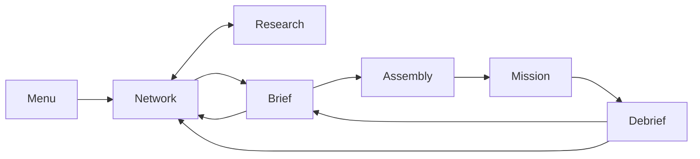

# Nexus Reborn

**Game Design Document**

A living specification of the game. It describes what the player does, what the world does back, and which rules are load-bearing. It is not a tour of the repository.

When this document and the playable build disagree, treat the disagreement as a defect in one of them and resolve both. Do not silently let either drift.

---

## 1. The game

### High concept

The player is an executive operations director for **Nexus Global**. From a secure corporate command network they watch a hostile world change hands, fund a research program, accept deniable contracts, and deploy a four-operative strike team into rain-soaked city districts.

The fantasy is remote command, not heroics. The player never walks the street. They read a situation, spend a few consequential orders, and live with the corporate cost of every stray round.

### Player promise

> Read a hostile corporate world, invest in the right technologies, deploy the right four-person team, and execute a precise operation where every shot can change both the firefight and the contract payout.

### Product

| | |
|---|---|
| Genre | Real-time squad tactics with a strategic management layer |
| Perspective | Fixed-angle isometric 3D |
| Player role | Corporate Operations Director |
| Setting | Corporate-controlled Earth, 14 May 2087 |
| Core unit | Four cybernetically enhanced operatives |
| Input | Keyboard and mouse |
| Display | Desktop browser, 1280×720 minimum |
| Session | Plan on the network → brief → assemble → execute → debrief |
| Content | Three authored operations, a generated contract market, eight starting operatives, five weapons, twenty-one research projects |
| Players | Single-player |
| Persistence | Versioned local campaign save. A mission in progress is not saved. |
| Monetization | None |

### What this game is not

- A hero shooter, stealth sim, or click-every-shot RTS.
- A character drama. There are no cutscenes, dialogue trees, or relationship tracks.
- A loadout locker. There is no equipment inventory, consumable shop, or account level.
- A multiplayer or mobile game.

---

## 2. Design pillars

Each pillar can kill a proposal. If a pillar never does, it is copy, not design.

### Command, do not micromanage

The player selects groups, places them, and sets stances. Operatives acquire visible targets on their own when weapons are free. The skill is tempo and position, not issuing every shot.

*Vetoes:* per-bullet click combat; forcing the player to babysit idle operatives who can already see a target.

### Information is operational power

The player is rewarded for reading the board: unrest, control, patrols, sight cones, objective zones, weapon state, camera coverage. A good order is a small order made at the right time.

*Vetoes:* hiding the minimap as a difficulty lever; fog that exists only to pad mission length; undecorated numbers the player cannot act on.

### Violence has corporate consequences

Combat is fast and noisy. Missed shots continue downrange and hit whoever is in the lane. A civilian struck by the squad is a line item on the invoice, not flavor text.

*Vetoes:* harmless stray fire; collateral that is narrated but not priced; making CorpSec-caused civilian harm the player's fine.

### The two layers feed each other

Contract money funds research. Research changes the next deployment. Mission results move the world: control, unrest, city ownership, intel, injuries, deaths. The strategic clock is the same clock that finishes labs and heals the roster.

*Vetoes:* a world map that is only a mission picker; research that does not change a later firefight; a win that leaves the network looking as it did before.

### One corporate operating system

Every surface is a module of the same secure terminal: near-black, teal, amber, red. Briefing, assembly, research, the world map, the HUD, and the debrief are different rooms of one building.

*Vetoes:* a game-UI that breaks character; a second visual language for “gameplay” versus “menu.”

---

## 3. Fantasy and world

### The player

The login is `OPS_DIRECTOR`. The organization is Nexus Global. Clearance is Executive. The tactical asset is Strike Team 04.

The player funds programs, accepts work, chooses personnel, and issues battlefield orders. They are not an operative.

### The world

Earth in 2087 is split into corporate spheres. Cities change hands through trade, seizures, raids, unrest, and infrastructure failure. Nexus Global is both a city-holding corporation and a deniable-operations house. Rivals remain paying clients. Work Nexus signs itself is an internal directive.

Story arrives as paperwork: briefing copy, the world event feed, operative dossiers, research abstracts, the in-mission comm log, objective updates, and the debrief invoice. That is the narrative system. It is complete as designed.

### Corporations

| Name | Role | Color |
|---|---|---|
| Stratos Industries | City holder and client | Cyan |
| Nexus Global | Player house, city holder, issuer of internal directives | Green |
| Helix Corp | City holder and client | Amber |
| Omnicorp | City holder; CorpSec affiliation on Glass Veil | Muted teal-gray |
| Sable Enterprises | Client for Glass Veil | None on the map |
| Contested | Ownership tie | Red |
| Unknown | Unsurveyed | Dark teal |

Nexus-signed generated work may target any city in its sector. An outside client is never paired with a Nexus-held city. A sector held entirely by Nexus can only post internal work.

Sable has no cities and no color. That is a hole; see Open questions.

### Tone

Cold, procedural, corporate. Violence is logged, not celebrated. Operatives answer in short professional acknowledgements. Civilians keep the player’s fire morally and financially legible. Spectacle is night, rain, neon, scanlines, and sparse bloom.

---

## 4. Structure of play

### Session rules

1. The menu offers Continue when a campaign save exists, and New Operation behind a two-step erase.
2. The World Network opens on Europe.
3. From the network the player inspects sectors, runs or pauses the strategic clock, reads the feed, or opens Research.
4. An unlocked contract opens its brief. Intel level gates access.
5. Accepting a contract goes straight to assembly. There is no buy-in and no second confirm.
6. Exactly four operatives must be assigned before deployment.
7. The mission ends when the required objectives are done, or when the squad is lost.
8. The debrief applies payout, sector movement, intel, influence, and roster changes once, then returns the player to the network (or back to the brief to replay).
9. Strategy screens autosave. The mission and the debrief do not. Aborting a mission discards it. There is no mid-operation resume.

The unsaved mission is a design choice, not a limitation. Once the team is on the ground, the director is committed.

### The strategic loop

Monitor the world. Spend or hold time. Fund research. Take a contract. Pick four. Execute. Collect the invoice, less collateral. Reinvest.

### The tactical loop

Read patrols, cones, civilians, and the objective. Select. Move or hold. Choose whether to trip awareness. Engage by placement or by explicit fire. Complete the active objective. Repeat through extraction.

### The research loop

Inspect a branch. Commit credits to one project in that lab. Let world time run. Collect the effect on the next deployment. Unlock the next tier.

### Campaign end

Winning all three authored contracts marks the campaign complete. The network posts a banner. The contracts stay replayable; completion is a mark, not a lock.

Losing every remaining operative is a terminal fail. The network posts a failure banner, contracts lock, and the campaign cannot also be marked complete.

Sector crisis is pressure below that floor. It is recoverable.

---

## 5. The strategic layer

The World Network is the player’s job between operations. Time is a resource. Leaving it paused is a decision.

### Two clocks

**Strategic time** runs only on the World Network and Research screens. The campaign begins 14 May 2087, 14:32:17 UTC. At 1×, one real second is sixty world seconds. Speeds are 1×, 2×, 4×, and 8×; the default is 2×. The clock can be paused. A rolling 24-hour timeline can be scrubbed without changing live state.

**Tactical time** is a separate night. Every mission opens at 22:14:08 on its own clock. The world does not tick while the team is in the field. After a win, the debrief spends the contract’s ETA in strategic days, and labs, injuries, and recruitment catch up to that new time.

The clocks are independent because the director is either watching the world or running an operation, never both.

### Sectors

Six continents are open. Antarctica is locked at every intel level: no survey data.

| Sector | Opening control | Opening unrest | Influence weight |
|---|---:|---:|---:|
| North America | 68% | 12% | 1.15 |
| South America | 41% | 24% | 0.85 |
| Europe | 62% | 18% | 1.20 |
| Africa | 37% | 28% | 0.90 |
| Asia | 55% | 16% | 1.35 |
| Oceania | 73% | 9% | 0.55 |
| Antarctica | — | — | — |

Each open sector shows control, unrest, weekly tax yield, influence income, black-market impact, garrison condition, total forces, and defense rating.

**Influence index** is the weighted average control of the open sectors. Beside it sits a spendable **influence points** balance.

A sector above **60 unrest** decays: every 6 world hours it loses 1–2 control, and its tax yield falls 2% per unrest point above the threshold, floored at 25%. At **85+ unrest** the sector enters **crisis**: it reads red, a red feed event posts, event frequency doubles, and its open generated contracts gain the priority tag. Crisis clears, with a green feed event, once unrest falls under **70**. Unrest is clamped to 2–96 so the crisis band is always reachable.

Asset count and black-market impact are readouts, not verbs. Defense rating and garrison condition already feed generated-contract threat; tax yield already falls under unrest. See Open questions.

### Influence actions

Three numbered actions per sector, each with a point cost and a per-sector cooldown. Unaffordable actions disable.

| Action | Cost | Effect | Cooldown |
|---|---:|---|---:|
| Stabilize | 8 | −12 unrest over 6 world hours, hourly | 24 h |
| Lobby | 10 | +8 control over 12 world hours, eight steps | 36 h |
| Expedite | 12 | The sector’s lowest-intel open generated contract loses its intel gate and gains 24 world hours of expiry | 24 h |

Staged spends ride the same time-ordered catch-up as world events, so a contract ETA jump applies them exactly as continuous ticking would.

### City ownership

Eighteen named cities, each with a corporate holder. A sector’s color is the corporation that holds the most of its cities; ties display as contested.

Ownership changes through seizure events and through missions: a win hands the mission city to Nexus Global; a loss of a Nexus-held city returns it to its default holder. A flip re-clients that sector’s open generated contracts and posts a feed note.

Ownership does not change research prices, tactical layouts, or weapon tables. It changes who is paying, and who holds the map.

### World events

Events fire every 15–45 world minutes and favor high-unrest sectors. Crisis doubles a sector’s weight.

| Event | World effect | Market effect |
|---|---|---|
| Riot | Raises unrest, reduces control | 45% chance of a linked priority suppression contract |
| Blackout | Raises unrest | — |
| CorpSec raid | Reduces unrest, may improve control | 35% chance to withdraw an open generated contract |
| Trade agreement | Improves control, may reduce unrest | — |
| Seizure | May change city ownership and control/unrest | A city flip re-clients the sector’s open generated contracts |

The feed also carries contract offers, priority tags, expiries, withdrawals, re-clienting, crisis entry and exit, and influence spends. It holds 40 events and shows the most recent 14 for the selected timeline point.

A mission result writes into this system. A win raises the sector’s control and lowers unrest. A loss does the opposite. Civilian hits add unrest. Each result posts its own feed event.

At intel 2+ the sector panel shows an **event forecast**: the chance of each category landing in the focused sector over the next 6 world hours, derived from the same weights the generator rolls.

### Intel

The campaign opens at intel **1**, with 25/100 progress.

- A contract win awards **+40**. A clean win (no civilian hit by the squad) awards **+15** more.
- A loss awards nothing.
- Each 100 progress becomes the next level.
- Hollow Crown and Rust Haven require level 2. Generated contracts gate by threat: moderate at 1, high at 2, severe at 3.
- Expedite can waive a generated contract’s intel gate.

At intel 2+ the brief replaces a raw success percentage with a computed **risk index** (Low / Guarded / High / Severe), derived from the actual deployment: patrol, garrison, and civilian counts, weighted by enemy toughness and weather.

Intel is earned in the field and spent on access and foresight. That is its whole job.

---

## 6. Economy and progression

Two currencies. **Credits** buy research and recruits. **Influence** buys sector actions. They do not convert.

### Credits

Opening balance: **128,450 CR**. Successful contracts add their net payout. Failed contracts pay nothing. Research and hiring cannot overdraw the account; the authorization simply refuses.

### Collateral

Each unique civilian hit by an operative deducts **5,000 CR** from a successful contract.

- The fine is on the first squad-caused hit, not only on death.
- Repeated hits to the same civilian do not stack.
- CorpSec-caused civilian harm does not count.
- Deductions cannot exceed the contract reward.
- A failed mission already pays zero, so collateral cannot create debt.

This is the corporate face of the violence pillar. The debrief must make the fine readable.

### How the player gets stronger

The next deployment is better because of what happened between operations, not because the player bought a gun.

- **Research** changes weapon stats or every operative’s health and speed. Effects stack in completion order. They are sampled when the mission is created and cannot change a team already on the ground.
- **Experience** goes to survivors at debrief. Each point is +2 max HP and +0.05 m/s on the next deployment, sampled the same way.
- **Intel** opens work and forecasts.
- **The roster** is itself progression: the dead are gone, the injured cost world time, replacements are bought from a rolling market.

There is no account level, no owned equipment, and no consumable shop. Those are out of scope.

### Influence income

- **+6** on any contract win.
- **+2** more for a clean win.
- **+1** per 12 world hours while the influence index holds above **55**.

---

## 7. Research

Research is the loadout system. The player does not pick guns per operative. They fund a program, and the next team goes in changed.

### Rules

- Three branches, seven projects each, twenty-one total.
- One laboratory per branch. One active project per lab. Three projects may run at once if they are in different branches.
- Durations use strategic time. Credits are spent the moment authorization succeeds.
- Tiers require their listed prerequisites.
- Full program cost: **779,000 CR**.

At default 2× strategic speed, a two-hour project takes about one real minute of network time.

Ballistics is lethality and handling. Cybernetics is the body. Control Systems is coordination and sensors. The split is the fantasy of three labs, not three independent games.

### Ballistics — 248,000 CR

| Project | Cost | Time | Requires | Effect |
|---|---:|---:|---|---|
| Advanced Propellants | 16,000 | 2h | — | +12% assault-rifle damage |
| Barrel Wear Coating | 14,000 | 2h | — | −10% spread, all squad weapons |
| Hypervelocity Core | 30,000 | 4h | Advanced Propellants | +18% longrifle damage; +10% longrifle range |
| Caseless Ammo Feed | 26,000 | 4h | Barrel Wear Coating | +10 SMG magazine; −12% reload, all weapons |
| Rail Stabilization | 44,000 | 8h | Hypervelocity Core | −15% spread, all weapons |
| Smart Fragmentation | 42,000 | 8h | Caseless Ammo Feed | +22% shotgun damage; +15% shotgun range |
| Tungsten Sabot | 76,000 | 14h | Rail Stabilization + Smart Fragmentation | +15% damage, all weapons |

### Cybernetics — 261,000 CR

| Project | Cost | Time | Requires | Effect | Bay |
|---|---:|---:|---|---|---|
| Neural Interface I | 15,000 | 2h | — | −8% fire delay, all weapons | Neural |
| Synaptic Enhancement | 17,000 | 2h | — | +0.20 m/s | Chest |
| Reflex Booster | 28,000 | 4h | Neural Interface I | −15% reload, all weapons | Arms |
| Pain Inhibitor | 27,000 | 4h | Synaptic Enhancement | +14 max HP | Chest |
| Neural Accelerator Mk II | 48,000 | 8h | Reflex Booster | −12% fire delay; +0.15 m/s | Neural |
| Subdermal Weave | 46,000 | 8h | Pain Inhibitor | +22 max HP | Chest |
| Neural Cache Array | 80,000 | 14h | Neural Accelerator Mk II + Subdermal Weave | +18 max HP; +0.35 m/s | Neural |

### Control Systems — 270,000 CR

| Project | Cost | Time | Requires | Effect | Bay |
|---|---:|---:|---|---|---|
| Targeting AI Suite | 18,000 | 2h | — | −12% spread, all weapons | Arms |
| Sensor Fusion Array | 16,000 | 2h | — | +8% range, all weapons | Neural |
| Swarm Coordination | 29,000 | 4h | Targeting AI Suite | +0.25 m/s | Legs |
| Threat Prediction | 31,000 | 4h | Sensor Fusion Array | +12 max HP | Neural |
| EM Hardening | 45,000 | 8h | Swarm Coordination | +16 max HP | Legs |
| Encryption Core | 47,000 | 8h | Threat Prediction | −10% reload, all weapons | Arms |
| Adaptive Command AI | 84,000 | 14h | EM Hardening + Encryption Core | −10% fire delay; +0.20 m/s | Neural |

### Augmentation bays

The assembly dossier shows four bays — Neural, Chest, Arms, Legs — and lists the latest completed project in each bay as installed hardware.

That hardware is a label on a global program. Projects apply to the whole squad, not as individually installed or swappable cyberware. The diegesis is “the program upgraded the team.” Per-operative loadouts are a different game; see Open questions.

---

## 8. The strike team

### Deployment rules

- Roster cap: eight. The campaign starts full.
- Every mission deploys exactly four.
- Default four: Mara, Ghost, Dart, Torq.
- Inspection and assignment are separate. At least one operative stays assigned while the player edits.
- Deploy is disabled until all four bays are filled.

The eight are a starting roster, not a protected cast.

### Death, injury, replacement

A kill is permanent. The debrief removes the operative, lists them under Killed in Action, and the world feed posts a red loss naming them. Their bay is empty. The next deployment cannot leave until it is filled.

A survivor who ends a mission below 35% of maximum health returns **Injured**. Downtime scales with missing health: 12 world hours just under the threshold, up to 48 at near-death. Everyone else stays Ready. Newly injured operatives leave the squad at debrief and cannot be assigned until the world clock finishes their recovery. Raven opens the campaign Injured and recovers after 24 world hours.

**Recruitment** replaces losses. The assembly screen offers three procedural candidates at a time, one new candidate every 24 world hours on the same clock injuries recover on. A candidate has a stable name, face, one of the eight roles, health and speed inside the authored ranges, and that role’s primary weapon. Hiring costs 16,000–34,000 CR by quality and is refused on overdraw or a full roster.

### Starting roster

Speed is meters per second. Research and experience are added at deployment.

| Codename | Name | Role | HP | Speed | Primary | Sidearm | Opens | Specialty |
|---|---|---|---:|---:|---|---|---|---|
| Mara | D. Torres | Assault | 124 | 4.6 | RFC-27 Assault | S-18 Pistol | Ready | Frontline breach |
| Ghost | L. Fernandez | Recon | 110 | 5.2 | K-9 Rattler SMG | S-18 Pistol | Ready | Intel and range |
| Dart | K. Park | Infiltrator | 98 | 5.6 | K-9 Rattler SMG | S-18 Pistol | Ready | Quiet close work |
| Torq | M. Ivanova | Demolitions | 132 | 4.2 | M6 Breacher | S-18 Pistol | Ready | Breach and denial |
| Raven | A. Okafor | Sniper | 92 | 4.4 | VK-88 Longrifle | S-18 Pistol | Injured | Overwatch |
| Slate | J. Sato | Tech | 104 | 4.8 | K-9 Rattler SMG | S-18 Pistol | Ready | Disruption |
| Vex | R. Volkov | Support | 118 | 4.4 | RFC-27 Assault | S-18 Pistol | Ready | Tempo and logistics |
| Kestrel | N. Diallo | Medic | 100 | 5.0 | S-18 Pistol | S-18 Pistol | Ready | Trauma |

### Roles

Every role has one active and one passive. Q fires the actives of the current selection. Actives cool down for 25–45 seconds. A targeted active that finds no target reports on the comm log and keeps its cooldown.

A role that does not change a tactical decision is unfinished.

| Role | Active | Effect | Passive |
|---|---|---|---|
| Assault | Overdrive (30 s) | Fire delay halved for 6 s | +10% weapon damage, both slots |
| Recon | Pulse Scan (35 s) | All enemies and their sight cones on the minimap for 8 s | Enemies within 16 m are marked even when calm |
| Infiltrator | Ghost Veil (35 s) | Enemies cannot gain vision awareness of this operative for 6 s; hearing still works | Enemy vision certainty builds 25% slower against this operative |
| Demolitions | Frag Charge (40 s) | Thrown under the nearest enemy within 10 m; after 1 s deals 60 damage in a 3 m radius, loud, with an impact flash | Takes 15% less damage |
| Sniper | Deadeye (30 s) | Next shot within 10 s cannot miss and deals double damage | +15% weapon range, both slots |
| Tech | EM Burst (35 s) | Enemies within 8 m drop to suspicious, lose their target, and cannot fire for 4 s | Squad ability cooldowns run 15% faster while this operative lives |
| Support | Suppression Sweep (30 s) | For 6 s, enemies within 12 m and line of sight move at half speed | Operatives within 6 m reload 20% faster |
| Medic | Field Stim (25 s) | Heals the most wounded living operative within 8 m by 40 HP, never above max | Living operatives within 6 m regenerate 1 HP/s up to half their maximum |

### Items

Med kits and power cells are squad-shared pools, fixed at deployment.

- Base team: two med kits, one power cell.
- Medic +2 med. Support +1 med. Tech +1 cell.
- Each filled loadout slot on a deployed operative adds one of its item.

A med kit heals the most wounded selected operative by 50 HP, never above max. A power cell instantly finishes the first selected operative’s running ability cooldown. Power cells also arm grenades, so the cell pool is contested.

Empty or invalid use reports on the comm log and spends nothing.

### Deployment mass

Mass is a real gate, not a flavor number.

- 60 kg base per operative.
- Authored weapon masses: assault 4.2, SMG 3.1, pistol 1.2, longrifle 6.8, shotgun 4.9.
- 0.25 kg per max-HP point above 90, so health research is also plating.
- 8 kg per med kit, 6 kg per power cell.

Each operative has two extra item slots on the assembly screen. Filled slots add their items to the mission pools.

**400 kg** blocks deployment. The button names the overage.

Mass also sets a squad-wide speed tier, applied at deployment: at or under 340 kg, +0.15 m/s; over 380 kg, −0.15 m/s. The assembly screen shows the active tier beside the mass readout.

---

## 9. Contracts

A contract is a night of work with a client, a city, a threat, a reward, and an ETA. Accepting it is free. After the mission, the debrief spends the ETA as strategic days.

Authored chance is not a static field. It is derived from threat, weather, the source sector’s control and unrest, and completed research, then clamped to 35–95. At intel 2+ the brief hides the percentage and shows the risk index instead.

### Authored operations

Opening-campaign figures, no research done, sectors at their starting values:

| Codename | City | Type | Client | Threat | Reward | District | Opens at | ETA |
|---|---|---|---|---|---:|---|---|---:|
| Glass Veil | New Carthage, District 07, Europe | Seizure | Sable Enterprises | Severe | 85,000 CR | Checkpoint | Intel 1 | 2 days |
| Hollow Crown | Shingang, District 21, Asia | Extraction | Helix Corp | High | 62,000 CR | Compound | Intel 2 | 4 days |
| Rust Haven | Detroit Sprawl, District 03, North America | Sabotage | Stratos Industries | Moderate | 41,000 CR | Industrial | Intel 2 | 3 days |

Contracts remain replayable after success or failure. That is the current economy. It is also an open question: the full research tree costs 779,000 CR, Glass Veil pays 85,000, and nothing diminishes a replay.

### Generated market

Beside the authored three, the network keeps up to three generated contracts. A new one rolls every 2–6 world hours when below target, weighted toward high unrest or low control.

- Threat comes from the sector’s defense rating and garrison.
- Reward comes from threat and influence weight, 30,000–95,000 CR on a 500 CR grid.
- Client comes from city ownership.
- Type is seizure, extraction, sabotage, or riot-linked suppression.
- Each type maps to a district archetype and a full objective set built from the shared primitives. Enemy counts scale with threat.
- Unaccepted offers expire after 24–48 world hours (priority 8–16) and post a feed line.
- A fulfilled or failed generated contract applies the standard debrief consequences and leaves the market.

Generated work is first-class content, not filler. The authored three are the campaign spine; the market is the world’s ongoing demand.

### The brief

The brief is the translation from strategy into an operational plan. It carries identity, client, type, threat, reward, narrative notes, the sequential objectives, collateral tolerance, a recon image, and a tactical map built from the same city the mission will use: insertion, target, extraction, patrols, hostile zones, and estimated civilian and force counts.

If the brief’s geometry does not match the deployed city, the brief is wrong.

---

## 10. The tactical mission

Every mission is a night in a deterministic **96 × 96 meter** district. Three layout families share one generator, one southern insertion, and the same connectivity guarantees. The seed rebuilds the same city.

Shared landmarks: insertion and extraction on the south, near (48, 88); a central north-south avenue; a road and alley grid with walkable setbacks. The generator guarantees walkable routes from insertion to the objective landmarks, the enemies, the patrol paths, and extraction.

| Archetype | Used by | Base garrison | Base street patrols | Base civilians | Geometry |
|---|---|---:|---:|---:|---|
| Checkpoint | Glass Veil; generated seizure and suppression | 6 plaza + 1 authored 80-HP longrifle | 5 | 22 | Northern plaza near (48, 14) |
| Compound | Hollow Crown; generated extraction | 6 interior, bypassable | 4 | 14 | Walled eastern detention block; 7 m streets |
| Industrial | Rust Haven; generated sabotage | 4 yard guards | 3 | 8 | Fenced eastern yard; 8 m cross streets |

Threat extras, unrest extras, and Hardened add street patrols and civilians on top of those bases. Four operatives deploy every time.

### Player verbs

The mission opens with every living operative selected. The dead are never valid order recipients.

**Select.** Left click one. Shift-click to add or remove. Drag a box; shift-drag adds. Click empty ground to clear. Clicking an enemy does not clear. Keys 1–4 pick a slot. 0 or backtick picks everyone living. Backspace clears.

**Move.** Right click ground. Selected operatives walk to a compact ring so they do not stack. A move clears explicit targeting and releases Hold Ground. Along the route, operatives stop to engage visible enemies when weapons are free, then resume.

**Attack.** Right click a living hostile. They chase until they have line of sight and range. Explicit attack overrides Hold Fire. Hold Ground prevents the chase but keeps the target.

**Stop.** Clears pathing and targeting. Stances stay.

**Hold Ground.** Pins the operative. An active path is parked and restored on release. Separation will not shove a held operative off their tile. They may still fire.

**Hold Fire.** Clears automatic targets. The operative will not auto-acquire. A later explicit attack still fires.

These five plus the ability key are the whole command language. New verbs need a pillar reason.

### Movement

Eight-direction pathfinding on a one-meter walk grid. No diagonal corner cutting. Paths straighten when line of sight allows. Blocked clicks snap to the nearest walkable cell. Units slide on a valid axis when a step is blocked, and living bodies separate so they do not overlap. There is no rigid-body physics.

### Camera

Fixed 45° yaw, 55° elevation, 25° field of view. Zoom 44–115 meters. Pan from the keyboard or the minimap. Recenter on the living squad. Buildings that hide operatives or important ground fade to ghost shells.

The camera does not rotate or tilt in play. Up on the minimap is up on the screen. That shared orientation is load-bearing.

### The opposing force

CorpSec has three states: **patrol** (authored route, reduced speed), **suspicious** (last seen or heard point, then a scan), **combat** (pursue and fire).

Four archetypes:

| Archetype | HP | Speed | Distinct behavior |
|---|---|---|---|
| Trooper | 60 | 4.2 | Baseline. Every street patrol and wave unit. |
| Heavy | 100 | 3.2 | Takes 15% less damage. Walks a shotgun in. |
| Marksman | 70 | 4.0 | Longrifle. Backpedals when a target closes inside 8 m. |
| Officer | 70 | 4.4 | Radios nearby guards onto the squad. |

Threat sets the elite mix: Moderate fields none; High upgrades one garrison member to a heavy; Severe fields one heavy and one officer. Upgraded members keep their posts. The checkpoint’s authored longrifle is the one authored marksman; its 80 HP outranks the archetype base.

**Officer radio.** Four seconds after an officer enters combat, every guard within 22 m that is not already fighting is put on the squad’s last seen position at investigation-level awareness. Killing the officer inside the delay — or calming them, for example with an EM burst — cancels the call. Officers wear an amber chest lamp. Heavies read by bulk. Marksmen read by a lean frame.

**Vision.** 14 m in clear weather, 12.6 m in light rain, 11.2 m in heavy rain. 110° cone. 4.5 m omnidirectional notice, weather-invariant. Vision needs clear grid line of sight. Certainty takes about 0.45 s up close and about 1.7 s at maximum range.

**Hearing.** Gunshots make noise that passes through walls. Noise supplies a location, not a target. Sound alone can raise awareness only to 85%: investigation, not fire. Louder weapons shout farther.

**Alert.** A guard can alert another within 9 m if they can see each other. Combat awareness does not propagate through walls. After six seconds without sight, a guard falls back to suspicious investigation, not straight to patrol. Awareness decays when no evidence arrives.

### Civilians

Civilians wander when calm. Gunfire within 10 m makes them flee for five seconds after the latest nearby shot, at +50% speed. A direct hit forces a flee from the shooter. Either side can injure or kill them.

They exist to complicate fire lanes and to price the invoice. Placement that makes collateral feel arbitrary is a content bug.

### Combat

Combat is real-time and resolves itself after the player’s placement and targeting decisions.

A shot requires a living shooter, a drawn weapon, a round in the magazine, no reload in progress, a finished cooldown, the target in range, and line of sight.

Hit chance is approximately `(0.78 − 0.28 × distance/range + jitter) × accuracy`, clamped 5–95%. Operative accuracy is 1.0. CorpSec accuracy is 0.45. Weapon spread shapes the path of a miss; it is not the hit roll.

Operatives deal full weapon damage. CorpSec deals 70% and fires at 1.75× the authored cooldown. Magazines reload from an unlimited reserve.

**Missed rounds continue** along the shot lane to weapon range. The first living body in that lane before cover is hit, regardless of faction. Friendlies, civilians, and other enemies are all legal. Cover stops the lane.

Tracers, the comm log, and the debrief must make this readable. If stray fire is invisible, the pillar is broken.

### Weapons

| Weapon | Damage | Range | Delay | Mag | Reload | Spread | Job |
|---|---:|---:|---:|---:|---:|---:|---|
| RFC-27 Assault | 11 | 16 m | 0.16 s | 30 | 1.7 s | 0.045 | Flexible sustained fire |
| K-9 Rattler SMG | 7 | 12 m | 0.09 s | 40 | 1.9 s | 0.080 | High-volume close work |
| S-18 Pistol | 10 | 11 m | 0.45 s | 12 | 1.2 s | 0.030 | Accurate light sidearm |
| VK-88 Longrifle | 46 | 26 m | 1.60 s | 5 | 2.6 s | 0.008 | Precision elimination |
| M6 Breacher | 26 | 8 m | 0.90 s | 6 | 2.2 s | 0.120 | Short-range burst |

Every operative carries a primary and a sidearm. V swaps the selection. The drawn weapon cannot fire for 0.5 s (the HUD reads Drawing). Each slot keeps its own magazine; swapping cancels an in-progress reload of the stowed weapon and resumes its count when drawn again. Auto-fire, ordered attacks, engagement range, noise, tracers, and gunshot audio follow the drawn weapon. Research applies to both slots. Enemies carry one weapon and never swap. Reserve-ammo numbers in the UI are informational.

**Grenades.** G arms or cancels targeting. A confirmed throw spends one power cell, snaps onto nearby pavement within 2.5 m, must land within 18 m, and detonates immediately: 70 damage at centre falling to 35 at a 3.5 m edge, line of sight only, 24 m noise, 4 s squad cooldown. Empty cells or a running cooldown disable the control.

### Objectives

Seven kinds. An objective names a zone or resolves one from the city’s landmarks; authored data never carries coordinates the generator owns.

| Kind | Completes when |
|---|---|
| Reach zone | Any living operative enters the radius |
| Eliminate tag | No living enemy with the tag remains |
| Extract | Every surviving operative is inside the extraction radius |
| Interact | The channel at the point reaches its duration |
| Escort | Every VIP is alive and inside the target zone |
| Destroy | No device with the tag remains |
| Defend | The hold timer at the zone reaches zero |

Interact and defend advance only while a living operative stands in the zone. An empty zone pauses; it does not reset. A dead VIP voids every unfinished escort. An optional destroy whose device dies to non-squad fire fails rather than completing.

Defend carries a wave: unit count, weapons, and named entry landmarks. The wave spawns when the objective activates.

An objective may carry a time limit from activation. Expiry fails an optional objective and loses the mission on a required one.

Required objectives are strictly sequential. Optional objectives activate with the required objective they precede, never block the sequence, and pay a bonus on top of the contract. Ignoring or failing an optional costs nothing.

### Win and loss

**Win:** every required objective completes. Optionals do not gate the win.

**Loss:** no living operatives remain; a required escort VIP dies; or a required time limit expires.

The HUD shows the result immediately. After 2.5 seconds the game enters the debrief, which reports target, eliminations, squad casualties, the KIA list, new injuries and recovery times, survivor experience, civilian collateral, mission time, contract value, optional bonus, collateral penalty, ETA spent, net payout, and the new balance.

---

## 11. The three authored nights

Each authored operation is a designed problem, not a reskin. Generated contracts reuse the archetypes and the objective vocabulary; they do not replace these three as the campaign’s argument.

### Glass Veil — open the district

Sable wants District 07 opened for an asset transfer at 23:00. Omnicorp CorpSec has sealed it behind a checkpoint. The team inserts on the south perimeter and advances through market blocks under heavy rain.

Heavy rain is the squad’s ally: the largest sight penalty in the game, which is why a Severe contract is still workable. Rain does not change accuracy or movement. Civilian density is moderate (22, or 28 if the sector is above 20 unrest). Collateral tolerance is low. Severe threat adds three extra street patrols (four if unrest is high), scales enemy health to 1.2 (1.25 if control is above 60), and upgrades one garrison member to an officer and one to a heavy.

1. Reach the checkpoint gate.
2. Eliminate the seven-garrison (street patrols are optional unless they threaten the team).
3. Extract south.

The night is a read-and-commit: bypass or break eight street patrols, keep fleeing civilians out of the lane, breach the northern plaza, and silence the officer inside four seconds or fight the whole plaza. Then walk home with whoever is still standing.

### Hollow Crown — take the architect alive

Helix pays for a neurochem architect, alive. CorpSec means to move the asset before the next maglev window. Light rain. The compound can be bypassed; the interior garrison is optional.

High threat: two extra street patrols (three if unrest is high), enemy health 1.1 (1.15 if control is above 60), one garrison heavy. Fourteen civilians, twenty if unrest is high. The compound is a walled eastern detention block with one gated south entry and one breachable side entry; seed parity mirrors the flank. Cell blocks on the north wall, records hut at the server corner.

1. Reach the compound gate.
2. *(Optional, +9,000 CR)* Pull the detention server — a four-second channel at the records hut. Activates with objective 1. The server wipes 90 seconds later; expiry fails only the bonus.
3. Override the cell-block locks — a five-second channel at the console.
4. Walk the freed VIP to extraction alive.
5. Extract the squad.

The night is a route choice and an escort. The side wall skips most of the interior. The optional server sits away from the console, so the bonus is paid in exposure. The VIP is fragile and walks out through whatever the team already woke up. A body pays nothing.

### Rust Haven — drop the grid and hold it

Stratos has found an Omnicorp relay yard feeding the Detroit Sprawl security grid. Three fuel relays sit in a fenced yard behind two gates. Clear night: full sight, full hearing. Sparse civilians (8, or 14 if unrest is high). Moderate threat: the three base street patrols, one more if unrest is high; enemy health 1.0 (1.05 if control is above 60). Demolition cells drop devices quickly. Gunfire works, slowly.

The yard splits into two sub-yards. Seed parity sets the split. Streets are wider than the other archetypes.

1. Reach the relay yard.
2. *(Optional, +6,000 CR)* Destroy the backup transformer in the far sub-yard.
3. Destroy the three fuel relays.
4. Hold the yard 45 seconds against a five-unit wave through both gates.
5. Extract.

The night inverts. The team is the aggressor until the burn starts, then it holds ground it just made loud. The optional transformer sits deeper in, so taking it commits the squad before the wave.

---

## 12. Interface

The interface is the game’s character. It is a secure corporate OS wrapped around a readable tactical picture, not a HUD pasted on a shooter.

### Principles

- DOM around and over the 3D scene.
- Near-black ground for contrast.
- Teal for operation and selection. Amber for focus, authorization, and the active objective. Red for danger, locks, damage, and failure. Green for completion.
- Small monospace uppercase labels. Primary values larger than their labels.
- Every screen is a module of the same terminal.
- Critical state is never color alone.
- Text must remain legible at 1280×720. Clipping or truncation at that size is a bug.
- Smaller windows keep the minimum layout and scroll. They do not compress panels.

### Surfaces

**Menu.** Establishes the secure-system fiction, unlocks audio on the first gesture, offers Continue and New Operation, and opens Settings.

**World Network.** The job between nights: sectors, ownership, contracts, the clock, the 24-hour review timeline, the feed, credits, influence, roster count, intel. Campaign-complete and campaign-failed banners live here. First visit, a one-shot overlay names the panel groups and the Research tab.

**Research Division.** Three branch trees. Node states: researched, active, available, locked. Authorization is a spend, not a browse.

**Mission Brief.** Dossier and plan. The map must be the city.

**Operative Assembly.** Inspect, assign, read research-adjusted stats, see bay labels, fill two item slots, and pass the 400 kg gate.

**Mission HUD.** District clock, weather, alert, credits, squad cards (health, magazine, selection, stances), objectives, comm log, drawn weapons, the ability bar, item counts, grenade control, the minimap, pause, the result banner, and first-mission tutorial toasts. Toasts never block input and never pause the sim.

**Debrief.** The invoice. It applies sector, intel, influence, and roster consequences exactly once.

**Settings.** Audio, remaps, accessibility, quality, difficulty, telemetry. Persists separately from the campaign, so New Operation keeps the player’s preferences.

### Minimap

A tactical instrument, not a decoration. It shares the camera’s yaw so up is up. It shows buildings, roads, extraction and checkpoints, the active-objective pulse, enemy calm/suspicious/combat, sight cones for suspicious and combat guards, civilians, operatives, and the camera’s ground footprint. Three zoom levels. Click and drag steers the camera.

Difficulty must not strip this information.

### Pause and discovery

Space or Escape opens a modal pause: the sim and the camera freeze, every remappable binding prints from the same table the input uses, focus is trapped, Resume returns, Settings stays inside the freeze, and Abort is a two-step, three-second confirm that discards the mission without a debrief.

The first mission teaches with dismissible HUD toasts — selection, move, attack, stances, ability, items, weapon swap, directives, extraction — that name the current bindings and advance on action or dismiss. Skip Tutorial marks all steps seen. One-shot advisories fire at most once per campaign: an operative under 35% with med kits in stock, the first combat alert, a role ability left ready for a minute, an overweight deployment.

### Accessibility

Designed in, not bolted on:

- Contextual accessible labels on major controls.
- Research nodes activate on Enter and Space.
- Timeline: arrows, Home, End.
- Pause and Settings trap and restore focus.
- Remappable controls, with pause, operative slots, and mouse reserved.
- Reduced motion: decorative sweeps gone, looping pulses frozen, rain at minimum.
- High contrast: brighter ink, stronger frames.
- Text scale 90 / 100 / 110 / 125%; screens scroll rather than clip.

Still open: full keyboard travel across every panel, color-vision presets, captions for audio cues, and a screen-reader pass on the tactical HUD.

---

## 13. Controls

Defaults below. Every keyboard action except pause and the operative slots can be remapped. The pause menu, the tutorial, and the input handlers read one table, so a remap renames itself everywhere at once.

### Camera

| Input | Action |
|---|---|
| W / Up | Pan forward |
| S / Down | Pan backward |
| A / Left | Pan left |
| D / Right | Pan right |
| F | Recenter on the living squad |
| `=` / Numpad `+` | Zoom in |
| `-` / Numpad `-` | Zoom out |
| Mouse wheel | Zoom |
| Minimap click or drag | Steer camera |

### Squad

| Input | Action |
|---|---|
| 1–4 / Numpad 1–4 | Select slot |
| 0 / backtick / Numpad 0 | Select all living |
| Backspace | Clear selection |
| X | Stop and clear orders |
| H | Toggle Hold Ground |
| C | Toggle Hold Fire |
| V | Swap weapon |
| Space / Escape | Pause |

### Abilities and items

| Input | Action |
|---|---|
| Q | Role ability for the selection |
| E / M | Med kit on the most wounded selected operative |
| R | Power cell: finish the selected operative’s ability cooldown |
| G | Arm or cancel grenade targeting |

### Mouse

| Input | Action |
|---|---|
| Left click operative | Select |
| Shift + left click | Add or remove |
| Left drag | Box select |
| Shift + left drag | Add box selection |
| Left click bare ground | Clear selection |
| Right click ground | Move |
| Right click hostile | Attack |
| Double-click squad card | Center camera on that operative |

---

## 14. Art direction

Late-1980s / 1990s cyberpunk strategy vocabulary, rebuilt as a crisp modern terminal.

Near-black and dark blue-green ground. Teal operational graphics. Amber focus. Red hostility and failure. Thin technical borders. Monospace uppercase type. Scanlines, vignette, radar sweeps, data chips, coordinate labels, barcodes.

The tactical scene is a night district in heavy weather: wet asphalt, cool window light, warm street lamps, procedural neon, dense towers and industrial slabs, instanced street dressing. Bloom is emissive only. Building ghosting exists so the player can still read the fight.

Units are assembled from simple geometry. Operatives are cool armor with personal accent colors, slot tags, health pips, selection rings, and route feedback. CorpSec is dark coats, red visors, faction rings, garrison marks, alert and suspicion markers. Civilians vary. Hits flash; operatives flash red, everyone else amber, with a brief flinch.

Effects stay sparse and informative: colored tracers, muzzle and impact flashes, dashed routes, destination rings, click marks, objective pulses, two-layer camera-following rain.

**No external art assets.** Textures, portraits, figures, icons, unit geometry, the world plate, and UI decoration are generated in code. The constraint is stylistic and production: one hand drew this world. An external pipeline is a deliberate change of project, not a polish pass.

---

## 15. Audio direction

Audio is synthesized at runtime. It confirms orders, marks danger, and prices violence. It does not narrate.

Voices that must exist: weapon-specific gunshots, reload, confirmation, UI click, alert sting, objective-complete, death thud, operative-hit thump. An alert-tension drone tracks the mission alert level (0–3), ramps between levels, and releases when the mission ends.

Two beds: a low industrial drone on strategy screens (music), a rain-hiss and city-hum on the mission (ambience). Each dies with the screen that owns it.

Four channels under a master — UI, combat, music, ambience — plus mute. Levels persist with player settings, not the campaign. Dense combat is rate-limited so the mix does not collapse into noise.

There is no spoken operative dialogue and no spatial audio model. Those are out of scope unless reopened. Clearer separation among squad, CorpSec, UI, and objective voices, and an optional synthetic radio treatment on acknowledgements, are welcome polish inside the current system.

---

## 16. Difficulty and balance

The player’s advantages are information, quality, and pause. CorpSec’s advantages are numbers, coverage, and propagation.

The player has four operatives, full weapon damage, higher accuracy, faster weapon cooldowns, automatic acquisition, a tactical pause, visible enemy states and sight cones, and a research program that permanently improves later nights.

CorpSec has numerical superiority (12 hostiles on the baseline checkpoint before extras), patrol coverage, alert propagation, a longrifle garrison guard, and civilians in the lane.

**Standard** is the authored baseline. **Hardened** adds two street patrols and six civilians. It does not hide minimap information. The choice lives in player settings and survives New Operation.

Difficulty should turn readable knobs: sight confirmation time, accuracy and cooldown, patrol count and overlap, garrison mix, civilian density, economy, alert range, optional-objective pressure. It must not turn off the minimap without giving the player a compensating tool.

Economy pressure is real. Glass Veil pays 85,000 CR. The tree costs 779,000 CR. Completing the program requires repeated income. Unlimited undiminished replay of the same authored contract is the current rule and an open question.

---

## 17. Platform and persistence

Desktop web. Keyboard and mouse. Minimum 1280×720. No mobile or touch design.

Single-player. No networking.

The campaign save is versioned and local. It holds the network, the labs, the roster, tutorial progress, and the campaign result. A mission in progress is memory only. Settings and telemetry live in their own slots so a new operation does not reset the player’s preferences.

Missions and cities are deterministic from the mission seed. Portraits and figures use stable hashes. The strategic event stream and the recruitment market use serialized random state so a reload continues the same sequence. Rain and synthesized noise may be unseeded; they do not change outcomes.

Quality is a player setting (Auto / High / Medium / Low), not a design lever. Building ghosting survives every tier because it is readability.

Telemetry is opt-in, local, off by default, and never leaves the machine. When enabled, each debrief appends one record (capped at 60) covering outcome, duration, first contact, objectives, weapon shots and damage, damage in and out, civilian hits by source, item and ability use, KIA, payout, and deployed roles. A Balance dashboard aggregates those records. Export is a local JSON download. Clear is a two-step confirm.

Telemetry should distinguish a deliberate play style from a discovery failure. An unused Hold Fire may be aggression or a hidden binding.

---

## 18. Out of scope

These are not unfinished features. They are not this game.

- Multiplayer, accounts, leaderboards, cloud saves.
- Mobile or touch controls.
- Cutscenes, branching dialogue, companion relationships, campaign chapters.
- Player-as-operative, rotatable tactical camera, click-per-shot combat.
- Equipment ownership, a consumable shop, account levels.
- Mid-mission save and resume.
- External art or licensed audio pipelines.
- Spoken VO and a spatial audio model, unless explicitly reopened.

---

## 19. Open questions

Unresolved on purpose. Do not implement a silent answer.

1. **Replay economy.** Authored contracts pay full reward forever. The research tree cannot be finished on a single pass of the three. Does a replay diminish, convert to influence, or stay as the intended grind?

2. **Sable Enterprises.** Glass Veil’s client has no cities and no map color. Give them a strategic identity, or write them as a pure client house and stop implying they are a peer of Stratos and Helix.

3. **Per-operative augmentations.** Bays are labels on a global program. Is that the fantasy, or should operatives wear distinct hardware?

4. **Weather as a combat modifier.** Rain already shortens sight and quiets weapons. Should it also change accuracy, movement, or the omnidirectional notice radius? Should weather change during a night?

5. **Sector assets and the black market.** They print on the panel and do nothing. Either give them a verb or stop showing them as if they were systems.

6. **Remaining accessibility.** Full keyboard travel, color-vision presets, captions, HUD screen-reader pass.

7. **Telemetry depth.** Time on strategy screens, world-speed use, research order, alert-level duration, explicit versus automatic fire, stance use, patrols bypassed versus killed, abort and replay rates.

---

## 20. Acceptance

The design is doing its job when all of the following are true.

**Campaign.** A successful mission visibly changes at least two strategic values. A failed mission is costly and recoverable, unless the roster is gone. Intel has at least two earn sources and at least two uses. A save and reload reproduces strategic and roster state.

**Mission.** Every operation has at least one route choice. Not every patrol must die. Civilians create risk without making fines feel random. Mission notes match live modifiers. The brief’s city is the deployed city.

**Squad.** Every role changes at least one decision. Every active has readable range, targeting, cooldown, and feedback. A four-person composition has identifiable strengths and holes.

**UX.** A new player can discover select, move, attack, Hold Ground, Hold Fire, objectives, and extraction without opening this document. Critical state uses more than color. Text holds at 1280×720.

**Feel.** Four powerful operatives through a populated district, managing information, detection, fire lanes, and an invoice. If a session is only a firefight or only a spreadsheet, a pillar was ignored.

---

## 21. Glossary

| Term | Meaning |
|---|---|
| Alert | HUD level from how many living enemies are in combat |
| Awareness | Per-enemy certainty, 0 to 1 |
| Candidate | A procedural operative offered for credits |
| Clean win | A win in which the squad hit no civilian |
| CorpSec | Armed corporate security |
| Crisis | Sector unrest at 85 or above |
| Explicit target | A hostile assigned by a right-click attack |
| Hold Fire | No automatic acquisition |
| Hold Ground | Pinned in place; parked route preserved |
| Influence | Spendable strategic points, distinct from the influence index |
| Influence index | Weighted average control of open sectors |
| Intel | Earned level that gates contracts and unlocks forecasts |
| KIA | An operative killed in a mission, gone for good |
| Operative | A player-controlled squad member |
| Optional objective | Activates beside a required step, never blocks, pays a bonus |
| Review time | A historical point on the 24-hour event timeline |
| Risk index | Low / Guarded / High / Severe, computed from the live deployment |
| Role ability | The role’s active (Q) or its always-on passive |
| Strategic time | The network and laboratory clock |
| Tactical time | The independent mission clock |
| Tagged enemy | An enemy bound to an eliminate objective |
